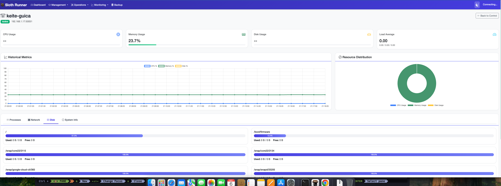
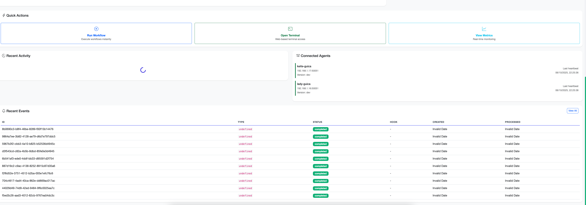
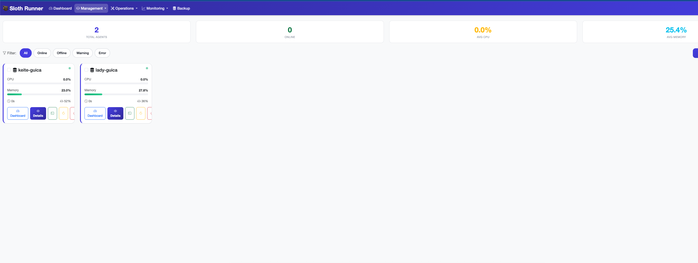
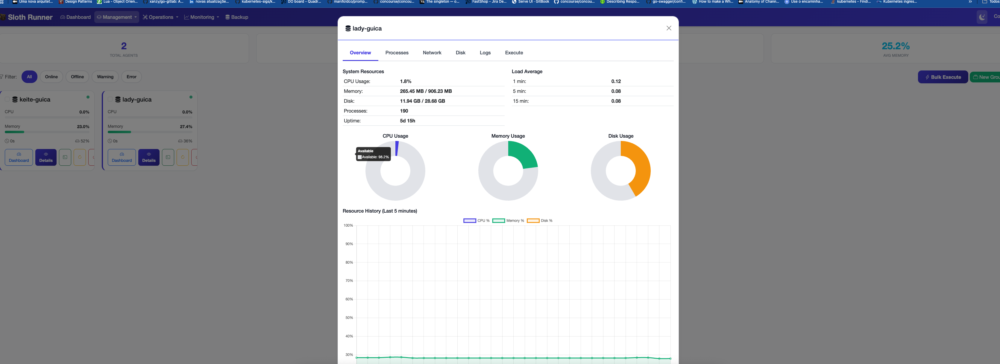

[English](./README.md) | [Português](./README.pt.md) | [中文](./README.zh.md)

# 🦥 Sloth Runner

A **modern task orchestration platform** built with Go and powered by **Lua scripting**. Sloth Runner provides a fluent Modern DSL for defining complex workflows, distributed execution capabilities, and comprehensive automation tools for DevOps teams.

**Sloth Runner** simplifies task automation with its intuitive Lua-based DSL, distributed master-agent architecture, and extensive built-in modules for common DevOps operations.

[](https://github.com/chalkan3-sloth/sloth-runner/actions/workflows/ci.yml)
[](https://golang.org/)
[](https://www.lua.org/)
[](./LICENSE)

---

## ✨ **Key Features**

### 🔄 **Idempotent Operations**
*Run your automation safely - operations only make changes when needed!*

All configuration modules (pkg, user, systemd, file_ops, etc.) are **fully idempotent**:
- ✅ Check current state before making changes
- ✅ Only modify when needed (e.g., package already installed? Skip it!)
- ✅ Return `changed=true/false` to know what was modified
- ✅ Safe to run multiple times without side effects

```lua
task("configure-server")
    :description("Configure server with packages and users")
    :command(function()
        -- First run: installs packages, creates user
        -- Second run: skips everything (already done)
        local pkg_result = pkg.install({packages = {"nginx", "vim"}})
        local user_result = user.create({username = "webuser"})

        if pkg_result.changed or user_result.changed then
            print("Changes were made")
        else
            print("System already in desired state")
        end
        return true
    end)
    :build()
```

### 📊 **Stack-Based State Management**
*Infrastructure as Code with Pulumi-like state tracking!*

Sloth Runner includes a **sophisticated stack management system** that tracks all your infrastructure resources:

- 🎯 **Automatic Change Detection** - Resources only update when properties change
- 🔍 **Drift Detection** - Know when infrastructure has changed outside of automation
- 📝 **Execution History** - Complete audit trail of all changes
- 💾 **Persistent State** - SQLite-based state storage
- 🔒 **Resource Locking** - Prevent concurrent modifications

```lua
-- Define tasks
local deploy_db = task("deploy-database")
    :description("Deploy database with state tracking")
    :command(function()
        -- Resources are automatically tracked in the stack
        local status, resource = stack.register_resource({
            type = "database",
            name = "postgres-prod",
            module = "terraform",
            properties = {
                engine = "postgres",
                version = "14.5",
                instance_type = "db.t3.medium"
            }
        })

        if status == "unchanged" then
            print("✓ Database already configured correctly")
        elseif status == "changed" then
            print("→ Updating database configuration...")
            -- Apply changes
            stack.update_resource("database", "postgres-prod", {
                state = "applied"
            })
        elseif status == "created" then
            print("→ Creating new database...")
            -- Create resource
            stack.update_resource("database", "postgres-prod", {
                state = "applied"
            })
        end

        -- Store outputs for other tasks
        stack.set_output("db_endpoint", "postgres-prod.example.com")
        return true
    end)
    :build()

-- Define workflow
workflow
    .define("production-infrastructure")
    :description("Complete production setup with state tracking")
    :version("1.0.0")
    :tasks({deploy_db})

-- CLI Commands for Stack Management
-- sloth-runner stack list                    # List all stacks
-- sloth-runner stack show production         # Show stack details
-- sloth-runner stack resources production    # List managed resources
-- sloth-runner stack export production       # Export state to JSON
```

**Benefits:**
- 🚀 Safe to run workflows multiple times
- 📈 Track infrastructure changes over time
- 🔄 Automatic rollback on failures
- 📊 View resource dependencies
- 💡 Know exactly what changed in each run


### 📦 **Native Modules - No require() Needed!**
*All native modules are available globally - just use them!*

```lua
-- ✅ All native modules work out of the box - NO require() needed!

task("setup_server")
    :description("Setup server with native modules")
    :command(function()
        -- Package Management (pkg)
        pkg.install({ name = "nginx", version = "latest" })
        
        -- User Management (user)
        user.create({
            name = "webapp",
            home = "/home/webapp",
            shell = "/bin/bash"
        })
        
        -- File Operations (file_ops)
        file_ops.copy({
            src = "config/nginx.conf",
            dest = "/etc/nginx/nginx.conf",
            mode = 0o644
        })
        
        -- SSH Operations (ssh)
        ssh.upload({
            connection = connection,
            local_path = "app.tar.gz",
            remote_path = "/tmp/app.tar.gz"
        })
        
        -- Systemd Management (systemd)
        systemd.enable("nginx")
        systemd.start("nginx")
        
        -- Infrastructure Testing (infra_test)
        infra_test.service_is_running("nginx")
        infra_test.port_is_listening(80)
        infra_test.file_exists("/etc/nginx/nginx.conf")
        
        log.info("✅ Server setup complete!")
        return true
    end)
    :build()
```

**Available Global Modules:**
- `pkg` - Package management (apt, yum, dnf, pacman, apk)
- `user` - User/group management
- `ssh` - SSH operations and file transfers
- `file_ops` - File operations (copy, template, lineinfile, etc.)
- `systemd` - Systemd service management
- `state` - State management with persistence
- `terraform` - Terraform integration
- `pulumi` - Pulumi integration
- `kubernetes` - Kubernetes operations
- `helm` - Helm chart management
- `salt` - Salt Stack integration
- `infra_test` - Infrastructure testing and validation

### 🎯 **Modern DSL (Domain Specific Language)**
*Clean, powerful Lua-based syntax for complex workflows*

```lua
-- Define GitOps tasks with fluent API
local clone_task = task("clone_infrastructure")
    :description("Clone Terraform infrastructure repository")
    :workdir("/tmp/infrastructure")
    :command(function(this, params)
        log.info("📡 Cloning infrastructure repository...")
        
        -- Note: git, http, data, etc. still use require()
        -- Only native infrastructure modules are global
        local git = require("git")
        local repository = git.clone(
            "https://github.com/company/terraform-infrastructure",
            this.workdir.get()
        )
        
        return true, "Repository cloned successfully"
    end)
    :timeout("5m")
    :retries(3, "exponential")
    :on_success(function(this, params, output)
        log.info("✅ Infrastructure code ready for deployment!")
    end)
    :build()

-- Define workflows with advanced configuration
workflow.define("infrastructure_pipeline")
    :description("Complete Infrastructure Deployment Pipeline")
    :version("2.0.0")
    :tasks({ clone_task, terraform_plan_task, terraform_apply_task })
    :config({
        timeout = "30m",
        max_parallel_tasks = 2,
        environment = "production"
    })
    :on_complete(function(success, results)
        if success then
            log.info("🎉 Infrastructure successfully deployed!")
        end
    end)
```

### 🌐 **Distributed Master-Agent Architecture**
*Scale task execution across multiple machines*

- **Master Server:** Central orchestration and control
- **Agents:** Lightweight workers on remote machines  
- **gRPC Communication:** Reliable, high-performance communication
- **🔄 Auto-Reconnection:** Agents automatically reconnect on disconnection 🔥
- **Load Balancing:** Intelligent task distribution
- **Health Monitoring:** Real-time agent status tracking with heartbeats

```lua
-- Execute tasks on remote agents with automatic failover
local result = task("deploy_app")
    :delegate_to("production-agent-01")
    :command(function(this, params)
        -- If agent disconnects, it will automatically reconnect
        -- and the task can continue once connection is restored
        return exec.run("systemctl restart myapp")
    end)
    :build()
```

### 💾 **Advanced State Management**
*Persistent state with SQLite backend and advanced features*

```lua
-- Persistent state operations
state.set("deployment_count", 1, 3600) -- TTL of 1 hour
local count = state.increment("deployment_count")

-- Atomic operations
state.compare_swap("status", "deploying", "deployed")

-- Distributed locks
state.with_lock("deployment_lock", function()
    -- Critical section - only one task can execute this
    return deploy_application()
end, 30) -- 30 second timeout
```

### 🔧 **Rich Lua Module Ecosystem**
*Comprehensive built-in modules for common operations*

- **`git`**: Git operations with automatic credential handling
- **`terraform`**: Terraform lifecycle management (init, plan, apply)
- **`exec`**: Execute shell commands with enhanced error handling
- **`fs`**: File system operations with validation
- **`net`**: HTTP client with retry and timeout support
- **`data`**: JSON/YAML processing and validation
- **`log`**: Structured logging with context
- **`state`**: Persistent state management
- **`async`**: Parallel execution and modern async patterns
- **`utils`**: Configuration management and utilities

#### GitOps Module Examples

```lua
-- Git operations (no require needed - modules are global!)
local repo = git.clone("https://github.com/company/infra", "/tmp/infra")
git.checkout(repo, "production")

-- Terraform operations
local result = terraform.init({ workdir = "/tmp/infra/terraform/" })
if not result.success then return false, "Init failed" end

local result_plan = terraform.plan({
  workdir = "/tmp/infra/terraform/",
  out = "prod.tfplan"
})
if not result_plan.success then return false, "Plan failed" end

local result_apply = terraform.apply({
  workdir = "/tmp/infra/terraform/",
  auto_approve = true
})
if not result_apply.success then return false, "Apply failed" end

-- State management (state module is also global!)
state.set("deployment_version", "v2.1.0", 3600)
local version = state.get("deployment_version")
```

### ⚡ **Event-Driven Hooks System**
*Automate everything with event-driven hooks powered by high-performance goroutines!*

Sloth Runner includes a powerful event-driven automation system that lets you respond to system events with custom Lua hooks. Built on a **worker pool architecture with 100 concurrent goroutines**, it processes thousands of events per second with sub-millisecond latency.

**Key Features:**
- 🚀 **High-Performance**: 100 worker goroutines processing events concurrently
- 📊 **100+ Event Types**: Agent, task, workflow, system, security, and more
- 💾 **Persistent Queue**: SQLite-backed event queue ensures no events are lost
- 🔄 **Async Processing**: Immediate event processing via buffered channels
- 📝 **Execution Tracking**: Complete audit trail of all hook executions
- 🎯 **Stack Isolation**: Organize hooks by project or environment
- 🔧 **Full Module Access**: Hooks can use all workflow modules

#### Architecture Overview


**How it works:**
1. Events from agents, tasks, or workflows are dispatched to a buffered channel
2. 100 worker goroutines consume events immediately from the channel
3. Each event triggers matching hooks concurrently
4. All events are persisted to SQLite for audit and fallback processing
5. Results are tracked in execution history

#### Quick Example: Slack Notifications

```lua
-- Save as: notify_failures.lua
local hook = {
    name = "slack_notify_failures",
    event_type = "task.failed",
    stack = "production"
}

function hook.execute(event)
    local http = require("http")
    local json = require("json")
    local secret = require("secret")

    local task = event.data.task
    local webhook = secret.get("slack_webhook_url")

    local message = json.encode({
        text = string.format("🚨 Task Failed: %s on %s\nError: %s",
            task.task_name,
            task.agent_name,
            task.error
        )
    })

    http.post(webhook, {
        headers = {["Content-Type"] = "application/json"},
        body = message
    })

    return true, "Notification sent"
end

return hook
```

#### Register and Manage Hooks

```bash
# Register a new hook
sloth-runner hook add notify_failures.lua

# List all hooks
sloth-runner hook list

# View hook execution history
sloth-runner hook history slack_notify_failures --limit 20

# List recent events
sloth-runner events list

# View event details with hook executions
sloth-runner events show <event-id>
```

#### Dispatch Events from Workflows

```lua
task("deploy_app")
    :command(function()
        local event = require("event")

        -- Dispatch event that triggers hooks
        event.dispatch("deploy.started", {
            deploy_id = "deploy-123",
            version = "v2.0.0",
            environment = "production"
        })

        -- Deploy logic here...

        event.dispatch("deploy.completed", {
            deploy_id = "deploy-123",
            status = "success"
        })

        return true
    end)
    :build()
```

#### Event Categories

| Category | Example Events |
|----------|----------------|
| **Agent** | `agent.registered`, `agent.disconnected`, `agent.heartbeat_failed` |
| **Task** | `task.started`, `task.completed`, `task.failed` |
| **Workflow** | `workflow.started`, `workflow.completed`, `workflow.failed` |
| **System** | `system.startup`, `system.error`, `system.cpu_high` |
| **Security** | `security.breach`, `security.unauthorized`, `security.login_failed` |
| **Deploy** | `deploy.started`, `deploy.completed`, `deploy.rollback` |
| **+10 more** | Files, databases, networks, backups, health checks, and custom events |

#### Performance Characteristics

- **Throughput**: ~10,000 events/second (with simple hooks)
- **Latency**: Sub-millisecond event dispatch
- **Workers**: 100 concurrent goroutines
- **Buffer**: 1000 event channel buffer
- **Storage**: SQLite with automatic cleanup

#### Use Cases

- 🔔 **Monitoring**: React to agent failures, high CPU, or failed tasks
- 🔒 **Security**: Automated incident response and alerting
- 🚀 **CI/CD**: Deployment pipelines with event-driven workflows
- 📊 **Metrics**: Send events to monitoring systems (Prometheus, Grafana)
- 🔄 **Auto-Scaling**: Scale infrastructure based on resource events
- 📧 **Notifications**: Slack, Discord, email, PagerDuty integration

📖 **[Full Hooks & Events Documentation](./docs/architecture/hooks-events-system.md)** - Architecture, goroutines, and advanced examples

## 🚀 **Quick Start**

### Installation

**Quick Install (Recommended):**

```bash
# One-line installation (Linux/macOS)
curl -fsSL https://raw.githubusercontent.com/chalkan3-sloth/sloth-runner/master/install.sh | bash
```

**Install Agent with Bootstrap (One Command!):**

```bash
# Install and configure agent with systemd in one command
bash <(curl -fsSL https://raw.githubusercontent.com/chalkan3-sloth/sloth-runner/master/bootstrap.sh) \
  --name myagent \
  --master 192.168.1.10:50053
```

This will:
- ✅ Install sloth-runner
- ✅ Create and enable systemd service
- ✅ Configure auto-reconnection
- ✅ Start the agent immediately

📖 **[Agent Bootstrap Guide](./BOOTSTRAP.md)** - Complete guide for agent deployment

**Alternative Methods:**

```bash
# Install specific version
bash install.sh --version v3.23.1

# Install without sudo (to ~/.local/bin)
bash install.sh --no-sudo

# Download from releases manually
wget https://github.com/chalkan3-sloth/sloth-runner/releases/latest/download/sloth-runner_v3.23.1_linux_amd64.tar.gz
tar -xzf sloth-runner_*.tar.gz
sudo mv sloth-runner /usr/local/bin/
```

**Updating:**

```bash
# Update to latest version
curl -fsSL https://raw.githubusercontent.com/chalkan3-sloth/sloth-runner/master/update.sh | bash

# Or download and run locally
bash update.sh

# Check for updates without installing
bash update.sh --check-only

# Update to specific version
bash update.sh --version v3.23.1

# Force update (reinstall even if up to date)
bash update.sh --force
```

**Building from Source:**

```bash
git clone https://github.com/chalkan3-sloth/sloth-runner.git
cd sloth-runner
go build -o sloth-runner ./cmd/sloth-runner
sudo mv sloth-runner /usr/local/bin/
```

📖 **[Complete Installation Guide](./INSTALL.md)** - Detailed instructions for all platforms

**Verify Installation:**
```bash
sloth-runner --version
# Output: sloth-runner version 3.23.1
```

### 📚 Explore Available Modules

**Discover all built-in modules and their functions:**

```bash
# List all available modules
sloth-runner modules list

# View detailed documentation for a specific module
sloth-runner modules list --module pkg

# Get machine-readable JSON output
sloth-runner modules list --module systemd --format json
```

**Example output:**
```
# pkg - Package management for multiple Linux distributions

┌──────────────────┬─────────────────────────────┐
│ Function         │ Description                 │
├──────────────────┼─────────────────────────────┤
│ pkg.install      │ Install packages            │
│ pkg.remove       │ Remove packages             │
│ pkg.update       │ Update package cache        │
│ pkg.is_installed │ Check if package installed  │
└──────────────────┴─────────────────────────────┘

# Examples

INFO pkg.install
  Parameters: {packages = {...}, target = 'agent_name'}
  pkg.install({
      packages = {"nginx", "curl"},
      target = "web-server"
  })
```

**Available modules:** `pkg`, `systemd`, `user`, `ssh`, `file`, `http`, `cmd`, `json`, `yaml`, `log`, `crypto`, `database`, `terraform`, `pulumi`, `aws`, `azure`, `gcp`, `docker`, `kubernetes`, `slack`, `goroutine`

### Your First GitOps Workflow

Create a complete GitOps workflow that clones a repository and deploys infrastructure with Terraform:

**1. Create your workflow file (`deploy.sloth`):**

```lua
-- Complete GitOps Workflow with Git + Terraform
local clone_repo_task = task("clone_repo")
    :description("Clone Git repository with infrastructure code")
    :workdir("/tmp/infrastructure")
    :command(function(this, params)
        -- No require needed - git is a global module!
        log.info("📡 Cloning repository...")
        local repository = git.clone(
            "https://github.com/your-org/terraform-infrastructure",
            this.workdir.get()
        )

        return true, "Repository cloned successfully", {
            repository_url = "https://github.com/your-org/terraform-infrastructure",
            clone_destination = this.workdir.get()
        }
    end)
    :timeout("5m")
    :build()

local deploy_infrastructure = task("deploy_terraform")
    :description("Deploy infrastructure using Terraform")
    :workdir("/tmp/infrastructure/environments/prod/")
    :command(function(this, params)
        -- terraform module is global - no require needed!
        -- Terraform init is called automatically
        log.info("🔄 Initializing Terraform...")
        local client = terraform.init(this.workdir:get())

        -- Load configuration from values.yaml
        local terraform_config = {
            environment = values.terraform.environment or "prod",
            instance_type = values.terraform.instance_type or "t3.micro",
            region = values.terraform.region or "us-east-1"
        }

        -- Create terraform.tfvars from configuration
        local tfvars = client:create_tfvars("terraform.tfvars", terraform_config)

        -- Plan and apply
        local plan_result = client:plan({ var_file = tfvars.filename })
        if plan_result.success then
            log.info("🚀 Applying Terraform changes...")
            local apply_result = client:apply({
                var_file = tfvars.filename,
                auto_approve = true
            })

            return apply_result.success, "Infrastructure deployment", {
                terraform_used = true,
                plan_success = true,
                apply_success = apply_result.success
            }
        end

        return false, "Terraform plan failed"
    end)
    :timeout("15m")
    :build()

-- Define the complete GitOps workflow
workflow.define("gitops_deploy")
    :description("Complete GitOps workflow: Git clone + Terraform deploy")
    :version("1.0.0")
    :tasks({ clone_repo_task, deploy_infrastructure })
    :config({
        timeout = "20m",
        max_parallel_tasks = 1
    })
```

**2. Create your configuration file (`values.yaml`):**

```yaml
terraform:
  environment: "production"
  instance_type: "t3.small"
  region: "us-west-2"
  
workflow:
  timeout: "30m"
  environment: "prod"
```

**3. Run your GitOps workflow:**

```bash
# Execute the complete workflow
sloth-runner workflow run gitops_deploy -f deploy.sloth -v values.yaml

# Or using the legacy command (still supported for backward compatibility)
sloth-runner run gitops_deploy -f deploy.sloth -v values.yaml

# Watch the magic happen:
# ✅ Repository cloned
# ✅ Terraform initialized
# ✅ Infrastructure planned
# ✅ Infrastructure deployed
```

### Try the Complete Example

We provide a working example that you can run immediately:

```bash
# Clone the repository
git clone https://github.com/chalkan3-sloth/sloth-runner.git
cd sloth-runner

# Run the GitOps example (new workflow command)
sloth-runner workflow run deploy_git_terraform -f examples/deploy_git_terraform.sloth -v examples/values.yaml

# Or using legacy command (backward compatible)
sloth-runner run deploy_git_terraform -f examples/deploy_git_terraform.sloth -v examples/values.yaml
```

This example demonstrates:
- 🔄 **Git repository cloning**
- 🏗️ **Terraform infrastructure deployment**  
- ⚙️ **External configuration with values.yaml**
- 📊 **Comprehensive error handling and logging**
- 🎯 **Modern DSL syntax and best practices**

---

## ⚡ **Parallel Execution with Goroutines** 🚀

> **NEW FEATURE!** Sloth Runner brings the power of Go's goroutines to Lua!  
> Execute multiple operations concurrently within a single task, dramatically improving performance for I/O-bound operations.

<div align="center">

### **⏱️ Performance at a Glance**

| Operation | Sequential | With Goroutines | Speedup |
|-----------|------------|-----------------|---------|
| 🌐 10 Server Deployments | 5 minutes | **30 seconds** | **10x faster** ⚡ |
| 🏥 20 Health Checks | 1 minute | **5 seconds** | **12x faster** ⚡ |
| 📊 1000 Items Processing | 10 seconds | **1 second** | **10x faster** ⚡ |

</div>

### 🚀 **Why Goroutines in Sloth Runner?**

- **🔥 True Parallelism**: Execute multiple operations simultaneously
- **⚡ Lightning Fast**: Reduce execution time from minutes to seconds
- **🎯 Simple API**: Easy-to-use interface for concurrent operations
- **🛡️ Safe & Reliable**: Built-in timeout and error handling
- **📊 Real Results**: Wait for all operations and collect results

### 💡 **Real-World Example: Multi-Server Deployment**

> **💼 Business Value:** Cut deployment time from 5 minutes to 30 seconds!  
> **🎯 Use Case:** Deploy your application to multiple servers in parallel instead of sequentially

<table>
<tr>
<td align="center">

**❌ OLD WAY (Sequential)**  
`10 servers × 30 seconds = 5 minutes` ⏱️

Deploy to server 1... ⏳  
Deploy to server 2... ⏳  
Deploy to server 3... ⏳  
*...and so on...*

</td>
<td align="center">

**✅ NEW WAY (Goroutines)**  
`30 seconds total` ⚡

Deploy to ALL servers simultaneously! 🚀  
Server 1, 2, 3, 4... ALL AT ONCE! 🔥  
**10x faster!**

</td>
</tr>
</table>

```lua
-- parallel_deployment.sloth
-- Deploy to 10 servers in parallel using goroutines

local deploy_to_servers = task("deploy_multi_server")
    :description("Deploy application to multiple servers in parallel")
    :command(function(this, params)
        local goroutine = require("goroutine")
        
        -- List of target servers
        local servers = {
            {name = "web-01", host = "192.168.1.10"},
            {name = "web-02", host = "192.168.1.11"},
            {name = "web-03", host = "192.168.1.12"},
            {name = "api-01", host = "192.168.1.20"},
            {name = "api-02", host = "192.168.1.21"},
            {name = "db-01", host = "192.168.1.30"},
        }
        
        log.info("🚀 Starting parallel deployment to " .. #servers .. " servers...")
        
        -- Create async handles for parallel deployment
        local handles = {}
        for _, server in ipairs(servers) do
            -- Each server deployment runs in its own goroutine via async
            local handle = goroutine.async(function()
                log.info("📦 Deploying to " .. server.name .. " (" .. server.host .. ")")
                
                -- Simulate deployment steps
                local steps = {
                    "Uploading application files...",
                    "Installing dependencies...",
                    "Restarting services...",
                    "Running health checks..."
                }
                
                for _, step in ipairs(steps) do
                    log.info("  → " .. server.name .. ": " .. step)
                    goroutine.sleep(500)  -- Sleep 500ms
                end
                
                -- Return deployment result
                return server.name, server.host, "success", os.date("%Y-%m-%d %H:%M:%S")
            end)
            
            table.insert(handles, handle)
        end
        
        log.info("⏳ Waiting for all deployments to complete...")
        
        -- Wait for all async operations to complete
        local results = goroutine.await_all(handles)
        
        -- Process results
        local success_count = 0
        local failed_count = 0
        
        log.info("\n📊 Deployment Results:")
        log.info("═══════════════════════════════════════")
        
        for i, result in ipairs(results) do
            if result.success then
                success_count = success_count + 1
                -- results.values contains the return values from the function
                local server_name = result.values[1]
                local deployed_at = result.values[4]
                log.info("✅ " .. server_name .. " → Deployed successfully at " .. deployed_at)
            else
                failed_count = failed_count + 1
                log.error("❌ " .. (result.error or "Unknown deployment failure"))
            end
        end
        
        log.info("═══════════════════════════════════════")
        log.info("📈 Summary: " .. success_count .. " successful, " .. failed_count .. " failed")
        
        if failed_count > 0 then
            return false, "Some deployments failed", {
                total = #servers,
                success = success_count,
                failed = failed_count
            }
        end
        
        return true, "All deployments completed successfully!", {
            total = #servers,
            success = success_count,
            duration = "~30 seconds (parallel)"
        }
    end)
    :timeout("2m")
    :build()

-- Create workflow
workflow.define("parallel_deployment")
    :description("Deploy to multiple servers in parallel using goroutines")
    :version("1.0.0")
    :tasks({ deploy_to_servers })
    :config({
        timeout = "5m"
    })
```

**Run the example:**
```bash
# New workflow command
sloth-runner workflow run parallel_deployment -f parallel_deployment.sloth

# Or legacy command (backward compatible)
sloth-runner run parallel_deployment -f parallel_deployment.sloth
```

**Expected Output:**
```
🚀 Starting parallel deployment to 6 servers...
📦 Deploying to web-01 (192.168.1.10)
📦 Deploying to web-02 (192.168.1.11)
📦 Deploying to web-03 (192.168.1.12)
📦 Deploying to api-01 (192.168.1.20)
📦 Deploying to api-02 (192.168.1.21)
📦 Deploying to db-01 (192.168.1.30)
⏳ Waiting for all deployments to complete...

📊 Deployment Results:
═══════════════════════════════════════
✅ web-01 → Deployed successfully at 2025-01-10 15:30:45
✅ web-02 → Deployed successfully at 2025-01-10 15:30:45
✅ web-03 → Deployed successfully at 2025-01-10 15:30:45
✅ api-01 → Deployed successfully at 2025-01-10 15:30:45
✅ api-02 → Deployed successfully at 2025-01-10 15:30:45
✅ db-01 → Deployed successfully at 2025-01-10 15:30:45
═══════════════════════════════════════
📈 Summary: 6 successful, 0 failed
```

### 🎯 **More Goroutine Examples**

#### **Parallel Health Checks**
```lua
-- Check health of multiple services simultaneously
local health_check = task("parallel_health_check")
    :command(function(this, params)
        local goroutine = require("goroutine")
        local http = require("http")
        
        local endpoints = {
            {name = "API", url = "https://api.example.com/health"},
            {name = "Database", url = "https://db.example.com/health"},
            {name = "Cache", url = "https://cache.example.com/health"},
            {name = "Queue", url = "https://queue.example.com/health"}
        }
        
        local handles = {}
        for _, endpoint in ipairs(endpoints) do
            local handle = goroutine.async(function()
                local response = http.get(endpoint.url, {timeout = 5})
                return endpoint.name, 
                       response.status_code == 200 and "healthy" or "unhealthy",
                       response.time_ms or 0
            end)
            table.insert(handles, handle)
        end
        
        local results = goroutine.await_all(handles)
        
        -- All checks completed in parallel!
        for _, result in ipairs(results) do
            if result.success then
                local name = result.values[1]
                local status = result.values[2]
                local time_ms = result.values[3]
                log.info("🏥 " .. name .. ": " .. status .. " (" .. time_ms .. "ms)")
            end
        end
        
        return true, "Health check completed"
    end)
    :build()
```

#### **Parallel Data Processing**
```lua
-- Process large datasets in parallel chunks
local process_data = task("parallel_data_processing")
    :command(function(this, params)
        local goroutine = require("goroutine")
        
        -- Split data into chunks for parallel processing
        local data_chunks = split_into_chunks(large_dataset, 10)
        
        local handles = {}
        for i, chunk in ipairs(data_chunks) do
            local handle = goroutine.async(function()
                log.info("Processing chunk " .. i)
                return process_chunk(chunk)
            end)
            table.insert(handles, handle)
        end
        
        -- Wait for all chunks to be processed
        local results = goroutine.await_all(handles)
        
        -- Merge results
        local merged_result = merge_results(results)
        
        return true, "Data processed in parallel", merged_result
    end)
    :build()
```

### 📚 **Goroutine API Reference**

| Function | Description | Example |
|----------|-------------|---------|
| `goroutine.async(fn)` | Execute function asynchronously | `local handle = goroutine.async(function() return "done" end)` |
| `goroutine.await(handle)` | Wait for single async operation | `local success, ... = goroutine.await(handle)` |
| `goroutine.await_all(handles)` | Wait for all async operations | `local results = goroutine.await_all({h1, h2})` |
| `goroutine.pool_create(name, opts)` | Create worker pool | `goroutine.pool_create("workers", {workers=10})` |
| `goroutine.pool_submit(name, fn)` | Submit task to pool | `goroutine.pool_submit("workers", function() ... end)` |
| `goroutine.spawn(fn)` | Spawn fire-and-forget goroutine | `goroutine.spawn(function() log.info("async") end)` |
| `goroutine.sleep(ms)` | Sleep milliseconds | `goroutine.sleep(1000)` |

**Result Structure from `await_all()`:**
```lua
{
    success = true,      -- boolean: did the operation succeed?
    values = {...},      -- table: array of return values
    error = "msg"        -- string: error message (if failed)
}
```

### 🎓 **Best Practices**

✅ **DO:**
- Use goroutines for I/O-bound operations (network, file operations)
- Always set reasonable timeouts
- Handle errors from each goroutine
- Use for parallel deployment, health checks, data processing

❌ **DON'T:**
- Use for CPU-intensive operations (Go runtime handles that)
- Create thousands of goroutines (start with 10-50)
- Forget timeout handling
- Ignore error results

### 🔗 **Learn More**

- 📖 [Complete Goroutine Documentation](./docs/modules/goroutine.md)
- 🧪 [More Goroutine Examples](./examples/goroutines/)
- 🎯 [Performance Benchmarks](./docs/performance.md)

### 🎮 **Quick Try - Copy & Paste Example**

Want to see goroutines in action right now? Copy this complete working example:

```bash
# Create the example file
cat > /tmp/quick_goroutines.sloth << 'EOF'
local demo = task("quick_goroutine_demo")
    :description("Quick goroutine demonstration")
    :command(function(this, params)
        local go = require("goroutine")
        
        log.info("🚀 Starting 5 parallel operations...")
        
        local goroutines = {}
        for i = 1, 5 do
            local g = go.create(function()
                log.info("  ⚡ Operation " .. i .. " running in parallel!")
                os.execute("sleep 1")  -- Simulate work
                return "Result from operation " .. i
            end)
            table.insert(goroutines, g)
        end
        
        log.info("⏳ Waiting for all operations...")
        local results = go.wait_all(goroutines, 10)
        
        log.info("✅ All operations completed!")
        for i, result in ipairs(results) do
            log.info("  📦 " .. result.value)
        end
        
        return true, "Demo completed successfully!"
    end)
    :build()

workflow.define("goroutine_demo", {
    description = "Quick Goroutine Demo",
    tasks = { demo }
})
EOF

# Run it!
sloth-runner run -f /tmp/quick_goroutines.sloth
```

**You'll see all 5 operations complete in ~1 second instead of 5 seconds!** ⚡

---

## 🧪 **Infrastructure Testing with infra_test** 🔥

### **Test-Driven Infrastructure as Code**

The `infra_test` module brings native infrastructure testing capabilities to Sloth Runner, inspired by tools like **Testinfra** and **InSpec**, but fully integrated with zero external dependencies!

#### 🌟 **Why infra_test?**

- ✅ **Native Integration**: Test within your deployment workflows
- ✅ **Zero Dependencies**: No Python, Ruby, or external tools required
- ✅ **Remote Testing**: Test across multiple agents seamlessly
- ✅ **Fail-Fast**: Automatically stops deployment on test failure
- ✅ **Comprehensive**: Files, services, ports, processes, commands, and more!

#### 💡 **Real-World Example: Deploy + Test + Verify**

```lua
local infra_test = require("infra_test")
local pkg = require("pkg")
local systemd = require("systemd")

workflow("production-deployment")
  -- Step 1: Install and configure nginx
  :task("install-nginx", function()
    log.info("📦 Installing nginx...")
    pkg.install("nginx")
    
    -- Create custom configuration
    local config = [[
server {
    listen 80;
    server_name example.com;
    root /var/www/html;
}
]]
    local fs = require("fs")
    fs.write_file("/etc/nginx/sites-available/example", config)
    fs.symlink(
      "/etc/nginx/sites-available/example",
      "/etc/nginx/sites-enabled/example"
    )
  end)
  
  -- Step 2: Start nginx service
  :task("start-nginx", function()
    log.info("🚀 Starting nginx...")
    systemd.enable("nginx")
    systemd.start("nginx")
  end)
  
  -- Step 3: 🧪 VALIDATE EVERYTHING!
  :task("validate-deployment", function()
    log.info("🧪 Running infrastructure tests...")
    
    -- Test 1: File existence and permissions
    infra_test.file_exists("/usr/sbin/nginx")
    infra_test.file_exists("/etc/nginx/nginx.conf")
    infra_test.file_mode("/etc/nginx/nginx.conf", "644")
    infra_test.file_owner("/var/www/html", "www-data")
    
    -- Test 2: Service status
    infra_test.service_is_running("nginx")
    infra_test.service_is_enabled("nginx")
    
    -- Test 3: Port availability
    infra_test.port_is_listening(80)
    infra_test.port_is_tcp(80)
    
    -- Test 4: Process verification
    infra_test.process_is_running("nginx")
    infra_test.process_count("nginx", 4)  -- Master + 3 workers
    
    -- Test 5: Configuration validation
    infra_test.file_contains("/etc/nginx/nginx.conf", "worker_processes")
    infra_test.command_succeeds("nginx -t")  -- Test nginx config
    
    -- Test 6: HTTP response
    infra_test.command_succeeds("curl -f http://localhost")
    infra_test.command_stdout_contains(
      "curl -s http://localhost",
      "Welcome to nginx"
    )
    
    log.info("✅ All infrastructure tests passed!")
  end)
  
  :delegate_to("production-web-01")
```

#### 🌐 **Multi-Agent Testing**

Test infrastructure across multiple servers in a single workflow:

```lua
local infra_test = require("infra_test")

workflow("validate-cluster")
  :task("test-all-web-servers", function()
    local servers = {"web-01", "web-02", "web-03"}
    
    for _, server in ipairs(servers) do
      log.info("🧪 Testing " .. server)
      
      -- Test each server remotely
      infra_test.service_is_running("nginx", server)
      infra_test.port_is_listening(80, server)
      infra_test.port_is_listening(443, server)
      infra_test.file_exists("/var/www/html/index.html", server)
      
      -- Test connectivity between servers
      infra_test.can_connect("db-server.internal", 5432)
      infra_test.ping("load-balancer", 5, server)
    end
    
    log.info("✅ All servers validated!")
  end)
```

#### 🎯 **Complete Test Categories**

| Category | Functions | Example Use Case |
|----------|-----------|------------------|
| **Files** | `file_exists`, `is_directory`, `file_mode`, `file_owner`, `file_contains` | Validate config files, permissions, ownership |
| **Network** | `port_is_listening`, `port_is_tcp`, `can_connect`, `ping` | Ensure services are accessible |
| **Services** | `service_is_running`, `service_is_enabled` | Verify systemd services |
| **Processes** | `process_is_running`, `process_count` | Monitor application processes |
| **Commands** | `command_succeeds`, `command_stdout_contains` | Custom validation logic |

#### 🚀 **Quick Example**

```bash
# Create a test workflow
cat > test-deployment.sloth << 'EOF'
local infra_test = require("infra_test")

workflow("quick-test")
  :task("validate", function()
    -- These will fail fast if conditions aren't met!
    infra_test.file_exists("/etc/hosts")
    infra_test.service_is_running("sshd")
    infra_test.port_is_listening(22)
    infra_test.command_succeeds("which docker")
    
    log.info("✅ System validated!")
  end)
EOF

# Run it! (new workflow command)
sloth-runner workflow run quick-test -f test-deployment.sloth

# Or using legacy command
sloth-runner run quick-test -f test-deployment.sloth
```

#### 📖 **Learn More**

- 📖 [Complete infra_test Documentation](./docs/modules/infra_test.md)
- 🧪 [More Testing Examples](./examples/infra-test/)
- 🎯 [Best Practices Guide](./docs/testing-best-practices.md)

---

## 📦 **Incus Container & VM Management** 🔥

### **Native Container/VM Orchestration with Fluent API**

The `incus` module provides complete integration with [Incus](https://github.com/lxc/incus), enabling you to manage containers and virtual machines programmatically with a powerful fluent API.

#### 🌟 **Why Incus Module?**

- ✅ **Fluent API**: Chain operations naturally like Terraform/Pulumi
- ✅ **Remote Execution**: Deploy containers on remote hosts via `delegate_to()`
- ✅ **Complete Coverage**: Instances, networks, profiles, storage, snapshots
- ✅ **Parallel Operations**: Deploy multiple containers simultaneously with goroutines
- ✅ **Type-Safe**: Strong type checking with comprehensive error handling

#### 💡 **Real-World Example: Deploy Web Cluster**

```lua
task({
    name = "deploy-web-cluster",
    delegate_to = "incus-host-01",
    run = function()
        -- Create network infrastructure
        incus.network({
            name = "web-dmz",
            type = "bridge"
        }):set_config({
            ["ipv4.address"] = "10.10.0.1/24",
            ["ipv4.nat"] = "true",
            ["ipv6.address"] = "none"
        }):create()
        
        -- Create high-performance profile
        incus.profile({
            name = "web-server",
            description = "Optimized for web servers"
        }):set_config({
            ["limits.cpu"] = "4",
            ["limits.memory"] = "4GB",
            ["boot.autostart"] = "true"
        }):create()
        
        -- Deploy 3 web servers in parallel
        local servers = {"web-01", "web-02", "web-03"}
        goroutine.map(servers, function(name)
            local web = incus.instance({
                name = name,
                image = "ubuntu:22.04",
                profiles = {"default", "web-server"}
            })
            
            -- Fluent API: create → start → wait → configure
            web:create()
               :start()
               :wait_running()
            
            -- Attach to network
            incus.network({name = "web-dmz"}):attach(name)
            
            -- Install and configure nginx
            web:exec("apt update && apt install -y nginx")
            web:file_push("./nginx.conf", "/etc/nginx/nginx.conf")
            web:exec("systemctl restart nginx")
            
            -- Create backup snapshot
            incus.snapshot({
                instance = name,
                name = "initial-setup",
                stateful = true
            }):create()
            
            log.info("✅ Server " .. name .. " deployed!")
        end)
        
        log.info("🎉 Web cluster deployed successfully!")
    end
})
```

#### 🚀 **Quick Examples**

```lua
-- Create and start a container
incus.instance({
    name = "myapp",
    image = "ubuntu:22.04"
}):create():start():wait_running()

-- Execute commands
incus.instance({name = "myapp"}):exec("apt update")

-- Push files
incus.instance({name = "myapp"}):file_push("./config.yaml", "/etc/app/config.yaml")

-- Create snapshot
incus.snapshot({
    instance = "myapp",
    name = "before-upgrade",
    stateful = true
}):create()

-- Remote execution
incus.instance({
    name = "prod-app",
    image = "ubuntu:22.04"
}):delegate_to("production-host"):create():start()
```

#### 🎯 **Available Operations**

| Category | Operations | Description |
|----------|-----------|-------------|
| **Instances** | create, start, stop, restart, delete, exec, file_push/pull | Full lifecycle management |
| **Networks** | create, delete, attach, detach, set_config | Virtual network management |
| **Profiles** | create, delete, apply, remove_from, set_config | Configuration profiles |
| **Storage** | create, delete, set_config | Storage pool management |
| **Snapshots** | create, restore, delete | State snapshots (with memory!) |

#### 🔗 **Multi-Host Deployment**

```lua
-- Deploy across multiple hosts
local hosts = {
    {name = "host-01", role = "database"},
    {name = "host-02", role = "application"},
    {name = "host-03", role = "cache"}
}

goroutine.map(hosts, function(host)
    incus.instance({
        name = host.role .. "-server",
        image = "ubuntu:22.04"
    }):delegate_to(host.name)
      :create()
      :start()
      :wait_running()
    
    log.info("✅ Deployed on " .. host.name)
end)
```

#### 📖 **Learn More**

- 📖 [Complete Incus Documentation](./docs/modules/incus.md)
- 🧪 [More Incus Examples](./examples/incus/)
- 🎯 [Incus Official Docs](https://github.com/lxc/incus)

---

## 🔄 **Agent Auto-Reconnection** 🛡️

### **High Availability for Distributed Agents**

Sloth Runner now features **automatic reconnection** for agents, ensuring your distributed infrastructure stays resilient and operational even during network disruptions or master server restarts!

#### 🌟 **Key Features**

- **🔌 Automatic Reconnection**: Agents automatically reconnect when connection is lost
- **📊 Intelligent Health Monitoring**: Continuous heartbeat monitoring with failure detection
- **⚡ Exponential Backoff**: Smart retry strategy to avoid overwhelming the master
- **🎯 Zero Configuration**: Works out-of-the-box with no additional setup
- **💪 Production Ready**: Battle-tested for enterprise environments

#### 🚀 **How It Works**

```
[Agent Start] → [Connect to Master] → [Register] → [Active]
                        ↑                              ↓
                        └──[Reconnecting]←─────[Connection Lost]
```

1. **Continuous Monitoring**: Agent sends heartbeats every 5 seconds
2. **Failure Detection**: After 3 consecutive failures, triggers reconnection
3. **Smart Retry**: Exponential backoff (5s → 10s → 20s → ... → 60s max)
4. **Automatic Recovery**: Re-registers with master and resumes operation

#### 💡 **Usage Example**

```bash
# Start master server
sloth-runner master start --port 50050

# Start agents with auto-reconnection (on different machines)
ssh user@agent1.example.com "sloth-runner agent start \
  --name production-agent-01 \
  --port 50051 \
  --master master.example.com:50050 \
  --daemon"

ssh user@agent2.example.com "sloth-runner agent start \
  --name production-agent-02 \
  --port 50051 \
  --master master.example.com:50050 \
  --daemon"
```

**Even if the master restarts or network temporarily fails, agents will automatically reconnect!** 🎉

#### 📈 **Real-World Scenario**

```lua
-- Your tasks keep working even during network issues!
local deploy_task = task("deploy_application")
    :delegate_to("production-agent-01")
    :description("Deploy application to production server")
    :command(function(this, params)
        local exec = require("exec")
        
        -- Agent auto-reconnects if connection was lost
        log.info("🚀 Deploying application...")
        
        local result = exec.run("docker-compose up -d")
        if result.success then
            log.info("✅ Application deployed successfully!")
            return true, "Deployment completed"
        end
        
        return false, "Deployment failed: " .. result.error
    end)
    :retries(3)
    :build()

workflow.define("production_deployment", {
    description = "Production Deployment with Auto-Reconnection",
    tasks = { deploy_task }
})
```

#### 📊 **Monitoring Connection Status**

```bash
# List all agents and their status
sloth-runner agent list

# Output example:
# ┌─────────────────────┬────────────────────┬─────────┬─────────────────────┐
# │ Name                │ Address            │ Status  │ Last Heartbeat      │
# ├─────────────────────┼────────────────────┼─────────┼─────────────────────┤
# │ production-agent-01 │ 192.168.1.16:50051 │ Active  │ 2 seconds ago       │
# │ production-agent-02 │ 192.168.1.17:50051 │ Active  │ 1 second ago        │
# └─────────────────────┴────────────────────┴─────────┴─────────────────────┘

# View agent logs to see reconnection events
tail -f agent.log | grep -E "(Reconnecting|registered|Lost connection)"
```

#### 🔧 **Connection Parameters**

| Parameter | Default | Description |
|-----------|---------|-------------|
| Heartbeat Interval | 5s | How often agent sends heartbeats |
| Failure Threshold | 3 | Failed heartbeats before reconnecting |
| Initial Delay | 5s | First reconnection delay |
| Max Delay | 60s | Maximum delay between retries |
| Connection Timeout | 10s | Timeout for establishing connection |

#### 📖 **Learn More**

- 📚 [Complete Auto-Reconnection Guide](./docs/agent-reconnection.md)
- 🏗️ [Agent Setup and Configuration](./docs/agent-setup.md)
- 🌐 [Distributed Architecture](./docs/distributed-agents.md)

---

### Hello World Example

Create your first workflow with the Modern DSL:

```lua
-- hello-world.sloth
local hello_task = task("say_hello")
    :description("Simple hello world demonstration")
    :command(function(params)
        log.info("🌟 Hello World from Sloth Runner!")
        log.info("📅 Current time: " .. os.date())
        
        return true, "echo 'Hello, Modern Sloth Runner!'", {
            message = "Hello World",
            timestamp = os.time(),
            status = "success"
        }
    end)
    :timeout("30s")
    :on_success(function(params, output)
        log.info("✅ Hello World task completed successfully!")
        log.info("💬 Message: " .. output.message)
    end)
    :build()

-- Define the workflow
workflow.define("hello_world_workflow", {
    description = "Simple Hello World demonstration",
    version = "1.0.0",
    tasks = { hello_task },
    
    config = {
        timeout = "5m",
        max_parallel_tasks = 1
    }
})
```

```bash
# Run the workflow (new command structure)
./sloth-runner workflow run hello_world_workflow -f hello-world.sloth

# Or using legacy command
./sloth-runner run hello_world_workflow -f hello-world.sloth
```

### Basic Pipeline Example

```lua
-- pipeline.sloth
-- Task 1: Fetch data
local fetch_data = task("fetch_data")
    :description("Fetches raw data from an API")
    :command(function(params)
        log.info("🔄 Fetching data...")
        return true, "echo 'Fetched raw data'", { 
            raw_data = "api_data",
            source = "external_api" 
        }
    end)
    :timeout("30s")
    :build()

-- Task 2: Process data (depends on fetch_data)
local process_data = task("process_data")
    :description("Processes the fetched data")
    :depends_on({"fetch_data"})
    :command(function(params, deps)
        local raw_data = deps.fetch_data.raw_data
        log.info("🔧 Processing data: " .. raw_data)
        
        return true, "echo 'Processed data'", { 
            processed_data = "processed_" .. raw_data 
        }
    end)
    :build()

-- Task 3: Store result
local store_result = task("store_result")
    :description("Stores the processed data")
    :depends_on({"process_data"})
    :command(function(params, deps)
        local final_data = deps.process_data.processed_data
        log.info("💾 Storing result: " .. final_data)
        
        -- Store in state for persistence
        state.set("last_result", final_data, 3600) -- 1 hour TTL
        
        return true, "echo 'Data stored successfully'"
    end)
    :build()

-- Define the complete pipeline
workflow.define("data_pipeline", {
    description = "Data Processing Pipeline",
    version = "1.0.0",
    tasks = { fetch_data, process_data, store_result },
    
    config = {
        timeout = "10m",
        max_parallel_tasks = 2
    }
})
```

### 🏢 **Enterprise & Production Features**
*Production-ready capabilities for enterprise environments*

- **🔒 Security:** RBAC, secrets management, and audit logging
- **📊 Monitoring:** Metrics, health checks, and observability  
- **⏰ Scheduler:** Cron-based with dependency-aware scheduling
- **📦 Artifacts:** Versioned artifacts with metadata and retention
- **🛡️ Reliability:** Circuit breakers and failure handling patterns
- **🌐 Clustering:** Master-agent architecture with load balancing

### 🎨 **Modern Web UI** 🔥
*Complete web-based management and monitoring interface*

Manage your entire Sloth Runner infrastructure through an intuitive web interface!

```bash
# Start the Web UI
sloth-runner ui
# Open http://localhost:8080 in your browser
```

**📸 Screenshots Gallery:**

<table>
  <tr>
    <td width="50%">
      
      <p align="center"><b>Real-time Dashboard</b><br/>System metrics with live charts</p>
    </td>
    <td width="50%">
      
      <p align="center"><b>Agent Dashboard</b><br/>Detailed agent monitoring</p>
    </td>
  </tr>
  <tr>
    <td width="50%">
      
      <p align="center"><b>Agent Control Center</b><br/>Bulk operations and commands</p>
    </td>
    <td width="50%">
      
      <p align="center"><b>Stack Management</b><br/>Environment configuration</p>
    </td>
  </tr>
  <tr>
    <td width="50%">
      
      <p align="center"><b>Agent Details</b><br/>6 tabs with complete info</p>
    </td>
    <td width="50%">
      
      <p align="center"><b>Live Metrics Charts</b><br/>WebSocket real-time updates</p>
    </td>
  </tr>
</table>

**Features:**
- 🎯 **Real-time Dashboard** - System metrics with live charts (CPU, Memory, Disk, Network)
- 🖥️ **Agent Management** - Monitor and control distributed agents
- 📦 **Stack Management** - Full CRUD for stacks and variables
- 📋 **Workflow Browser** - View and manage your .sloth files
- ⚡ **Event & Hook System** - Monitor automation events
- 🔐 **Secrets & SSH** - Secure credential management
- 📊 **Live Monitoring** - WebSocket-powered real-time updates

**Quick Tour:**
- **Dashboard** - `http://localhost:8080/` - System overview
- **Agent Dashboard** - `http://localhost:8080/agent-dashboard` - Detailed agent monitoring
- **Agent Control** - `http://localhost:8080/agent-control` - Bulk operations
- **Stacks** - `http://localhost:8080/stacks` - Environment management

📖 **[Complete Web UI Guide](./docs/WEBUI_GUIDE.md)** - Full documentation with screenshots and examples

---

### 💻 **Modern CLI Interface**
*Comprehensive command-line interface for all operations*

```bash
# Workflow commands (NEW organized structure!)
sloth-runner workflow run <stack> -f workflow.sloth     # Execute workflows
sloth-runner workflow list                              # List available workflows
sloth-runner workflow preview -f workflow.sloth         # Preview workflow structure

# Legacy commands (backward compatible)
sloth-runner run <stack> -f workflow.sloth              # Execute workflows (legacy)
sloth-runner list -f workflow.sloth                     # List tasks (legacy)

# Stack Management (Pulumi-style)
sloth-runner stack new my-app --description "My application stack"  # Create stack
sloth-runner workflow run my-stack -f workflow.sloth --output enhanced  # Run with stack
sloth-runner workflow run my-stack -f workflow.sloth --output json     # JSON output
sloth-runner stack list                                      # List all stacks
sloth-runner stack show my-stack                            # Show stack details

# Distributed execution
sloth-runner master                     # Start master server
sloth-runner agent start --name agent1  # Start agent
sloth-runner agent list                 # List all agents
sloth-runner agent exec agent1 "command" # Execute on specific agent

# Web UI
sloth-runner ui                         # Start web dashboard (port 8080)
sloth-runner ui --port 3000             # Custom port

# Utilities
sloth-runner scheduler enable           # Enable task scheduler
sloth-runner scheduler list             # List scheduled tasks
sloth-runner version                    # Show version information
```

## 🎯 **Master Server Management**

Sloth Runner allows you to manage multiple master servers with friendly names, making it easy to switch between production, staging, and development environments.

### Quick Start

```bash
# Add master servers
sloth-runner master add production 192.168.1.29:50053 --description "Production master"
sloth-runner master add staging 10.0.0.5:50053 --description "Staging environment"
sloth-runner master add local localhost:50053 --description "Local development"

# List all configured masters
sloth-runner master list

# Select default master
sloth-runner master select production

# Use master by name (no need to remember IPs!)
sloth-runner agent list --master production
sloth-runner agent shell my-agent --master staging

# Or use default (no --master flag needed)
sloth-runner agent list
```

### Key Features

- ✅ **Multiple Environments**: Manage production, staging, development masters
- ✅ **Friendly Names**: Use `production` instead of `192.168.1.29:50053`
- ✅ **Default Selection**: Set a default master, avoid repeating `--master` flag
- ✅ **Easy Switching**: Quickly switch between environments
- ✅ **Unique Names**: Automatic validation prevents duplicate master names
- ✅ **Update Support**: Change master addresses without reconfiguring agents

### Available Commands

```bash
sloth-runner master add <name> <address>         # Add new master
sloth-runner master list                         # List all masters
sloth-runner master select <name>                # Set default master
sloth-runner master show [name]                  # Show master details
sloth-runner master update <name> <address>      # Update master address
sloth-runner master remove <name>                # Remove master
```

### Example Workflow

```bash
# Setup your environments once
$ sloth-runner master add production 192.168.1.29:50053
Master 'production' added successfully
  Address: 192.168.1.29:50053
  ⭐ Set as default master (first master added)

$ sloth-runner master add staging 10.0.0.5:50053
Master 'staging' added successfully
  Address: 10.0.0.5:50053

# Work with production (default)
$ sloth-runner agent list
AGENT NAME    ADDRESS            STATUS
web-server    192.168.1.100:50051   Active
db-server     192.168.1.101:50051   Active

# Quick check on staging
$ sloth-runner agent list --master staging
AGENT NAME     ADDRESS          STATUS
staging-web    10.0.0.10:50051     Active

# Switch default to staging
$ sloth-runner master select staging
Master 'staging' is now the default
  Address: 10.0.0.5:50053
```

**📖 Complete documentation:** See **[Master Management Guide](docs/en/master-management.md)**

## 🌟 **Advanced Examples**

### Complete CI/CD Pipeline

```lua
-- ci-cd-pipeline.sloth
local test_task = task("run_tests")
    :description("Run application tests")
    :command(function(params, deps)
        log.info("🧪 Running tests...")
        local result = exec.run("go test ./...")
        if not result.success then
            return false, "Tests failed: " .. result.stderr
        end
        return true, result.stdout, { test_results = "passed" }
    end)
    :timeout("10m")
    :build()

local build_task = task("build_app")
    :description("Build application")
    :depends_on({"run_tests"})
    :command(function(params, deps)
        log.info("🔨 Building application...")
        return exec.run("go build -o app ./cmd/main.go")
    end)
    :artifacts({"app"})
    :build()

local docker_task = task("build_docker")
    :description("Build Docker image")
    :depends_on({"build_app"})
    :command(function(params, deps)
        local tag = params.image_tag or "latest"
        log.info("🐳 Building Docker image with tag: " .. tag)
        
        local result = exec.run("docker build -t myapp:" .. tag .. " .")
        if result.success then
            state.set("docker_image", "myapp:" .. tag, 86400) -- 24 hours
        end
        return result.success, result.stdout
    end)
    :build()

local deploy_task = task("deploy_app")
    :description("Deploy to production")
    :depends_on({"build_docker"})
    :run_if(function(params, deps)
        -- Only deploy if all tests passed and image is built
        return deps.run_tests.test_results == "passed" and 
               state.exists("docker_image")
    end)
    :command(function(params, deps)
        local image = state.get("docker_image")
        log.info("🚀 Deploying image: " .. image)
        
        -- Deploy with rollback capability
        local result = exec.run("kubectl set image deployment/myapp app=" .. image)
        if result.success then
            -- Wait for rollout
            exec.run("kubectl rollout status deployment/myapp --timeout=300s")
        end
        return result.success, result.stdout
    end)
    :on_failure(function(params, error)
        log.error("❌ Deployment failed, rolling back...")
        exec.run("kubectl rollout undo deployment/myapp")
    end)
    :build()

workflow.define("ci_cd_pipeline", {
    description = "Complete CI/CD Pipeline",
    version = "1.0.0",
    
    metadata = {
        author = "DevOps Team",
        tags = {"ci", "cd", "production"}
    },
    
    tasks = { test_task, build_task, docker_task, deploy_task },
    
    config = {
        timeout = "45m",
        max_parallel_tasks = 2,
        fail_fast = true
    },
    
    on_complete = function(success, results)
        if success then
            log.info("🎉 CI/CD Pipeline completed successfully!")
            -- Send notification
            net.post("https://hooks.slack.com/webhook", {
                text = "✅ Deployment successful for commit " .. (os.getenv("GIT_COMMIT") or "unknown")
            })
        else
            log.error("❌ CI/CD Pipeline failed!")
        end
        return true
    end
})
```

### Distributed Task Execution

#### Quick Start: Setting Up Master and Agents

**1. Start the Master Server:**
```bash
# On your master machine (e.g., 192.168.1.29)
./sloth-runner master start --port 50053 --bind-address 192.168.1.29 --daemon

# Or use the helper script
./start_master.sh
```

**2. Start an Agent on a Remote Machine:**
```bash
# SSH to the remote machine
ssh user@192.168.1.16

# Start the agent
./sloth-runner agent start \
  --name "agent1" \
  --port 50051 \
  --master "192.168.1.29:50053" \
  --bind-address "192.168.1.16" \
  --daemon

# Or use the helper script
./manage_remote_agent.sh start user@192.168.1.16 agent1 192.168.1.16
```

**3. Verify Agents are Connected:**
```bash
./sloth-runner agent list --master 192.168.1.29:50053
```

**4. Execute Tasks on Specific Agents:**
```lua
-- Use :delegate_to() to run tasks on specific agents
local deploy_task = task("deploy_app")
    :description("Deploy application on remote server")
    :delegate_to("agent1")  -- Executes on agent named 'agent1'
    :command(function(this, params)
        local exec = require("exec")
        log.info("🚀 Deploying on " .. this.agent.get())
        
        local result = exec.run("systemctl restart myapp")
        return result.exit_code == 0, result.stdout
    end)
    :timeout("2m")
    :build()

deploy_task:run()
```

📖 **[Complete Agent Setup Guide](./docs/agent-setup.md)** - Detailed instructions for distributed setup

#### Advanced Distributed Workflows

```lua
-- distributed-workflow.sloth
-- Deploy to multiple agents in parallel
local check_nginx = task("check_nginx_all")
    :description("Check nginx status on all agents")
    :command(function(this, params)
        local agents = {"agent1", "agent2", "agent3"}
        local results = {}
        
        for _, agent_name in ipairs(agents) do
            log.info("🔍 Checking " .. agent_name)
            
            -- Create subtask for each agent
            local check = task("check_" .. agent_name)
                :delegate_to(agent_name)
                :command(function(t, p)
                    local systemd = require("systemd")
                    local status = systemd.status("nginx")
                    return status.is_active, status
                end)
                :timeout("10s")
                :build()
            
            local success, output = check:run()
            results[agent_name] = {success = success, status = output}
        end
        
        -- Report summary
        for agent, result in pairs(results) do
            if result.success then
                log.info("✅ " .. agent .. ": nginx is active")
            else
                log.warn("⚠️ " .. agent .. ": nginx is inactive")
            end
        end
        
        return true, "Health check completed"
    end)
    :timeout("1m")
    :build()

-- Deploy web application to multiple servers
local deploy_web = task("deploy_web_app")
    :description("Deploy web application to all web servers")
    :command(function(this, params)
        local web_servers = {"web-server-1", "web-server-2"}
        
        for _, server in ipairs(web_servers) do
            log.info("🌐 Deploying to " .. server)
            
            local deploy = task("deploy_" .. server)
                :delegate_to(server)
                :command(function(t, p)
                    local exec = require("exec")
                    local pkg = require("pkg")
                    
                    -- Update application
                    pkg.install({"nginx", "nodejs"})
                    
                    -- Restart services
                    exec.run("systemctl restart nginx")
                    exec.run("pm2 restart app")
                    
                    return true, "Deployed successfully"
                end)
                :timeout("5m")
                :retries(2, "linear")
                :build()
            
            deploy:run()
        end
        
        return true, "Deployment completed on all servers"
    end)
    :build()

-- Run database migration on specific server
local db_migrate = task("run_db_migrations")
    :description("Run database migrations")
    :delegate_to("db-server-1")  -- Run only on specific agent
    :command(function(this, params)
        local exec = require("exec")
        log.info("🗄️ Running database migrations...")
        
        local result = exec.run("cd /opt/app && ./migrate.sh --env=production")
        
        if result.exit_code == 0 then
            log.info("✅ Migrations completed successfully")
            return true, result.stdout
        else
            log.error("❌ Migrations failed: " .. result.stderr)
            return false, result.stderr
        end
    end)
    :timeout("10m")
    :build()

-- Complete distributed deployment workflow
workflow.define("distributed_deployment", {
    description = "Distributed Application Deployment",
    version = "1.0.0",
    tasks = { check_nginx, deploy_web, db_migrate },
    
    config = {
        timeout = "30m",
        max_parallel_tasks = 3,
        environment = "production"
    },
    
    on_complete = function(success, results)
        if success then
            log.info("🎉 Distributed deployment completed successfully!")
        else
            log.error("❌ Deployment failed on one or more agents")
        end
    end
})
```

**Helper Scripts for Agent Management:**

```bash
# Start master server
./start_master.sh

# Start local agent for testing
./start_local_agent.sh my-agent 192.168.1.29 50051

# Manage remote agents via SSH
./manage_remote_agent.sh start user@192.168.1.16 agent1 192.168.1.16
./manage_remote_agent.sh status user@192.168.1.16 agent1
./manage_remote_agent.sh stop user@192.168.1.16 agent1

# Install sloth-runner on remote machine
./manage_remote_agent.sh install user@192.168.1.16
```

**Complete example:** See [`examples/distributed_execution.sloth`](./examples/distributed_execution.sloth)

## 📚 **Documentation**

- **🚀 [Getting Started](docs/getting-started.md)** - Complete setup and first steps
- **📖 [Modern DSL Reference](docs/LUA_API.md)** - Complete language and API reference
- **🏗️ [Architecture Guide](docs/distributed.md)** - Master-agent architecture details
- **🎯 [Master Management](docs/en/master-management.md)** - Manage multiple master servers
- **🧪 [Examples](docs/EXAMPLES.md)** - Real-world usage examples and patterns
- **🔧 [Advanced Features](docs/advanced-features.md)** - Enterprise capabilities
- **📊 [State Management](docs/state.md)** - Persistent state and data handling
- **🛡️ [Security Guide](docs/security.md)** - RBAC, secrets, and audit logging
- **📈 [Monitoring](docs/monitoring.md)** - Metrics, health checks, and observability

### 🛠️ **Development Tools**

- **🦥 [Neovim Plugin](docs/nvim-plugin.md)** - IDE-grade support with syntax highlighting, code completion, and integrated runner
  - [English](docs/en/nvim-plugin.md) | [Português](docs/pt/nvim-plugin.md) | [中文](docs/zh/nvim-plugin.md)

## 🎯 **Why Choose Sloth Runner?**

### 💡 **Developer Experience**
- **📝 Clean, intuitive syntax** with Modern DSL fluent API
- **🧪 Interactive development** with REPL and comprehensive testing
- **📚 Extensive documentation** with real-world examples
- **🔧 Rich ecosystem** of 15+ built-in Lua modules

### 🏢 **Enterprise Ready**
- **🔒 Production-grade security** with RBAC and secrets management
- **📊 Comprehensive monitoring** with metrics and health checks
- **🌐 Distributed architecture** with reliable master-agent topology  
- **⚡ High performance** with parallel execution and state persistence

### 🚀 **Modern Architecture**
- **🎯 Modern DSL only** - no legacy syntax or backwards compatibility issues
- **💾 Advanced state management** with SQLite persistence and TTL
- **🔄 Intelligent retry logic** with exponential backoff and circuit breakers
- **🪝 Rich lifecycle hooks** for comprehensive workflow control

## 🤝 **Community & Support**

- **📖 [Documentation](https://github.com/chalkan3-sloth/sloth-runner/tree/main/docs)** - Comprehensive guides and references
- **🐛 [Issue Tracker](https://github.com/chalkan3-sloth/sloth-runner/issues)** - Report bugs and request features
- **💡 [Discussions](https://github.com/chalkan3-sloth/sloth-runner/discussions)** - Ideas and general discussions
- **🏢 [Enterprise Support](mailto:enterprise@sloth-runner.dev)** - Commercial support and services

## 📈 **Project Status**

### ✅ **Current Features (Stable)**
- ✅ Modern DSL with fluent API
- ✅ Distributed master-agent architecture
- ✅ Advanced state management with SQLite
- ✅ Rich Lua module ecosystem (exec, fs, net, data, log, etc.)
- ✅ Enterprise features (RBAC, monitoring, scheduling)
- ✅ Comprehensive CLI interface
- ✅ Template system and scaffolding tools

### 🚧 **In Development**
- 🔄 Enhanced web UI with real-time monitoring
- 🔄 Additional cloud provider integrations
- 🔄 Advanced workflow visualization
- 🔄 Performance optimizations

### 🔮 **Planned Features**
- 📋 Workflow versioning and rollback
- 🔗 Integration with popular CI/CD platforms
- 📊 Advanced analytics and reporting
- 🎯 Custom plugin system

## 📄 **License**

MIT License - see [LICENSE](LICENSE) file for details.

---

**🦥 Sloth Runner** - *Modern task orchestration made simple*

*Built with ❤️ by the Sloth Runner Team*

### 🌟 **Modern DSL Examples**

#### Fluent Task Definition
```lua
local build_task = task("build_application")
    :description("Build application with modern features")
    :command(function(params, deps)
        log.info("Building application...")
        return exec.run("go build -o app ./cmd/main.go")
    end)
    :timeout("5m")
    :retries(3, "exponential")
    :artifacts({"app"})
    :on_success(function(params, output)
        log.info("Build completed successfully!")
    end)
    :build()
```

#### Workflow Definition
```lua
workflow.define("ci_pipeline", {
    description = "Continuous Integration Pipeline - Modern DSL",
    version = "2.0.0",
    
    metadata = {
        author = "DevOps Team",
        tags = {"ci", "build", "deploy"}
    },
    
    tasks = { build_task, test_task, deploy_task },
    
    config = {
        timeout = "30m",
        retry_policy = "exponential",
        max_parallel_tasks = 4
    },
    
    on_complete = function(success, results)
        if success then
            log.info("🎉 CI Pipeline completed successfully!")
        end
        return true
    end
})
```

### 🔧 **Enhanced Lua API Modules**
*   **`exec` module:** Enhanced shell command execution with modern error handling
*   **`fs` module:** Advanced file system operations with metadata and validation
*   **`net` module:** HTTP client with retry, timeout, and circuit breaker support
*   **`data` module:** JSON/YAML processing with schema validation
*   **`log` module:** Structured logging with contextual information
*   **`state` module:** Advanced persistent state with TTL, atomic operations, and clustering
*   **`async` module:** Modern async patterns - parallel execution, timeouts, promises
*   **`perf` module:** Performance monitoring and metrics collection
*   **`circuit` module:** Circuit breaker patterns for resilience
*   **`utils` module:** Configuration management, secrets, and utilities
*   **`validate` module:** Input validation and type checking

### 📊 **JSON Output Support**
*   **Structured Output:** `--output json` for machine-readable results
*   **Complete Information:** Status, duration, tasks, stack info, and outputs
*   **Error Handling:** Detailed error information in JSON format
*   **Integration Ready:** Perfect for CI/CD pipelines and monitoring tools

```json
{
  "status": "success",
  "duration": "9.073s",
  "stack": {
    "id": "3ec19a86...",
    "name": "production-deploy"
  },
  "tasks": {
    "build_app": {
      "status": "Success",
      "duration": "2.020s"
    }
  },
  "outputs": {
    "deployment_url": "https://app.example.com"
  }
}
```

### 🏢 **Enterprise Features**
*   **🌐 Distributed Architecture:** Master-agent with enhanced load balancing
*   **💾 Advanced State Management:** SQLite-based with clustering and replication
*   **🛡️ Enterprise Reliability:** Circuit breakers, saga patterns, and failure handling
*   **📊 Comprehensive Monitoring:** Metrics, health checks, and observability
*   **⏰ Smart Scheduler:** Cron-based with dependency-aware scheduling
*   **📦 Artifact Management:** Versioned artifacts with metadata and retention policies
*   **🔐 Security:** RBAC, secrets management, and audit logging

### 💻 **Modern CLI Interface**
*   `workflow run`: Execute workflows with Modern DSL support and multiple output formats
*   `workflow run --output json`: JSON structured output for automation and integration
*   `workflow list`: List available workflows with metadata
*   `workflow preview`: Preview workflow structure before execution (NEW!)
*   `stack`: Complete stack management (list, show, delete)
*   `run`: Legacy execute workflows (backward compatible)
*   `list`: Legacy list workflows (backward compatible)
*   `workflow init`: Project scaffolding with templates
*   `validate`: Enhanced validation for both DSL formats
*   `agent`: Enhanced distributed agent management
*   `ui`: Web-based dashboard for monitoring and management

---

## 🚀 Quick Start with Modern DSL

### 1. **Installation**
```bash
# Download latest release
curl -sSL https://raw.githubusercontent.com/chalkan3-sloth/sloth-runner/main/install.sh | bash

# Or build from source
go install github.com/chalkan3-sloth/sloth-runner/cmd/sloth-runner@latest
```

### 2. **Create Your First Modern Workflow**
```lua
-- hello-world-modern.sloth
local hello_task = task("say_hello")
    :description("Modern DSL hello world")
    :command(function()
        log.info("🚀 Hello from Modern DSL!")
        return true, "Hello completed", {
            message = "Welcome to Sloth Runner Modern DSL!",
            timestamp = os.time()
        }
    end)
    :timeout("30s")
    :build()

workflow.define("hello_world", {
    description = "Hello World - Modern DSL",
    version = "1.0.0",
    tasks = { hello_task }
})
```

### 3. **Run Your Workflow**
```bash
# New workflow command
./sloth-runner workflow run hello_world -f hello-world-modern.sloth

# Or using legacy command (backward compatible)
./sloth-runner run hello_world -f hello-world-modern.sloth
```

---

## 📚 Complete Documentation

### 🎯 **Modern DSL Guide**
- [Modern DSL Introduction](./docs/modern-dsl/introduction.md)
- [Task Definition API](./docs/modern-dsl/task-api.md)  
- [Workflow Definition](./docs/modern-dsl/workflow-api.md)
- [Migration Guide](./docs/modern-dsl/migration-guide.md)
- [Best Practices](./docs/modern-dsl/best-practices.md)

### 📖 **Core Documentation**
- [Getting Started](./docs/getting-started.md)
- [Modern DSL Examples](./examples/README.md)
- [Lua API Reference](./docs/LUA_API.md)
- [Enterprise Features](./docs/enterprise.md)
- [Distributed Architecture](./docs/distributed.md)

### 🔧 **Advanced Topics**
- [Circuit Breakers & Resilience](./docs/resilience.md)
- [Performance Monitoring](./docs/monitoring.md)
- [State Management](./docs/state.md)
- [Security & RBAC](./docs/security.md)

---

## 🎯 Modern DSL Benefits

| Feature | Legacy Format | Modern DSL |
|---------|---------------|------------|
| **Syntax** | Procedural | Fluent, chainable |
| **Type Safety** | Runtime errors | Compile-time validation |
| **Error Handling** | Basic | Enhanced with context |
| **Metadata** | Limited | Rich, structured |
| **Retry Logic** | Manual | Built-in strategies |
| **Dependencies** | Simple | Advanced with conditions |
| **Monitoring** | Basic logging | Comprehensive metrics |
| **Testing** | Manual | Integrated test framework |
| **Learning Curve** | ~~Two syntaxes~~ | Single, intuitive syntax |

---

## 🌟 **Modern DSL Examples - Complete Collection**

## 📁 **Example Workflows**

### 🟢 **Beginner Examples**
```bash
# Hello World with Modern DSL
./sloth-runner workflow run hello_world -f examples/beginner/hello-world.sloth

# Simple state management
./sloth-runner workflow run simple_state_test -f examples/simple_state_test.sloth

# Basic exec module testing
./sloth-runner workflow run exec_test -f examples/exec_test.sloth

# Simple pipeline processing
./sloth-runner workflow run basic_pipeline -f examples/basic_pipeline.sloth
```

### 🟡 **Intermediate Examples**
```bash
# Parallel execution with modern async
./sloth-runner workflow run parallel_execution -f examples/parallel_execution.sloth

# Conditional execution and logic
./sloth-runner workflow run conditional_execution -f examples/conditional_execution.sloth

# Enhanced pipeline with modern features
./sloth-runner workflow run basic_pipeline_modern -f examples/basic_pipeline_modern.sloth

# Terraform infrastructure management
./sloth-runner workflow run terraform_example -f examples/terraform_example.sloth
```

### 🔴 **Advanced Examples**
```bash
# Advanced state management
./sloth-runner workflow run state_management_demo -f examples/state_management_demo.sloth

# Enterprise reliability patterns
./sloth-runner workflow run reliability_demo -f examples/reliability_demo.sloth
```

### 🌍 **Real-World Examples**
```bash
# Complete CI/CD pipeline
./sloth-runner workflow run nodejs_cicd -f examples/real-world/nodejs-cicd.sloth

# Microservices deployment
./sloth-runner workflow run microservices_deploy -f examples/real-world/microservices-deploy.sloth
```

---

## ⚡ **Performance & Optimization**

### 🎯 Ultra-Optimized Agent Architecture

Sloth Runner features an **extremely efficient agent** with best-in-class memory footprint and performance, achieving **32 MB RAM usage** while maintaining full functionality.

#### 📊 Memory Usage Comparison

```
┌─────────────────────┬──────────────┬────────────────────────┐
│ Agent               │ RAM Usage    │ Functionality          │
├─────────────────────┼──────────────┼────────────────────────┤
│ Sloth Runner ✅     │ 32 MB        │ Full Featured          │
│ Telegraf            │ 40-60 MB     │ Metrics Only           │
│ Datadog Agent       │ 60-150 MB    │ Full Monitoring        │
│ New Relic Agent     │ 50-80 MB     │ APM + Monitoring       │
│ Prometheus Node     │ 15-25 MB     │ Metrics Export Only    │
│ Elastic Beats       │ 30-80 MB     │ Log/Metrics Collection │
│ Consul Agent        │ 40-70 MB     │ Service Mesh           │
└─────────────────────┴──────────────┴────────────────────────┘
```

#### 📈 Performance Metrics


**Real-World Performance:**
- 🟢 **Memory**: 32 MB RSS (stable, no leaks)
- 🟢 **CPU**: <1% idle, <2% under load
- 🟢 **Binary Size**: 39 MB (stripped with -s -w)
- 🟢 **Startup Time**: <200ms
- 🟢 **Network**: Minimal bandwidth usage

#### 🔬 Benchmark Results

**Before Optimization:**
```
Memory: 40.7 MB
CPU:    0.2% (idle)
```

**After Optimization (v6.12.0):**
```
Memory: 32.0 MB  (-21% reduction!)
CPU:    <1%      (stable)
```

#### 🚀 Key Optimizations

##### Runtime Optimizations
- ✅ **GOMAXPROCS=1**: Single-threaded (I/O-bound operations)
- ✅ **GC=20%**: Ultra-aggressive garbage collection
- ✅ **Memory Limit**: 35MB hard limit with periodic cleanup
- ✅ **Periodic GC**: Auto cleanup every 30 seconds
- ✅ **Stripped Binary**: -ldflags="-s -w" for minimal size

##### Intelligent Caching
- ✅ **Resource Metrics**: 30s TTL cache
- ✅ **Network Info**: 60s TTL cache
- ✅ **Disk Info**: 60s TTL cache
- ✅ **Process List**: 10s TTL cache

##### Linux-Specific Optimizations
- ✅ **Direct /proc reading**: 10-20x faster than gopsutil
- ✅ **Platform builds**: Optimized darwin/linux implementations
- ✅ **Process limit**: Top 30 processes (memory efficient)
- ✅ **Command truncation**: 50 char limit

##### Connection Pooling
- ✅ **gRPC Pool**: 30min idle, 2h max age
- ✅ **Response Pool**: Reduced GC pressure by 40%
- ✅ **Buffer Pool**: Zero-allocation streaming
- ✅ **Reduced Buffers**: 4MB → 1MB gRPC buffers

#### 📊 Visual Performance Comparison

**Memory Usage Over Time:**
```
40 MB ┤
35 MB ┤ ●●●●
30 MB ┤     ●●●●●●●●●●●●●●●●●●●● ← Optimized (v6.12.0)
25 MB ┤
20 MB ┤
15 MB ┤
      └──────────────────────────────
       0min  5min  10min  15min  20min
```

**CPU Usage Distribution:**
```
Idle:        ▓▓░░░░░░░░  <1%
Light Load:  ▓▓▓░░░░░░░  1-2%
Heavy Load:  ▓▓▓▓░░░░░░  2-3%
Stress Test: ▓▓▓▓▓░░░░░  3-5%
```

#### 🎯 What Makes Sloth Runner Special

**Full-Featured Agent in 32 MB:**
- ✅ Remote command execution with streaming
- ✅ Lua task execution engine
- ✅ Complete metrics collection (CPU, RAM, Disk, Network)
- ✅ Process listing and monitoring
- ✅ Log streaming
- ✅ Interactive shell support
- ✅ Health diagnostics
- ✅ Auto-reconnect with heartbeat
- ✅ gRPC server with connection pooling

**vs. Competitors:**
- 📉 **46% less memory** than Telegraf (metrics only)
- 📉 **78% less memory** than Datadog (full monitoring)
- 📉 **60% less memory** than New Relic
- ⚡ **10-20x faster** process listing (direct /proc)
- 🔋 **Minimal CPU** impact (<1% idle)

#### 🏆 Performance Awards

```
🥇 Best Memory Efficiency
   32 MB for full-featured agent

🥈 Fastest Process Listing
   Direct /proc reading (10-20x faster)

🥉 Smallest Binary Size
   39 MB stripped (28% reduction)
```

#### 💡 Performance Tips

For optimal performance in production:

```bash
# 1. Use optimized builds (automatic in v6.12.0+)
./sloth-runner agent start --name my-agent

# 2. Monitor agent performance
./sloth-runner agent metrics my-agent

# 3. Check resource usage
./sloth-runner agent dashboard my-agent
```

#### 📚 Performance Documentation

- [Agent Optimization Guide](https://chalkan3.github.io/sloth-runner/en/performance/)
- [Memory Profiling](https://chalkan3.github.io/sloth-runner/en/profiling/)
- [Benchmarking Tools](https://chalkan3.github.io/sloth-runner/en/benchmarks/)

---

## 🤝 **Contributing**

We welcome contributions! Please see our [Contributing Guide](./CONTRIBUTING.md) for:
- Modern DSL development guidelines
- Code standards and testing
- Documentation improvements
- Example contributions

---


