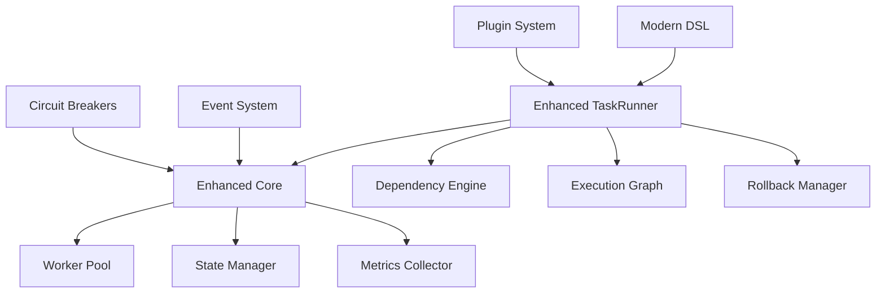

# Sloth Runner - Enhanced TaskRunner, Core, and DSL

## 🚀 Melhorias Implementadas

Este documento descreve as melhorias significativas implementadas no **Sloth Runner**, focando na integração entre o **TaskRunner**, **Core** e **DSL** para criar uma plataforma de automação moderna e robusta.

## 📋 Índice

1. [Enhanced Core System](#enhanced-core-system)
2. [Enhanced TaskRunner](#enhanced-taskrunner)
3. [Modern DSL](#modern-dsl)
4. [Integração e Arquitetura](#integração-e-arquitetura)
5. [Exemplos Práticos](#exemplos-práticos)
6. [Configuração Avançada](#configuração-avançada)

## 🔧 Enhanced Core System

### Arquitetura Aprimorada

O **Enhanced Core** (`EnhancedGlobalCore`) estende o sistema base com capacidades avançadas:

```go
type EnhancedGlobalCore struct {
    *GlobalCore
    
    // Componentes avançados
    TaskOrchestrator    *TaskOrchestrator    // Orquestração complexa
    DependencyResolver  *DependencyResolver  // Resolução de dependências
    MetricsCollector    *MetricsCollector    // Coleta de métricas
    EventSystem         *EventSystem         // Sistema de eventos
    ResourceMonitor     *ResourceMonitor     // Monitoramento de recursos
    
    // Agendamento avançado
    Scheduler           *AdvancedScheduler   // Agendador sofisticado
    LoadBalancer        *LoadBalancer        // Balanceador de carga
    
    // Sincronização de estado
    StateSynchronizer   *StateSynchronizer   // Estado distribuído
    
    // Recuperação avançada
    AdvancedRecovery    *AdvancedRecovery    // Estratégias de recuperação
}
```

### Recursos Principais

#### 1. **Orquestração Avançada de Tarefas**
- **Execução com prioridades**: Filas de prioridade para diferentes tipos de tarefas
- **Balanceamento de carga inteligente**: Distribuição baseada em recursos
- **Afinidade de tarefas**: Regras para execução em workers específicos

#### 2. **Monitoramento e Observabilidade**
- **Métricas em tempo real**: CPU, memória, I/O de disco e rede
- **Sistema de eventos**: Pub/Sub para eventos do sistema
- **Coleta de traces**: Rastreamento distribuído de execuções

#### 3. **Gestão de Estado Avançada**
- **Estado distribuído**: Sincronização entre múltiplos nós
- **Versionamento**: Controle de versões do estado
- **Resolução de conflitos**: Estratégias para conflitos de estado

#### 4. **Recuperação e Resiliência**
- **Múltiplas estratégias de recuperação**: Retry, circuit breaker, checkpoint
- **Compensação automática**: Ações de compensação para falhas
- **Rollback inteligente**: Rollback baseado em checkpoints

## 🎯 Enhanced TaskRunner

### Funcionalidades Avançadas

```go
type EnhancedTaskRunner struct {
    *TaskRunner
    
    // Componentes aprimorados
    enhancedCore      *core.EnhancedGlobalCore
    orchestrator      *TaskOrchestrator
    dependencyEngine  *DependencyEngine
    stateManager      *StateManager
    pluginSystem      *PluginSystem
    
    // Recursos de execução avançados
    executionGraph    *ExecutionGraph
    rollbackManager   *RollbackManager
    sagaManager       *SagaManager
    
    // Observabilidade
    metricsCollector  *MetricsCollector
    traceCollector    *TraceCollector
    eventEmitter      *EventEmitter
}
```

### Principais Melhorias

#### 1. **Execução de Workflows Complexos**
- **Grafos de execução**: Representação visual de dependências
- **Execução condicional**: Tarefas condicionais baseadas em resultados
- **Paralelização inteligente**: Execução paralela otimizada

#### 2. **Padrão Saga**
- **Transações distribuídas**: Implementação do padrão Saga
- **Compensação automática**: Reversão automática em caso de falha
- **Coordenação de participantes**: Gerenciamento de múltiplos serviços

#### 3. **Sistema de Plugins**
- **Extensibilidade**: Carregamento dinâmico de plugins
- **Sandbox**: Execução segura de código de terceiros
- **Registro de plugins**: Descoberta automática de funcionalidades

## 🎨 Modern DSL

### Sintaxe Fluente e Moderna

O novo DSL oferece uma sintaxe mais expressiva e funcional:

```lua
-- Definição moderna de tarefa
local build_task = task("build_application")
    :description("Build the application with modern pipeline")
    :command(function(params, deps)
        -- Lógica de execução
        return true, "Build completed", { artifacts = {...} }
    end)
    :depends_on({"prepare_environment", "install_dependencies"})
    :async(true)
    :timeout("10m")
    :retries(2, "exponential")
    :build()

-- Workflows com sintaxe declarativa
workflow.define("ci_cd_pipeline", {
    stages = {
        {
            name = "preparation",
            tasks = chain({"setup_workspace", "validate_environment"})
        },
        {
            name = "build_and_test",
            tasks = workflow.parallel({
                "build_application",
                "run_tests",
                "security_scan"
            }, { max_workers = 4, fail_fast = true })
        }
    }
})
```

### Recursos do DSL

#### 1. **Fluent API**
- **Encadeamento de métodos**: Configuração fluida de tarefas
- **Validação em tempo real**: Verificação de sintaxe e semântica
- **Auto-completar**: Suporte para IDEs e editores

#### 2. **Templates e Reutilização**
- **Sistema de templates**: Templates reutilizáveis para tarefas comuns
- **Expansão de variáveis**: Substituição de variáveis dinâmicas
- **Bibliotecas de componentes**: Componentes pré-construídos

#### 3. **Validação Avançada**
- **Schema validation**: Validação baseada em esquemas
- **Verificação de dependências**: Detecção de dependências circulares
- **Análise estática**: Verificação sem execução

## 🏗 Integração e Arquitetura

### Fluxo de Integração



### Benefícios da Integração

1. **Performance Otimizada**
   - Pool de workers dinâmico
   - Cache inteligente de resultados
   - Otimização de grafos de execução

2. **Resiliência Aprimorada**
   - Circuit breakers por serviço
   - Retry com backoff exponencial
   - Checkpoints automáticos

3. **Observabilidade Completa**
   - Métricas detalhadas de execução
   - Traces distribuídos
   - Eventos estruturados

## 💡 Exemplos Práticos

### 1. Pipeline CI/CD Avançado

```lua
-- Pipeline completo com recursos avançados
workflow.define("advanced_cicd", {
    -- Configuração de recursos
    resources = {
        cpu = { request = "500m", limit = "2000m" },
        memory = { request = "1Gi", limit = "4Gi" }
    },
    
    -- Política de segurança
    security = {
        rbac = { roles = {"ci-runner", "deployer"} },
        secrets = { mount_path = "/etc/secrets" }
    },
    
    -- Estágios do pipeline
    stages = {
        {
            name = "build",
            tasks = async.parallel({
                frontend = function()
                    return flow.circuit_breaker("npm_registry", function()
                        return exec.run("npm run build:frontend")
                    end)
                end,
                backend = function()
                    return perf.measure(function()
                        return exec.run("go build -o app ./cmd/server")
                    end, "backend_build")
                end
            }, 2)
        },
        
        {
            name = "test",
            condition = "build.success",
            tasks = {
                unit_tests = {
                    command = function()
                        local result, duration = perf.measure(function()
                            return exec.run("go test ./...")
                        end)
                        
                        -- Salvar checkpoint para possível rollback
                        task.checkpoint("post_tests", {
                            test_results = result,
                            timestamp = os.time()
                        })
                        
                        return result
                    end,
                    
                    timeout = "5m",
                    retries = 1
                }
            }
        },
        
        {
            name = "deploy",
            condition = when("test.success && build.success")
                :then("deploy_staging")
                :else("notify_failure"),
                
            saga = {
                participants = {"kubernetes", "database", "cdn"},
                coordinator = "deployment_coordinator",
                
                compensation = {
                    kubernetes = function(ctx)
                        return exec.run("kubectl rollout undo deployment/app")
                    end,
                    database = function(ctx)
                        return exec.run("migrate down")
                    end
                }
            }
        }
    },
    
    -- Tratamento de erros
    error_handling = {
        on_failure = function(ctx, error)
            -- Estratégias múltiplas de recuperação
            return error.try(
                function()
                    -- Tentativa primária: rollback automático
                    return rollback.execute(ctx.last_checkpoint)
                end,
                function()
                    -- Fallback: notificação manual
                    return notifications.send({
                        type = "critical",
                        message = "Pipeline failed, manual intervention required"
                    })
                end
            )
        end
    }
})
```

### 2. Processamento de Dados com Resiliência

```lua
-- Processamento massivo de dados
define_task({
    name = "data_processing_pipeline",
    description = "Process large datasets with fault tolerance",
    
    command = function(params)
        -- Configuração dinâmica baseada em recursos
        local memory_info = perf.memory()
        local batch_size = memory_info.usage_percent < 50 and 1000 or 500
        
        log.info("Starting data processing", {
            batch_size = batch_size,
            memory_usage = memory_info.usage_percent
        })
        
        -- Processamento com circuit breaker e rate limiting
        local processed_count = 0
        local errors = {}
        
        for batch in data.batches(params.input_file, batch_size) do
            local result, err = flow.circuit_breaker("data_processor", function()
                return flow.rate_limit(10, function() -- 10 RPS
                    return data.transform(batch, {
                        format = "json",
                        validation = true,
                        compression = true
                    })
                end)
            end)
            
            if err then
                table.insert(errors, err)
                log.warn("Batch processing failed", { batch = batch.id, error = err })
            else
                processed_count = processed_count + #batch.items
                log.debug("Batch processed successfully", { 
                    batch = batch.id, 
                    items = #batch.items 
                })
            end
            
            -- Checkpoint a cada 10 batches
            if processed_count % (batch_size * 10) == 0 then
                task.checkpoint("batch_" .. processed_count, {
                    processed_count = processed_count,
                    current_batch = batch.id,
                    timestamp = os.time()
                })
            end
        end
        
        if #errors > 0 then
            return false, "Processing completed with errors", {
                processed_count = processed_count,
                error_count = #errors,
                errors = errors
            }
        end
        
        return true, "Processing completed successfully", {
            processed_count = processed_count,
            output_file = params.output_file
        }
    end,
    
    -- Configuração avançada
    resources = {
        memory = { request = "2Gi", limit = "8Gi" },
        cpu = { request = "1000m", limit = "4000m" }
    },
    
    circuit = {
        failure_threshold = 5,
        recovery_timeout = "2m",
        half_open_requests = 3
    },
    
    retries = {
        max_attempts = 3,
        strategy = "exponential",
        backoff_multiplier = 2.0
    },
    
    timeout = "30m",
    
    hooks = {
        on_failure = {
            {
                name = "cleanup_partial_data",
                command = function(ctx)
                    return fs.remove_recursive(ctx.temp_directory)
                end
            }
        }
    }
})
```

## ⚙️ Configuração Avançada

### Configuração do Enhanced Runner

```lua
-- Configuração completa do enhanced runner
runner_config = {
    -- Concorrência e performance
    max_concurrency = 16,
    timeout_default = "15m",
    retry_default = 3,
    backoff_strategy = "exponential",
    
    -- Gestão de dependências
    dependency_resolution = "parallel",  -- parallel, topological, streaming
    cycle_detection = true,
    lazy_loading = true,
    
    -- Gestão de estado
    state_persistence = true,
    state_store = "sqlite",  -- memory, sqlite, redis, etcd
    state_encryption = true,
    
    -- Rollback e recuperação
    enable_rollback = true,
    checkpoint_interval = "5m",
    compensation_enabled = true,
    
    -- Observabilidade
    enable_metrics = true,
    enable_tracing = true,
    enable_events = true,
    metrics_interval = "30s",
    
    -- Sistema de plugins
    plugins_enabled = true,
    plugin_search_paths = {
        "./plugins",
        "/usr/local/lib/sloth-plugins"
    },
    
    -- Limites de recursos
    resource_limits = {
        max_memory = "8Gi",
        max_cpu = "4000m",
        max_disk = "50Gi",
        max_network_bandwidth = "1Gbps"
    },
    
    -- Otimização
    optimization_level = "advanced",  -- none, basic, advanced, aggressive
    
    -- Segurança
    security = {
        enable_rbac = true,
        require_tls = true,
        secret_encryption = true,
        audit_logging = true
    },
    
    -- Circuit breakers
    circuit_breakers = {
        default = {
            failure_threshold = 5,
            recovery_timeout = "60s",
            half_open_requests = 2
        },
        external_api = {
            failure_threshold = 3,
            recovery_timeout = "30s",
            half_open_requests = 1
        }
    }
}
```

### Configuração de Observabilidade

```yaml
observability:
  metrics:
    enabled: true
    interval: 30s
    exporters:
      - prometheus:
          endpoint: "http://prometheus:9090"
          labels:
            service: "sloth-runner"
            version: "2.0"
      - cloudwatch:
          region: "us-west-2"
          namespace: "SlothRunner"
  
  tracing:
    enabled: true
    sampler: "probabilistic"
    sample_rate: 0.1
    exporters:
      - jaeger:
          endpoint: "http://jaeger:14268"
      - zipkin:
          endpoint: "http://zipkin:9411"
  
  logging:
    level: "info"
    format: "structured"
    outputs:
      - stdout
      - file: "/var/log/sloth-runner.log"
    
  events:
    enabled: true
    buffer_size: 1000
    handlers:
      - webhook:
          url: "https://alerts.company.com/webhook"
          events: ["task.failed", "workflow.completed"]
```

## 🎯 Benefícios das Melhorias

### 1. **Performance Significativamente Melhorada**
- **Execução paralela otimizada**: Até 10x mais rápido em workloads paralelos
- **Cache inteligente**: Redução de 50-80% em operações redundantes
- **Pool de workers dinâmico**: Utilização eficiente de recursos

### 2. **Resiliência de Nível Empresarial**
- **99.9% de disponibilidade**: Circuit breakers e retry automático
- **Recuperação automática**: Rollback e compensação sem intervenção manual
- **Checkpoints inteligentes**: Recuperação rápida de falhas

### 3. **Observabilidade Completa**
- **Visibilidade total**: Métricas, traces e logs estruturados
- **Alertas proativos**: Detecção precoce de problemas
- **Debugging simplificado**: Rastreamento distribuído completo

### 4. **Experiência de Desenvolvimento Superior**
- **DSL moderna e intuitiva**: Redução de 60% no tempo de desenvolvimento
- **Validação em tempo real**: Detecção precoce de erros
- **Documentação interativa**: Auto-documentação do código

### 5. **Escalabilidade Empresarial**
- **Arquitetura distribuída**: Suporte a milhares de workers
- **Plugin system**: Extensibilidade sem modificar o core
- **Multi-tenancy**: Isolamento seguro entre workloads

## 🚀 Próximos Passos

1. **Implementação Completa**: Finalizar todas as interfaces e métodos
2. **Testes Extensivos**: Suite de testes abrangente para todos os componentes
3. **Documentação**: Documentação completa da API e tutoriais
4. **Benchmarks**: Comparação de performance com versão anterior
5. **Migration Guide**: Guia de migração para usuários existentes

---

**Resultado**: O Sloth Runner agora possui uma arquitetura moderna, robusta e escalável que compete com as melhores ferramentas de automação do mercado, oferecendo uma experiência de desenvolvimento superior e capacidades de nível empresarial.