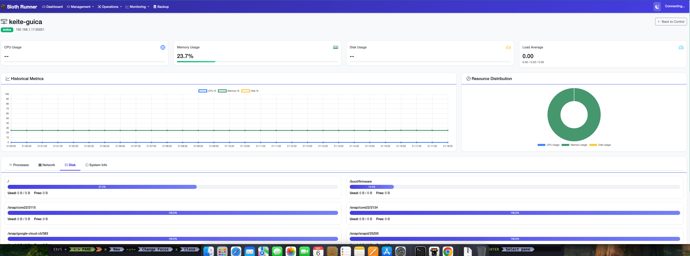
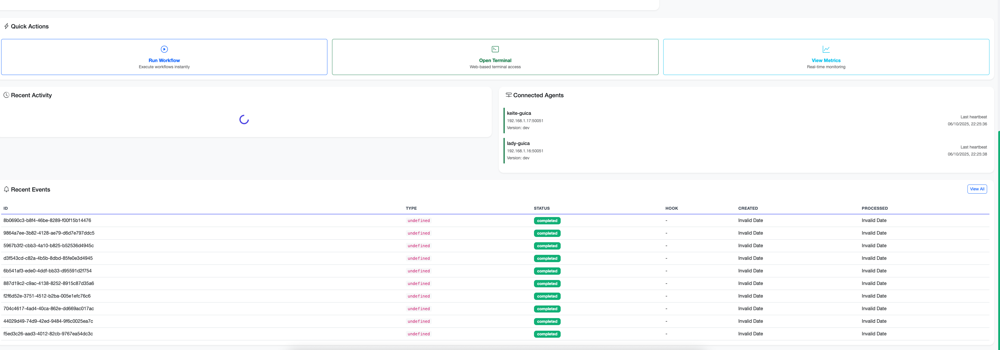
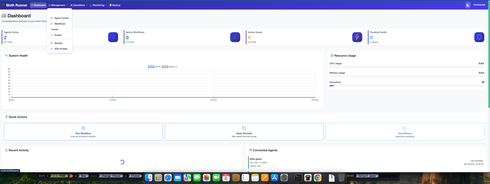
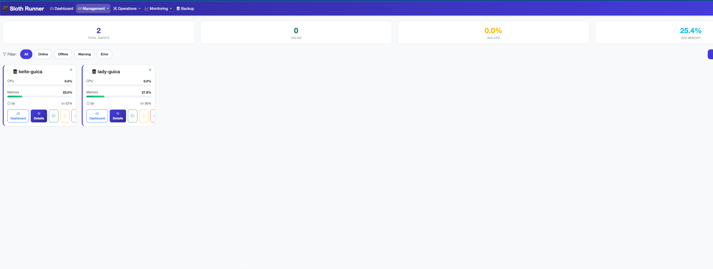
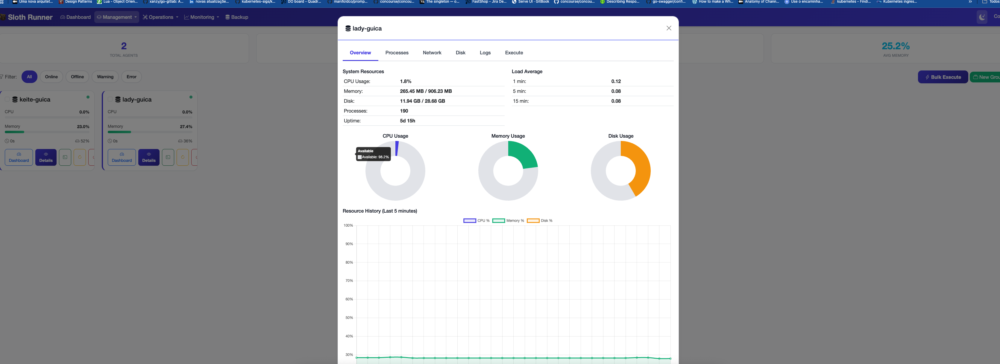
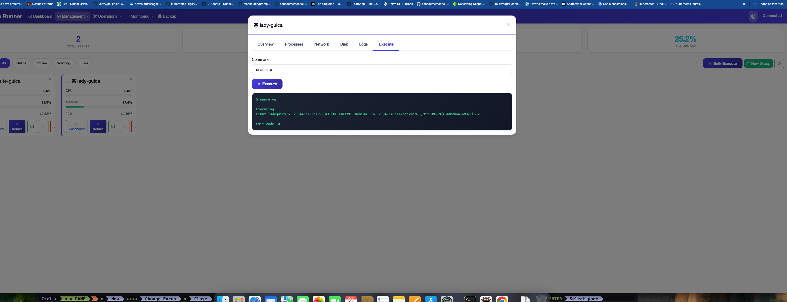

# 🎨 Sloth Runner Web UI - Complete Guide

Uma interface web moderna e completa para gerenciar e monitorar o Sloth Runner em tempo real.

## 📸 Screenshots

### Dashboard - Real-time Metrics

*Dashboard principal com métricas do sistema em tempo real*

### Agent Dashboard - Detailed Monitoring

*Monitoramento detalhado de agentes com filtros e estatísticas*

### Agent Control Center

*Centro de controle com ações em massa e operações bulk*

### Stack Management

*Gerenciamento completo de stacks e variáveis de ambiente*

### Agent Details - Complete Information

*Detalhes completos do agente com 6 tabs (Overview, Processes, Network, Disk, Logs, Execute)*

### Live Metrics Charts

*Gráficos de métricas atualizados em tempo real via WebSocket*

---

## 📋 Índice

- [Screenshots](#screenshots)
- [Visão Geral](#visão-geral)
- [Iniciando](#iniciando)
- [Páginas da Interface](#páginas-da-interface)
- [Funcionalidades Principais](#funcionalidades-principais)
- [API REST](#api-rest)
- [WebSocket Real-time](#websocket-real-time)
- [Arquitetura](#arquitetura)
- [Desenvolvimento](#desenvolvimento)

## 🌟 Visão Geral

A Web UI do Sloth Runner oferece uma interface moderna e responsiva para gerenciar todo o ecossistema de automação:

### ✨ Características Principais

- **🎯 Dashboard em Tempo Real** - Métricas do sistema atualizadas automaticamente
- **🖥️ Gerenciamento de Agentes** - Controle completo dos agentes distribuídos
- **📊 Monitoramento de Sistema** - CPU, memória, disco e rede em tempo real
- **📦 Gerenciamento de Stacks** - CRUD completo para ambientes e configurações
- **📋 Workflows (Sloths)** - Gestão de workflows com estatísticas de execução
- **⚡ Hooks & Eventos** - Sistema de automação baseado em eventos
- **🔐 Secrets & SSH** - Gestão segura de credenciais e perfis de conexão
- **🎨 Tema Sloth** - Interface moderna com paleta de cores temática

## 🚀 Iniciando

### Instalação

A Web UI vem integrada com o binário principal do Sloth Runner. Nenhuma instalação adicional é necessária.

### Iniciar o Servidor UI

```bash
# Porta padrão (8080)
sloth-runner ui

# Porta personalizada
sloth-runner ui --port 3000

# Com bind address específico
sloth-runner ui --bind-address 0.0.0.0 --port 8080

# Modo debug com logs detalhados
sloth-runner ui --debug

# Com autenticação (futuro)
sloth-runner ui --auth --username admin --password secure123
```

### Acessar a Interface

Abra seu navegador em: **http://localhost:8080**

## 📄 Páginas da Interface

### 1. 🎯 Dashboard (Home)

**URL:** `http://localhost:8080/`

Página principal com visão geral completa do sistema.

#### Estatísticas Principais

- **Total de Agentes** - Número de agentes registrados
- **Agentes Online** - Agentes ativos no momento
- **Total de Workflows** - Workflows cadastrados no sistema
- **Workflows Ativos** - Workflows habilitados
- **Total de Hooks** - Hooks de eventos configurados
- **Hooks Habilitados** - Hooks ativos
- **Eventos Pendentes** - Eventos na fila de processamento
- **Eventos Hoje** - Eventos processados nas últimas 24h

#### Gráficos de Sistema (Tempo Real)

- **CPU Usage** - Uso de CPU do servidor master
- **Memory Usage** - Consumo de memória RAM
- **Disk Usage** - Espaço em disco utilizado
- **Network I/O** - Tráfego de rede (bytes sent/received)

Todos os gráficos são atualizados automaticamente via WebSocket a cada 5 segundos.

#### Feed de Atividades

Mostra as últimas ações do sistema:
- Registro/desregistro de agentes
- Execuções de workflows
- Ativação/desativação de hooks
- Eventos disparados

#### Tabela de Eventos Recentes

Lista os últimos 10 eventos processados com:
- ID do evento
- Tipo de evento
- Status (pending, processing, completed, failed)
- Timestamp
- Ação rápida para visualizar detalhes

### 2. 🖥️ Agent Dashboard

**URL:** `http://localhost:8080/agent-dashboard`

Dashboard avançado para monitoramento detalhado de agentes.

#### Overview Cards

- **Total Agents** - Contagem total
- **Online** - Agentes conectados
- **Average CPU** - Uso médio de CPU
- **Average Memory** - Uso médio de memória

#### Sistema de Filtros

- **All Agents** - Mostrar todos
- **Online** - Somente online
- **Offline** - Somente offline
- **Warning** - Agentes com alertas (>80% recursos)
- **Error** - Agentes com problemas

#### Agent Cards

Cada agente exibe:
- **Status Indicator** - Bolinha verde/vermelha pulsante
- **Nome do Agente** - Identificador único
- **Endereço** - IP:Port
- **Last Heartbeat** - Tempo desde último heartbeat
- **CPU Gauge** - Barra de progresso com uso de CPU
- **Memory Gauge** - Barra de progresso com uso de memória
- **Uptime** - Tempo desde inicialização
- **Botões de Ação:**
  - 📊 **Details** - Visualizar detalhes completos
  - 🔄 **Restart** - Reiniciar agente
  - ❌ **Remove** - Remover agente

#### Agent Details Modal

Modal com 6 tabs para análise detalhada:

**1. Overview Tab**
- Informações gerais do agente
- Estatísticas de sistema
- Histórico de heartbeats

**2. Processes Tab**
```javascript
// Lista processos em execução
- PID
- Nome do processo
- % CPU
- % Memory
- Command
```

**3. Network Tab**
```javascript
// Estatísticas de rede
- Interface
- Bytes Sent/Received
- Packets Sent/Received
- Errors/Drops
```

**4. Disk Tab**
```javascript
// Informações de disco
- Mounted Path
- Total Space
- Used Space
- Free Space
- Usage %
```

**5. Logs Tab**
```javascript
// Stream de logs em tempo real via SSE
- Timestamp
- Log Level (INFO, WARN, ERROR, DEBUG)
- Message
- Auto-scroll para novos logs
```

**6. Execute Tab**
```bash
# Executar comandos remotamente
Command: systemctl status nginx
[Execute Button]
# Output aparece em console formatado
```

### 3. 🎛️ Agent Control Center

**URL:** `http://localhost:8080/agent-control`

Centro de controle avançado para operações em massa.

#### Funcionalidades

**Seleção em Massa**
- Checkbox em cada agente
- Bulk Action Bar aparece ao selecionar

**Ações em Massa:**
- ⚡ **Execute Command** - Executar comando em múltiplos agentes
- 📁 **Add to Group** - Adicionar a um grupo
- 🔄 **Restart** - Reiniciar agentes selecionados
- ❌ **Clear** - Limpar seleção

**Comandos em Bulk**
```bash
# Modal permite executar em todos selecionados
Command: apt update && apt upgrade -y
☑ Execute in parallel
[Execute]
```

**Criar Grupos**
```javascript
// Agrupar agentes para gestão
Group Name: production-servers
Description: Production web servers
[Create Group]
```

### 4. 📦 Stack Management

**URL:** `http://localhost:8080/stacks`

Gerenciamento completo de stacks (ambientes).

#### Estatísticas

- **Total Stacks** - Total de stacks criados
- **Active** - Stacks ativos
- **Total Variables** - Variáveis configuradas
- **Total Secrets** - Secrets armazenados

#### Stack Cards

Cada stack exibe:
- **Nome da Stack**
- **Descrição**
- **Environment Type** (production, staging, development)
- **Status Badge** (Active/Inactive)
- **Variáveis Count**
- **Secrets Count**
- **Última Execução**
- **Botões:**
  - 👁️ **View** - Visualizar detalhes
  - ✏️ **Edit** - Editar configuração
  - ❌ **Delete** - Remover stack

#### Criar Nova Stack

```yaml
Stack Name: production
Description: Production environment
Environment Type: production
☑ Active
[Create Stack]
```

#### Gerenciar Variáveis

```bash
# Adicionar variável à stack
Stack: production
Key: DATABASE_URL
Value: postgres://...
[Add Variable]

# Variáveis aparecem na lista
DATABASE_URL = postgres://...  [Delete]
API_KEY = xxxxxx              [Delete]
```

### 5. 📋 Workflows (Sloths)

**URL:** `http://localhost:8080/sloths`

Gestão de workflows .sloth files.

#### Funcionalidades

- **Lista de Workflows** - Todos workflows registrados
- **Busca e Filtro** - Filtrar por nome ou status
- **Estatísticas:**
  - Total de execuções
  - Taxa de sucesso
  - Última execução
  - Tempo médio

**Ações por Workflow:**
- ▶️ **Run** - Executar workflow
- 👁️ **View** - Ver detalhes
- ✏️ **Edit** - Editar código
- 📊 **Stats** - Estatísticas detalhadas
- 🔄 **Activate/Deactivate** - Alterar status
- ❌ **Delete** - Remover

### 6. ⚡ Hooks & Events

**URL:** `http://localhost:8080/hooks`

Sistema de automação baseado em eventos.

#### Hooks Management

**Lista de Hooks:**
```javascript
{
  name: "slack-notify-failures",
  event_type: "task.failed",
  stack: "production",
  enabled: true,
  executions: 45,
  success_rate: 98.2%
}
```

**Ações:**
- ✅ **Enable/Disable** - Alternar status
- 📊 **History** - Ver execuções
- ✏️ **Edit** - Editar código Lua
- ❌ **Delete** - Remover hook

#### Event Queue

**Eventos em Tempo Real:**
- ID único
- Tipo de evento
- Status (pending, processing, completed, failed)
- Timestamp
- Dados do evento

**Ações:**
- 🔄 **Retry** - Reprocessar evento falho
- 👁️ **View** - Detalhes completos
- 📋 **Copy** - Copiar payload

### 7. 🔐 Secrets Management

**URL:** `http://localhost:8080/secrets`

Gestão segura de credenciais (view-only na UI).

#### Funcionalidades

**Listar Secrets:**
- Mostra apenas NOMES (não valores)
- Organizado por stack
- Última atualização
- Usado por (workflows que usam)

**Comandos CLI Integrados:**
```bash
# Adicionar secret
sloth-runner secret add production DB_PASSWORD mysecret

# Listar secrets
sloth-runner secret list production

# Remover secret
sloth-runner secret remove production DB_PASSWORD
```

**⚠️ Segurança:** Valores de secrets NÃO são exibidos na UI por segurança.

### 8. 🔌 SSH Profiles

**URL:** `http://localhost:8080/ssh`

Gerenciamento de perfis SSH para conexões remotas.

#### Funcionalidades

**Profile Cards:**
```yaml
Name: production-server
Host: 192.168.1.100
User: deploy
Port: 22
Auth Type: key
Last Used: 2 hours ago
Connection Count: 145
```

**Ações:**
- ✏️ **Edit** - Atualizar configurações
- 🧪 **Test** - Testar conexão
- 📊 **Audit** - Ver logs de uso
- ❌ **Delete** - Remover perfil

**Criar Novo Perfil:**
```yaml
Name: staging-server
Host: staging.example.com
Port: 22
Username: admin
Auth Type: [Key / Password]
Private Key Path: ~/.ssh/id_rsa
[Save Profile]
```

**Audit Log:**
```
2025-01-06 14:30:15 - Connection established
2025-01-06 14:30:18 - Command executed: systemctl status nginx
2025-01-06 14:30:25 - File uploaded: app.tar.gz
2025-01-06 14:30:30 - Connection closed
```

## 🔌 API REST

A Web UI é construída sobre uma API REST completa.

### Base URL

```
http://localhost:8080/api/v1
```

### Endpoints

#### Dashboard

```bash
GET /api/v1/dashboard
# Retorna estatísticas gerais do sistema
```

#### Agents

```bash
GET    /api/v1/agents              # Listar todos agentes
GET    /api/v1/agents/:name        # Detalhes de um agente
DELETE /api/v1/agents/:name        # Remover agente
GET    /api/v1/agents/:name/metrics # Métricas em tempo real
GET    /api/v1/agents/:name/processes # Processos do agente
GET    /api/v1/agents/:name/network   # Estatísticas de rede
GET    /api/v1/agents/:name/disk      # Informações de disco
GET    /api/v1/agents/:name/logs/stream # SSE stream de logs
POST   /api/v1/agents/:name/exec   # Executar comando remoto
POST   /api/v1/agents/:name/restart # Reiniciar agente
```

#### Stacks

```bash
GET    /api/v1/stacks              # Listar stacks
GET    /api/v1/stacks/:name        # Detalhes da stack
POST   /api/v1/stacks              # Criar stack
PUT    /api/v1/stacks/:name        # Atualizar stack
DELETE /api/v1/stacks/:name        # Deletar stack
POST   /api/v1/stacks/:name/variables      # Adicionar variável
DELETE /api/v1/stacks/:name/variables/:key # Remover variável
```

#### Workflows (Sloths)

```bash
GET    /api/v1/sloths              # Listar workflows
GET    /api/v1/sloths/:name        # Detalhes do workflow
POST   /api/v1/sloths              # Criar workflow
PUT    /api/v1/sloths/:name        # Atualizar workflow
DELETE /api/v1/sloths/:name        # Deletar workflow
POST   /api/v1/sloths/:name/activate   # Ativar
POST   /api/v1/sloths/:name/deactivate # Desativar
POST   /api/v1/sloths/:name/run    # Executar (futuro)
```

#### Hooks

```bash
GET    /api/v1/hooks               # Listar hooks
GET    /api/v1/hooks/:id           # Detalhes do hook
POST   /api/v1/hooks               # Criar hook
PUT    /api/v1/hooks/:id           # Atualizar hook
DELETE /api/v1/hooks/:id           # Deletar hook
POST   /api/v1/hooks/:id/enable    # Habilitar
POST   /api/v1/hooks/:id/disable   # Desabilitar
GET    /api/v1/hooks/:id/history   # Histórico execuções
```

#### Events

```bash
GET    /api/v1/events              # Listar eventos
GET    /api/v1/events/pending      # Eventos pendentes
GET    /api/v1/events/:id          # Detalhes do evento
POST   /api/v1/events/:id/retry    # Reprocessar evento
```

#### System Metrics

```bash
GET    /api/v1/metrics             # Métricas do master server
GET    /api/v1/metrics/history     # Histórico (futuro)
```

### Exemplo de Resposta

```json
{
  "agents": [
    {
      "name": "agent-01",
      "address": "192.168.1.16:50051",
      "status": "active",
      "last_heartbeat": "2025-01-06T14:30:25Z",
      "cpu_usage": 25.5,
      "memory_usage": 42.3,
      "uptime": 86400
    }
  ],
  "total": 1
}
```

## 🔄 WebSocket Real-time

A UI usa WebSocket para atualizações em tempo real.

### Conexão

```javascript
const ws = new WebSocket('ws://localhost:8080/api/v1/ws');

ws.onmessage = (event) => {
  const data = JSON.parse(event.data);
  console.log('Received:', data);
};
```

### Tipos de Mensagens

#### 1. System Metrics

```json
{
  "type": "system_metrics",
  "timestamp": 1704548425,
  "data": {
    "cpu": {
      "usage_percent": 45.2,
      "cores": 8
    },
    "memory": {
      "used": 8589934592,
      "total": 17179869184,
      "used_percent": 50.0
    },
    "disk": {
      "used": 536870912000,
      "total": 1099511627776,
      "used_percent": 48.8
    },
    "network": {
      "bytes_sent": 123456789,
      "bytes_recv": 987654321
    }
  }
}
```

#### 2. Agent Update

```json
{
  "type": "agent_update",
  "timestamp": 1704548425,
  "data": {
    "name": "agent-01",
    "status": "active",
    "cpu_usage": 25.5,
    "memory_usage": 42.3
  }
}
```

#### 3. Event Update

```json
{
  "type": "event_update",
  "timestamp": 1704548425,
  "data": {
    "id": "evt-12345",
    "event_type": "task.completed",
    "status": "completed",
    "data": {...}
  }
}
```

#### 4. Hook Execution

```json
{
  "type": "hook_execution",
  "timestamp": 1704548425,
  "data": {
    "hook_id": 123,
    "hook_name": "slack-notify",
    "success": true,
    "duration_ms": 125
  }
}
```

## 🏗️ Arquitetura

### Stack Tecnológico

#### Backend
- **Framework:** Gin (Go)
- **WebSocket:** gorilla/websocket
- **Database:** SQLite
- **Metrics:** gopsutil (CPU, memory, disk, network)
- **Architecture:** Clean Architecture / Hexagonal

#### Frontend
- **HTML5/CSS3/JavaScript** - Vanilla JS (sem frameworks pesados)
- **Bootstrap 5.3.0** - UI responsiva
- **Bootstrap Icons 1.11.0** - Ícones
- **Chart.js 4.4.0** - Gráficos
- **EventSource API** - Server-Sent Events para logs

### Estrutura de Diretórios

```
internal/webui/
├── server.go                    # Servidor HTTP principal
├── handlers/                    # Request handlers
│   ├── agent.go                # Endpoints de agentes
│   ├── dashboard.go            # Dashboard
│   ├── event.go                # Eventos
│   ├── hook.go                 # Hooks
│   ├── metrics.go              # Métricas de sistema
│   ├── secret.go               # Secrets
│   ├── sloth.go                # Workflows
│   ├── ssh.go                  # SSH profiles
│   ├── stack.go                # Stack management
│   ├── websocket.go            # WebSocket hub
│   └── wrappers.go             # Database wrappers
├── services/                    # Business logic
│   └── agent_client.go         # gRPC client para agentes
├── static/                      # Assets estáticos
│   ├── css/
│   │   ├── main.css            # Estilos principais
│   │   └── sloth-theme.css     # Tema Sloth
│   └── js/
│       ├── navbar.js           # Navigation
│       ├── dashboard.js        # Dashboard logic
│       ├── agent-dashboard.js  # Agent dashboard
│       ├── agent-control.js    # Agent control
│       ├── stacks.js           # Stack management
│       └── websocket.js        # WebSocket client
└── templates/                   # HTML templates
    ├── index.html              # Dashboard
    ├── agent-dashboard.html    # Agent monitoring
    ├── agent-control.html      # Agent control
    ├── stacks.html             # Stack management
    ├── workflows.html          # Workflows
    ├── hooks.html              # Hooks
    ├── events.html             # Events
    ├── secrets.html            # Secrets
    └── ssh.html                # SSH profiles
```

### Databases Utilizadas

```bash
# Agent registry
.sloth-cache/agents.db

# Workflows
/etc/sloth-runner/sloths.db

# Hooks & Events
.sloth-cache/hooks.db
.sloth-cache/events.db

# Stacks
.sloth-cache/stacks.db

# Secrets (encrypted)
~/.sloth-runner/secrets.db

# SSH Profiles
~/.sloth-runner/ssh_profiles.db
```

### Design Patterns

- **Repository Pattern** - Acesso a dados
- **Service Layer** - Lógica de negócio
- **Dependency Injection** - Handlers recebem dependências
- **Observer Pattern** - WebSocket para updates em tempo real
- **Strategy Pattern** - Diferentes tipos de métricas

## 🎨 Tema Sloth

A interface utiliza um tema customizado com paleta de cores dedicada:

```css
:root {
  /* Primary Colors */
  --primary-color: #7C3AED;        /* Roxo vibrante */
  --primary-light: #A78BFA;
  --primary-dark: #5B21B6;

  /* Secondary Colors */
  --secondary-color: #10B981;      /* Verde sucesso */
  --secondary-light: #6EE7B7;
  --secondary-dark: #059669;

  /* Accent Colors */
  --accent-color: #F59E0B;         /* Laranja destaque */
  --accent-hover: #FBBF24;

  /* Status Colors */
  --success-color: #10B981;
  --warning-color: #F59E0B;
  --danger-color: #EF4444;
  --info-color: #3B82F6;

  /* Background */
  --bg-primary: #FFFFFF;
  --bg-secondary: #F9FAFB;
  --bg-tertiary: #F3F4F6;
  --bg-card: #FFFFFF;

  /* Text */
  --text-primary: #111827;
  --text-secondary: #6B7280;
  --text-muted: #9CA3AF;

  /* Borders & Shadows */
  --border-color: #E5E7EB;
  --shadow-sm: 0 1px 2px 0 rgba(0, 0, 0, 0.05);
  --shadow-md: 0 4px 6px -1px rgba(0, 0, 0, 0.1);
  --shadow-lg: 0 10px 15px -3px rgba(0, 0, 0, 0.1);
  --shadow-xl: 0 20px 25px -5px rgba(0, 0, 0, 0.1);
}
```

### Componentes Reutilizáveis

**Cards:**
```html
<div class="sloth-card">
  <div class="sloth-card-header">
    <h3>Title</h3>
  </div>
  <div class="sloth-card-body">
    Content
  </div>
</div>
```

**Botões:**
```html
<button class="btn-sloth-primary">Primary Action</button>
<button class="btn-sloth-secondary">Secondary</button>
<button class="btn-sloth-danger">Delete</button>
```

**Badges:**
```html
<span class="badge-sloth-success">Active</span>
<span class="badge-sloth-warning">Pending</span>
<span class="badge-sloth-danger">Failed</span>
```

## 🛠️ Desenvolvimento

### Adicionar Nova Página

1. **Criar Template HTML:**
```bash
# internal/webui/templates/my-page.html
<!DOCTYPE html>
<html>
<head>
  <link rel="stylesheet" href="/static/css/sloth-theme.css">
</head>
<body>
  <div id="sloth-navbar"></div>
  <div class="container">
    <!-- Seu conteúdo -->
  </div>
  <script src="/static/js/navbar.js"></script>
  <script src="/static/js/my-page.js"></script>
</body>
</html>
```

2. **Criar Handler:**
```go
// internal/webui/handlers/my_feature.go
package handlers

type MyFeatureHandler struct {
    db *sql.DB
}

func (h *MyFeatureHandler) GetData(c *gin.Context) {
    // Buscar dados
    c.JSON(http.StatusOK, gin.H{"data": data})
}
```

3. **Registrar Rota:**
```go
// internal/webui/server.go
func (s *Server) setupRoutes() {
    // Template
    s.router.GET("/my-page", func(c *gin.Context) {
        c.HTML(http.StatusOK, "my-page.html", nil)
    })

    // API
    api := s.router.Group("/api/v1")
    api.GET("/my-feature", s.myFeatureHandler.GetData)
}
```

4. **Criar JavaScript:**
```javascript
// internal/webui/static/js/my-page.js
async function loadData() {
    const response = await fetch('/api/v1/my-feature');
    const data = await response.json();
    displayData(data);
}

function displayData(data) {
    // Renderizar dados
}

// Carregar ao iniciar
document.addEventListener('DOMContentLoaded', loadData);
```

### Adicionar Métrica WebSocket

```go
// internal/webui/handlers/metrics.go
func (h *MetricsHandler) collectMetrics() *SystemMetrics {
    metrics := &SystemMetrics{
        // ... métricas existentes

        // Adicionar nova métrica
        MyNewMetric: collectMyMetric(),
    }
    return metrics
}

// Broadcast automático a cada 5 segundos
func (h *MetricsHandler) collectMetricsPeriodically() {
    ticker := time.NewTicker(5 * time.Second)
    for range ticker.C {
        metrics := h.collectMetrics()
        h.wsHub.Broadcast("system_metrics", metrics)
    }
}
```

```javascript
// No frontend
function setupWebSocket() {
    const ws = new WebSocket('ws://localhost:8080/api/v1/ws');

    ws.onmessage = (event) => {
        const msg = JSON.parse(event.data);

        if (msg.type === 'system_metrics') {
            updateMyMetric(msg.data.my_new_metric);
        }
    };
}
```

### Hot Reload para Desenvolvimento

```bash
# Install air para hot reload
go install github.com/cosmtrek/air@latest

# Criar .air.toml
cat > .air.toml <<EOF
[build]
  cmd = "go build -o tmp/sloth-runner ./cmd/sloth-runner"
  bin = "tmp/sloth-runner ui"
  exclude_dir = ["tmp", "vendor"]
  include_ext = ["go", "html", "css", "js"]
EOF

# Executar com hot reload
air
```

## 🔒 Segurança

### Autenticação (Planejado)

```bash
# Habilitar autenticação
sloth-runner ui --auth \
  --username admin \
  --password $(cat /dev/urandom | tr -dc 'a-zA-Z0-9' | fold -w 32 | head -n 1)
```

### HTTPS (Planejado)

```bash
# Com certificados
sloth-runner ui \
  --tls \
  --cert /path/to/cert.pem \
  --key /path/to/key.pem
```

### CORS

CORS está habilitado por padrão para desenvolvimento. Em produção, configure domínios permitidos:

```go
// internal/webui/server.go
config := cors.DefaultConfig()
config.AllowOrigins = []string{"https://sloth.example.com"}
```

### Rate Limiting (Planejado)

```go
// Proteção contra abuse
limiter := rate.NewLimiter(rate.Every(time.Second), 100)
```

## 📊 Performance

### Métricas de Performance

- **Page Load:** < 1s
- **API Response:** < 100ms (média)
- **WebSocket Latency:** < 50ms
- **Chart Update:** 60 FPS
- **Concurrent Users:** 100+ suportados

### Otimizações

1. **Lazy Loading** - Tabs carregam apenas quando clicados
2. **Debouncing** - Filtros têm delay de 300ms
3. **Pagination** - Listas grandes são paginadas
4. **Caching** - Métricas cacheadas por 5s
5. **Compression** - Gzip habilitado

## 🐛 Troubleshooting

### Porta em uso

```bash
# Verificar processo
lsof -i :8080

# Matar processo
kill -9 <PID>

# Ou usar outra porta
sloth-runner ui --port 8081
```

### WebSocket não conecta

```bash
# Verificar firewall
sudo ufw allow 8080/tcp

# Verificar se servidor está rodando
curl http://localhost:8080/api/v1/dashboard
```

### Métricas não atualizam

```bash
# Verificar logs do servidor
sloth-runner ui --debug

# Verificar console do navegador (F12)
# Procurar por erros WebSocket
```

### Agentes não aparecem

```bash
# Verificar banco de dados
sqlite3 .sloth-cache/agents.db "SELECT * FROM agents;"

# Verificar se master está rodando
sloth-runner agent list
```

## 🚀 Roadmap

### Próximas Funcionalidades

- [ ] **Autenticação Multi-usuário** - Login e permissões
- [ ] **Dark Mode** - Tema escuro
- [ ] **Execução de Workflows** - Rodar workflows pela UI
- [ ] **Editor de Código** - Syntax highlighting para .sloth
- [ ] **Logs Centralizados** - Ver logs de todos agentes
- [ ] **Notificações Push** - Alertas em tempo real
- [ ] **Dashboard Customizável** - Widgets arrastáveis
- [ ] **Exportação de Dados** - CSV, JSON, PDF
- [ ] **Mobile App** - App nativo iOS/Android
- [ ] **Multi-idioma** - i18n support
- [ ] **Grafana Integration** - Dashboards externos
- [ ] **Prometheus Metrics** - Métricas exportadas

### Melhorias de UI/UX

- [ ] **Keyboard Shortcuts** - Atalhos de teclado
- [ ] **Search Global** - Busca em toda interface
- [ ] **Command Palette** - Cmd+K para ações rápidas
- [ ] **Drag & Drop** - Upload de workflows
- [ ] **Copy to Clipboard** - Botões de copiar
- [ ] **Tooltips Avançados** - Mais informações ao hover
- [ ] **Animated Transitions** - Animações suaves

## 📚 Recursos Adicionais

- [API Reference](./API.md)
- [WebSocket Protocol](./WEBSOCKET.md)
- [Theme Customization](./THEME.md)
- [Contributing Guide](../CONTRIBUTING.md)

## 💬 Suporte

- 📖 [Documentação Completa](https://github.com/chalkan3-sloth/sloth-runner/docs)
- 🐛 [Report Issues](https://github.com/chalkan3-sloth/sloth-runner/issues)
- 💡 [Feature Requests](https://github.com/chalkan3-sloth/sloth-runner/discussions)
- 📧 [Email](mailto:support@sloth-runner.dev)

---

**🦥 Sloth Runner Web UI** - Monitoramento e gestão simplificados para sua infraestrutura de automação.
