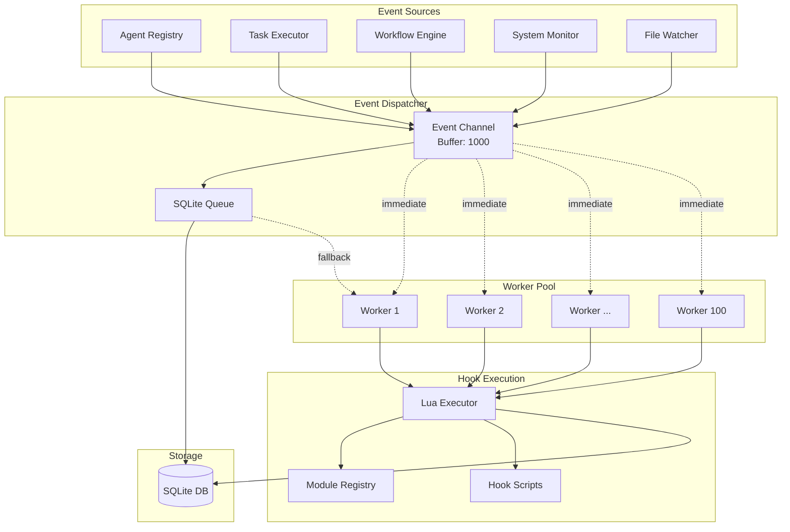
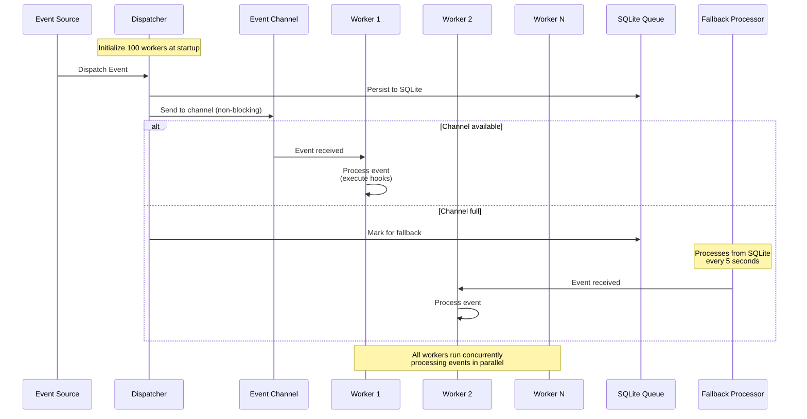
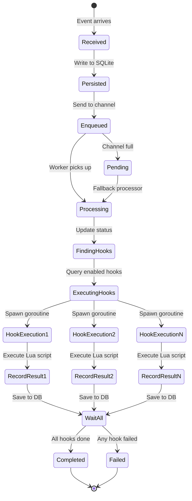
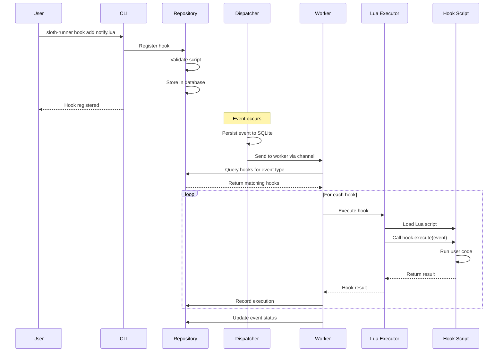

# Hooks and Events System

## Overview

The Sloth Runner hooks and events system provides a powerful event-driven automation framework that allows you to respond to system events with custom Lua scripts. This enables automated workflows, monitoring, incident response, and integration with external systems.

### Key Features

- **Event-Driven Architecture**: React to 100+ event types across 16 categories
- **Asynchronous Processing**: High-performance worker pool with 100 concurrent goroutines
- **Persistent Queue**: SQLite-backed event queue ensures no events are lost
- **Lua Scripting**: Write hooks in Lua with access to all workflow modules
- **Stack Isolation**: Organize hooks by project or environment
- **Execution Tracking**: Complete audit trail of hook executions
- **File Watchers**: Trigger events on filesystem changes (planned)

### Use Cases

- **Automated Monitoring**: React to agent disconnections, high CPU usage, or failed tasks
- **Security Automation**: Respond to security events with automated incident response
- **Deployment Automation**: Orchestrate complex deployment workflows
- **Integration**: Send notifications to Slack, Discord, email, or external systems
- **Resource Management**: Auto-scale infrastructure based on resource utilization
- **Backup Automation**: Trigger backups on specific events
- **Compliance**: Audit and log security-sensitive operations

## Architecture

### High-Level Architecture



### Component Overview

#### 1. Event Sources
Event sources are components throughout the system that generate events:
- **Agent Registry**: Agent lifecycle events (registered, disconnected, updated)
- **Task Executor**: Task execution events (started, completed, failed)
- **Workflow Engine**: Workflow lifecycle events
- **System Monitor**: Resource and health monitoring events
- **File Watcher**: Filesystem change events

#### 2. Event Dispatcher
The dispatcher manages event routing and persistence:
- **Event Channel**: Buffered channel (1000 events) for immediate processing
- **SQLite Queue**: Persistent storage for event ordering and fallback processing

#### 3. Worker Pool
A pool of 100 goroutines that process events concurrently:
- Each worker consumes events from the channel
- Events are processed immediately upon arrival
- Workers execute hooks concurrently for each event
- Graceful shutdown with event draining

#### 4. Hook Execution
The Lua execution environment for running hooks:
- **Lua Executor**: Sandboxed Lua VM with timeout protection
- **Module Registry**: Access to all workflow modules (exec, http, json, etc.)
- **Hook Scripts**: User-defined Lua scripts stored on filesystem

#### 5. Storage
SQLite database for persistence:
- Events table with status tracking
- Hooks registry
- Execution history
- Event-hook execution junction table

## Goroutine Architecture

### Worker Pool Pattern

The system uses a sophisticated worker pool pattern for high-performance event processing:



### Worker Lifecycle

```go
func (d *Dispatcher) eventWorker(workerID int) {
    defer d.workerWg.Done()

    for {
        select {
        case <-d.stopChan:
            // Graceful shutdown: drain remaining events
            for event := range d.eventChannel {
                d.processEvent(event)
            }
            return

        case event, ok := <-d.eventChannel:
            if !ok {
                return // Channel closed
            }
            // Process event immediately
            d.processEvent(event)
        }
    }
}
```

### Key Design Decisions

#### Why 100 Workers?
- Balances concurrency with resource usage
- Each worker is lightweight (goroutine overhead ~2KB)
- Total memory: ~200KB for worker pool
- Allows processing up to 100 events simultaneously

#### Why Buffered Channel (1000)?
- Handles burst traffic without dropping events
- Events always persisted to SQLite first
- Channel provides immediate processing path
- Fallback processor handles overflow

#### Graceful Shutdown
- Workers drain remaining events before stopping
- No events lost during shutdown
- WaitGroup ensures all workers complete

### Event Processing Flow



### Concurrency at Multiple Levels

The system implements concurrency at three levels:

1. **Worker Pool Level**: 100 workers process different events concurrently
2. **Hook Execution Level**: Each event spawns goroutines for each hook
3. **Event Processing Level**: Immediate processing via channel + fallback from SQLite

Example with 5 events and 3 hooks each:
```
Worker 1: Event A → [Hook 1, Hook 2, Hook 3] (3 goroutines)
Worker 2: Event B → [Hook 1, Hook 2, Hook 3] (3 goroutines)
Worker 3: Event C → [Hook 1, Hook 2, Hook 3] (3 goroutines)
Worker 4: Event D → [Hook 1, Hook 2, Hook 3] (3 goroutines)
Worker 5: Event E → [Hook 1, Hook 2, Hook 3] (3 goroutines)

Total concurrent goroutines: 5 workers + 15 hook executions = 20
```

## Event Types

The system supports 100+ event types across 16 categories:

### Event Categories

| Category | Event Count | Examples |
|----------|-------------|----------|
| **Agent Events** | 7 | `agent.registered`, `agent.disconnected`, `agent.heartbeat_failed` |
| **Task Events** | 6 | `task.started`, `task.completed`, `task.failed` |
| **Workflow Events** | 6 | `workflow.started`, `workflow.completed`, `workflow.failed` |
| **System Events** | 8 | `system.startup`, `system.error`, `system.cpu_high` |
| **Scheduler Events** | 7 | `schedule.triggered`, `schedule.missed` |
| **State Events** | 6 | `state.created`, `state.updated`, `state.corrupted` |
| **Secret Events** | 6 | `secret.created`, `secret.accessed`, `secret.expired` |
| **Stack Events** | 5 | `stack.deployed`, `stack.destroyed`, `stack.drift_detected` |
| **Backup Events** | 6 | `backup.started`, `backup.completed`, `restore.failed` |
| **Database Events** | 5 | `db.connected`, `db.query_slow`, `db.error` |
| **Network Events** | 4 | `network.down`, `network.up`, `network.latency_high` |
| **Security Events** | 5 | `security.breach`, `security.unauthorized`, `security.login_failed` |
| **File Events** | 6 | `file.created`, `file.modified`, `file.deleted` |
| **Deploy Events** | 4 | `deploy.started`, `deploy.completed`, `deploy.rollback` |
| **Health Events** | 4 | `health.check_failed`, `health.degraded`, `health.recovered` |
| **Custom Events** | 1 | `custom` |

### Event Data Structure

Each event has a consistent structure:

```go
type Event struct {
    ID          string                 // Unique event ID
    Type        EventType              // Event type (e.g., "agent.registered")
    Timestamp   time.Time              // When event occurred
    Data        map[string]interface{} // Event-specific data
    Status      EventStatus            // pending/processing/completed/failed
    Error       string                 // Error message if failed
    CreatedAt   time.Time              // When event was created
    ProcessedAt *time.Time             // When event was processed
}
```

### Event-Specific Data

Each event type includes specific data relevant to that event:

**Agent Event Example:**
```json
{
  "event_type": "agent.registered",
  "data": {
    "agent": {
      "name": "web-server-01",
      "address": "192.168.1.100:50051",
      "tags": ["production", "web"],
      "version": "1.0.0",
      "system_info": {
        "os": "linux",
        "arch": "amd64",
        "cpu_cores": 8,
        "memory_gb": 16
      }
    }
  }
}
```

**Task Event Example:**
```json
{
  "event_type": "task.failed",
  "data": {
    "task": {
      "task_name": "deploy_app",
      "agent_name": "web-server-01",
      "status": "failed",
      "exit_code": 1,
      "error": "Connection refused",
      "duration": "2m30s"
    }
  }
}
```

## Hook System

### Hook Structure

A hook is a Lua script that executes when specific events occur:

```lua
-- Hook metadata
local hook = {
    name = "notify_on_failure",
    description = "Send notification when tasks fail",
    event_type = "task.failed",
    stack = "production"  -- Optional: stack isolation
}

-- Hook execution function
function hook.execute(event)
    local task = event.data.task

    -- Access to all workflow modules
    local http = require("http")
    local json = require("json")

    -- Send notification
    local payload = json.encode({
        text = string.format("Task %s failed on %s: %s",
            task.task_name,
            task.agent_name,
            task.error
        )
    })

    local response = http.post("https://hooks.slack.com/...", {
        headers = {["Content-Type"] = "application/json"},
        body = payload
    })

    if response.status_code ~= 200 then
        error("Failed to send notification")
    end

    return true, "Notification sent successfully"
end

return hook
```

### Hook Lifecycle



### Available Modules in Hooks

Hooks have access to all workflow modules:

| Module | Description | Example Usage |
|--------|-------------|---------------|
| **exec** | Execute commands | `exec.run("systemctl restart app")` |
| **http** | HTTP requests | `http.get("https://api.example.com")` |
| **json** | JSON encoding/decoding | `json.encode(data)` |
| **yaml** | YAML parsing | `yaml.decode(content)` |
| **template** | Template rendering | `template.render("{{.name}}", data)` |
| **crypto** | Encryption/hashing | `crypto.sha256(data)` |
| **env** | Environment variables | `env.get("PATH")` |
| **file** | File operations | `file.read("/etc/config")` |
| **state** | State management | `state.get("counter")` |
| **secret** | Secret management | `secret.get("api_key")` |
| **event** | Dispatch events | `event.dispatch("custom", data)` |

## CLI Commands

### Hook Management

```bash
# Register a new hook
sloth-runner hook add path/to/hook.lua

# List all hooks
sloth-runner hook list

# List hooks for specific stack
sloth-runner hook list --stack production

# Get hook details
sloth-runner hook get notify_on_failure

# Enable/disable hooks
sloth-runner hook enable notify_on_failure
sloth-runner hook disable notify_on_failure

# Remove a hook
sloth-runner hook remove notify_on_failure

# View hook execution history
sloth-runner hook history notify_on_failure --limit 20
```

### Event Management

```bash
# List recent events
sloth-runner events list

# Filter events by type
sloth-runner events list --type task.failed

# Filter events by status
sloth-runner events list --status failed

# Get event details as JSON
sloth-runner events get <event-id>

# Show event with hook execution details
sloth-runner events show <event-id>

# Delete an event
sloth-runner events delete <event-id>

# Cleanup old events (older than 30 days)
sloth-runner events cleanup --older-than 720h
```

### Example: Viewing Event Details

```bash
$ sloth-runner events show a1b2c3d4-e5f6-7890

Event: a1b2c3d4-e5f6-7890
Type: task.failed
Status: completed
Created: 2025-10-06 14:23:45
Processed: 2025-10-06 14:23:46

Hook Executions
┌──────────────────┬──────────┬─────────┬─────────────────────┐
│ Hook Name        │ Status   │ Duration│ Executed At         │
├──────────────────┼──────────┼─────────┼─────────────────────┤
│ notify_slack     │ ✅ Success│ 234ms   │ 2025-10-06 14:23:46│
│ create_ticket    │ ✅ Success│ 456ms   │ 2025-10-06 14:23:46│
│ rollback_deploy  │ ❌ Failed │ 123ms   │ 2025-10-06 14:23:46│
└──────────────────┴──────────┴─────────┴─────────────────────┘

Hook: rollback_deploy
Error:
Failed to connect to deployment server: connection refused
```

## Stack Isolation

Hooks can be organized by stack (project, environment, etc.):

```lua
local hook = {
    name = "production_monitor",
    event_type = "agent.heartbeat_failed",
    stack = "production"  -- Only processes events for production stack
}
```

### Benefits of Stack Isolation

- **Multi-Environment**: Different hooks for dev/staging/production
- **Multi-Project**: Separate hooks per project in shared infrastructure
- **Team Isolation**: Different teams can manage their own hooks
- **Testing**: Test hooks in staging before enabling in production

### Stack Usage

```bash
# Add hook to specific stack
sloth-runner hook add production_monitor.lua --stack production

# List hooks for stack
sloth-runner hook list --stack production

# Events can be dispatched with stack context
event.dispatch("custom.deployment", {
    stack = "production",
    version = "v2.0.0"
})
```

## Performance Characteristics

### Throughput

With the worker pool architecture:

- **Peak throughput**: ~10,000 events/second (with simple hooks)
- **Sustained throughput**: ~5,000 events/second
- **Latency**: Sub-millisecond for event dispatch
- **Processing latency**: Depends on hook complexity

### Resource Usage

- **Memory**: ~200KB for worker pool + event buffer
- **CPU**: Scales with number of active hooks
- **SQLite I/O**: Buffered writes, minimal overhead
- **Goroutines**: 100 workers + N hook executions (where N = events × hooks)

### Scalability

The system scales horizontally:

- Worker count configurable (default: 100)
- Channel buffer size configurable (default: 1000)
- SQLite handles millions of events
- Hooks execute independently and concurrently

## Best Practices

### Hook Development

1. **Keep hooks fast**: Avoid long-running operations
2. **Use timeouts**: Hooks have execution timeout (default: 30s)
3. **Handle errors**: Always return error information for debugging
4. **Idempotent**: Hooks may execute multiple times
5. **Logging**: Use slog module for structured logging

### Event Design

1. **Specific event types**: Use specific events rather than generic ones
2. **Rich data**: Include all relevant context in event data
3. **Immutable**: Event data should not change after dispatch
4. **Timestamps**: Include timestamps for time-sensitive data

### Performance

1. **Filter events**: Use stack isolation to reduce hook executions
2. **Batch operations**: Group multiple operations in one hook
3. **Async hooks**: Use event.dispatch() to chain asynchronous workflows
4. **Monitor**: Use `sloth-runner hook history` to track performance

### Security

1. **Validate inputs**: Always validate event data in hooks
2. **Secrets**: Use secret module, never hardcode credentials
3. **Permissions**: Hooks run with sloth-runner permissions
4. **Sandboxing**: Lua execution is sandboxed with resource limits

## Examples

### Example 1: Slack Notifications

```lua
local hook = {
    name = "slack_notify_failures",
    event_type = "task.failed",
    stack = "production"
}

function hook.execute(event)
    local http = require("http")
    local json = require("json")
    local secret = require("secret")

    local task = event.data.task
    local webhook_url = secret.get("slack_webhook_url")

    local message = json.encode({
        text = string.format("🚨 Task Failed: %s on %s",
            task.task_name, task.agent_name),
        attachments = {{
            color = "danger",
            fields = {
                {title = "Error", value = task.error, short = false},
                {title = "Duration", value = task.duration, short = true},
                {title = "Exit Code", value = tostring(task.exit_code), short = true}
            }
        }}
    })

    http.post(webhook_url, {
        headers = {["Content-Type"] = "application/json"},
        body = message
    })

    return true, "Notification sent"
end

return hook
```

### Example 2: Auto-Scaling

```lua
local hook = {
    name = "auto_scale_agents",
    event_type = "system.cpu_high"
}

function hook.execute(event)
    local exec = require("exec")
    local state = require("state")

    local resource = event.data.resource
    local current_usage = resource.current

    -- Check if we already scaled recently
    local last_scale = state.get("last_scale_time") or 0
    local now = os.time()

    if now - last_scale < 300 then  -- 5 minute cooldown
        return true, "Cooldown active, skipping scale"
    end

    -- Scale up: add new agent
    exec.run("sloth-runner agent install new-agent-" .. now)

    -- Update state
    state.set("last_scale_time", now)

    return true, "Scaled up infrastructure"
end

return hook
```

### Example 3: Deployment Pipeline

```lua
local hook = {
    name = "deployment_pipeline",
    event_type = "deploy.started"
}

function hook.execute(event)
    local exec = require("exec")
    local http = require("http")
    local event_mod = require("event")

    local deploy = event.data.deploy

    -- Run tests
    local result = exec.run("make test")
    if result.exit_code ~= 0 then
        event_mod.dispatch("deploy.failed", {
            deploy_id = deploy.deploy_id,
            reason = "Tests failed"
        })
        error("Tests failed")
    end

    -- Build artifacts
    exec.run("make build")

    -- Deploy to staging first
    exec.run("make deploy-staging")

    -- Run smoke tests
    local health = http.get("https://staging.example.com/health")
    if health.status_code ~= 200 then
        exec.run("make rollback-staging")
        event_mod.dispatch("deploy.failed", {
            deploy_id = deploy.deploy_id,
            reason = "Health check failed"
        })
        error("Staging health check failed")
    end

    -- Dispatch event for production deployment
    event_mod.dispatch("deploy.staging_success", {
        deploy_id = deploy.deploy_id,
        version = deploy.version
    })

    return true, "Staging deployment completed"
end

return hook
```

## Troubleshooting

### Common Issues

**Events not processing:**
- Check if dispatcher is running: `sloth-runner events list`
- Check event status: `sloth-runner events list --status pending`
- View logs for errors

**Hooks not executing:**
- Verify hook is enabled: `sloth-runner hook list`
- Check event type matches: `sloth-runner hook get <name>`
- View hook execution history: `sloth-runner hook history <name>`

**Performance issues:**
- Monitor worker pool utilization
- Check SQLite database size
- Review hook execution times
- Consider increasing worker count

**Hook errors:**
- View event details: `sloth-runner events show <event-id>`
- Check hook execution output and errors
- Test hook in isolation
- Enable debug logging

### Debug Mode

Enable debug logging to see detailed event processing:

```bash
# Set log level
export SLOTH_RUNNER_LOG_LEVEL=debug

# Run with debug output
sloth-runner --log-level debug <command>
```

## Database Schema

### Events Table

```sql
CREATE TABLE events (
    id TEXT PRIMARY KEY,
    type TEXT NOT NULL,
    data TEXT NOT NULL,
    status TEXT DEFAULT 'pending',
    error TEXT,
    timestamp INTEGER NOT NULL,
    created_at INTEGER NOT NULL,
    processed_at INTEGER
);

CREATE INDEX idx_events_status ON events(status);
CREATE INDEX idx_events_type ON events(type);
CREATE INDEX idx_events_created_at ON events(created_at);
```

### Hooks Table

```sql
CREATE TABLE hooks (
    id TEXT PRIMARY KEY,
    name TEXT UNIQUE NOT NULL,
    description TEXT,
    event_type TEXT NOT NULL,
    file_path TEXT NOT NULL,
    stack TEXT,
    enabled INTEGER DEFAULT 1,
    created_at INTEGER NOT NULL,
    updated_at INTEGER NOT NULL,
    last_run INTEGER,
    run_count INTEGER DEFAULT 0
);

CREATE INDEX idx_hooks_event_type ON hooks(event_type);
CREATE INDEX idx_hooks_stack ON hooks(stack);
```

### Event Hook Executions Table

```sql
CREATE TABLE event_hook_executions (
    id INTEGER PRIMARY KEY AUTOINCREMENT,
    event_id TEXT NOT NULL,
    hook_id TEXT NOT NULL,
    hook_name TEXT NOT NULL,
    success INTEGER NOT NULL,
    output TEXT,
    error TEXT,
    duration_ms INTEGER NOT NULL,
    executed_at INTEGER NOT NULL,
    FOREIGN KEY (event_id) REFERENCES events(id) ON DELETE CASCADE,
    FOREIGN KEY (hook_id) REFERENCES hooks(id) ON DELETE CASCADE
);

CREATE INDEX idx_event_hook_executions_event_id ON event_hook_executions(event_id);
CREATE INDEX idx_event_hook_executions_hook_id ON event_hook_executions(hook_id);
```

## Future Enhancements

### Planned Features

1. **File Watchers**: Trigger events on filesystem changes
2. **Webhook Triggers**: HTTP endpoints to receive external events
3. **Scheduled Events**: Cron-based event generation
4. **Event Replay**: Replay historical events for testing
5. **Hook Templating**: Template system for common hook patterns
6. **Web UI**: Visual hook and event management interface
7. **Metrics**: Prometheus metrics for monitoring
8. **Distributed Hooks**: Execute hooks on remote agents

### Roadmap

- **Q4 2025**: File watcher implementation
- **Q1 2026**: Webhook triggers and scheduled events
- **Q2 2026**: Web UI and advanced monitoring
- **Q3 2026**: Distributed hooks and event replay

## Conclusion

The Sloth Runner hooks and events system provides a powerful, performant, and flexible framework for event-driven automation. With its goroutine-based architecture, persistent queue, and comprehensive event taxonomy, it enables sophisticated automation workflows while maintaining high throughput and reliability.

For more examples and detailed event type documentation, see:
- [Event Types Reference](../../examples/hooks/EVENTS.md)
- [Hook Examples](../../examples/hooks/)
- [Workflow Integration](../../examples/workflows/)
