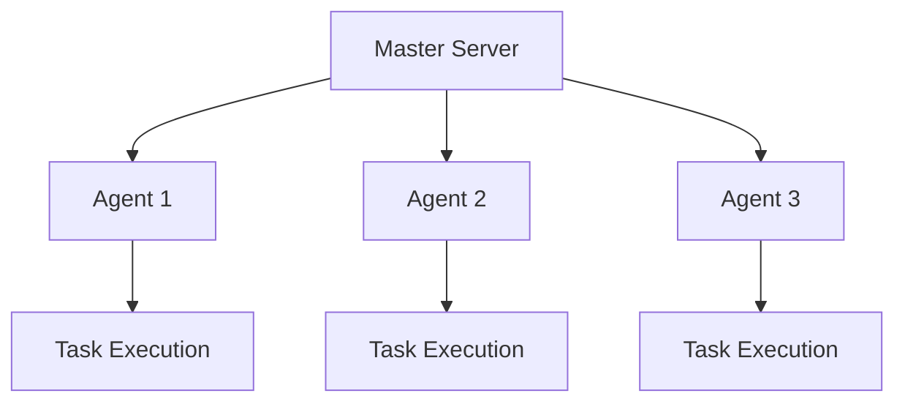

# 🌐 Distributed Agent System

Sloth Runner provides a powerful **distributed execution system** with master-agent architecture, enabling you to scale task execution across multiple machines with enterprise-grade reliability and security.

## 🏗️ Architecture Overview

### Master-Agent Model
The distributed system follows a **master-agent architecture** where:
- **Master server** coordinates task distribution and agent management
- **Agent nodes** execute tasks and report back to master
- **gRPC communication** ensures fast, reliable messaging
- **Automatic failover** provides high availability



## 🚀 Quick Start

### 1. Start Master Server

```bash
# Basic master server
sloth-runner master --port 50053

# Daemon mode with TLS
sloth-runner master --port 50053 --daemon \
  --tls-cert-file /path/to/cert.pem \
  --tls-key-file /path/to/key.pem \
  --tls-ca-file /path/to/ca.pem
```

### 2. Register Agents

```bash
# Start agent and register with master
sloth-runner agent start \
  --name "build-agent-1" \
  --master "localhost:50053" \
  --port 50051

# With custom bind address
sloth-runner agent start \
  --name "deploy-agent-1" \
  --master "master.company.com:50053" \
  --bind-address "192.168.1.100" \
  --port 50052
```

### 3. Execute Tasks Remotely

```bash
# Run command on specific agent
sloth-runner agent run build-agent-1 "docker build -t myapp ."

# List all registered agents
sloth-runner agent list --master localhost:50053

# Stop remote agent
sloth-runner agent stop build-agent-1
```

## 🔒 Security Features

### TLS Encryption
All communication is **optionally encrypted** with mutual TLS authentication:

```bash
# Master with TLS
sloth-runner master \
  --tls-cert-file server.crt \
  --tls-key-file server.key \
  --tls-ca-file ca.crt

# Agent with TLS  
sloth-runner agent start \
  --tls-cert-file client.crt \
  --tls-key-file client.key \
  --tls-ca-file ca.crt
```

### Certificate Management
- **Mutual authentication** with client certificates
- **CA verification** for trusted connections
- **Automatic certificate** rotation support

## 📊 Agent Management

### Registration Process
1. **Agent starts** and connects to master
2. **Registration request** with agent metadata
3. **Heartbeat system** maintains connection
4. **Automatic cleanup** of stale agents

### Health Monitoring
```bash
# Real-time agent status
sloth-runner agent list

# Output:
# AGENT NAME      ADDRESS           STATUS  LAST HEARTBEAT
# build-agent-1   192.168.1.100:50051  Active  2024-01-15T10:30:45Z
# deploy-agent-2  192.168.1.101:50052  Active  2024-01-15T10:30:42Z
```

### Load Balancing
- **Intelligent routing** based on agent capabilities
- **Resource-aware** task distribution
- **Failover handling** for unavailable agents

## 🎯 Use Cases

### CI/CD Pipeline Distribution
```lua
-- Distribute CI/CD tasks across specialized agents
task("build")
  :agent_selector("build-agents")
  :command(function()
    return exec.run("docker build -t app:latest .")
  end)

task("test")
  :agent_selector("test-agents") 
  :depends_on({"build"})
  :command(function()
    return exec.run("pytest tests/")
  end)

task("deploy")
  :agent_selector("deploy-agents")
  :depends_on({"test"})
  :command(function()
    return exec.run("kubectl apply -f k8s/")
  end)
```

### Multi-Environment Deployments
```bash
# Production deployment agents
sloth-runner agent start --name "prod-east-1" --master prod-master:50053
sloth-runner agent start --name "prod-west-1" --master prod-master:50053

# Staging deployment agents  
sloth-runner agent start --name "staging-1" --master staging-master:50053

# Execute deployment on specific environment
sloth-runner agent run prod-east-1 "./deploy.sh production"
```

### Geographically Distributed Tasks
```bash
# Regional agents for global operations
sloth-runner agent start --name "us-east-agent" --master global-master:50053
sloth-runner agent start --name "eu-west-agent" --master global-master:50053
sloth-runner agent start --name "asia-southeast-agent" --master global-master:50053

# Run region-specific tasks
sloth-runner agent run us-east-agent "backup-us-data.sh"
sloth-runner agent run eu-west-agent "backup-eu-data.sh"
```

## 🔧 Advanced Configuration

### Agent Capabilities
Agents can be **tagged with capabilities** for intelligent task routing:

```bash
# GPU-enabled agent for ML workloads
sloth-runner agent start \
  --name "ml-gpu-1" \
  --capabilities "gpu,tensorflow,pytorch"

# High-memory agent for data processing
sloth-runner agent start \
  --name "data-proc-1" \
  --capabilities "high-memory,spark,hadoop"
```

### Custom Workspaces
Agents support **workspace isolation** for task execution:

```lua
task("isolated_build")
  :workspace("/tmp/build-workspace")
  :command(function()
    -- Task runs in isolated workspace
    return exec.run("go build ./...")
  end)
```

## 🐛 Troubleshooting

### Common Issues

#### Agent Connection Problems
```bash
# Check master connectivity
telnet master-server 50053

# Verify TLS certificates
openssl verify -CAfile ca.crt client.crt
```

#### Agent Registration Failures
```bash
# Check agent logs
tail -f agent.log

# Test master registration endpoint
grpcurl -plaintext master-server:50053 list
```

### Debug Mode
```bash
# Enable debug logging
sloth-runner master --debug
sloth-runner agent start --debug
```

## 📈 Performance Optimization

### Connection Pooling
- **Persistent connections** between master and agents
- **Connection multiplexing** for efficiency
- **Automatic reconnection** on network issues

### Task Streaming
- **Real-time streaming** of task output
- **Chunked data transfer** for large outputs  
- **Buffered I/O** for performance

### Resource Management
- **Memory limits** per task execution
- **CPU throttling** support
- **Disk space** monitoring

## 🏢 Enterprise Features

### High Availability
- **Master clustering** for redundancy
- **Agent failover** mechanisms
- **State persistence** across restarts

### Monitoring Integration
```bash
# Prometheus metrics endpoint
curl http://master-server:8080/metrics

# Health check endpoint
curl http://master-server:8080/health
```

### Audit Logging
- **Complete audit trail** of all operations
- **Agent activity** logging
- **Security event** tracking

## 🎯 Best Practices

### Security
1. **Always use TLS** in production environments
2. **Rotate certificates** regularly  
3. **Limit agent access** with firewall rules
4. **Monitor agent activity** continuously

### Performance  
1. **Use agent tags** for task routing optimization
2. **Monitor resource usage** on agents
3. **Implement proper cleanup** of workspaces
4. **Use connection pooling** for high-throughput scenarios

### Reliability
1. **Implement health checks** for agents
2. **Use heartbeat monitoring**
3. **Plan for agent failures** in workflows
4. **Backup agent configurations**

---

The distributed agent system makes Sloth Runner a **truly scalable** solution for enterprise automation needs, enabling teams to execute complex workflows across multiple machines with confidence and reliability! 🚀