# 🏗️ Sloth Runner Architecture

**Complete Technical Architecture Documentation**

---

## 📋 Table of Contents

- [Overview](#overview)
- [High-Level Architecture](#high-level-architecture)
- [Core Components](#core-components)
- [System Architecture Diagrams](#system-architecture-diagrams)
- [Component Details](#component-details)
- [Data Flow](#data-flow)
- [Distributed Execution](#distributed-execution)
- [State Management](#state-management)
- [Security Architecture](#security-architecture)
- [Deployment Architectures](#deployment-architectures)

---

## Overview

Sloth Runner is a **distributed task automation and orchestration platform** built in Go, featuring:

- **Lua-based DSL** for workflow definition
- **Distributed agent architecture** for multi-machine execution
- **Pluggable module system** for extensibility
- **State management** with distributed locking
- **Event-driven hooks** for lifecycle management
- **Built-in scheduler** for cron-like task execution
- **Web UI** for visualization and monitoring

### Key Characteristics

- **Language**: Go (backend), Lua (DSL), TypeScript/React (Web UI)
- **Architecture Style**: Microservices, Master-Agent, Event-Driven
- **Communication**: gRPC (agents), HTTP (API), SSH (legacy)
- **State Storage**: SQLite (local), Bolt (embedded), optional PostgreSQL
- **Configuration**: YAML, TOML, Environment Variables

---

## High-Level Architecture


---

## Core Components

### 1. **CLI (Command Line Interface)**

Entry point for user interactions. Built using Cobra framework.


**Location**: `cmd/sloth-runner/main.go`, `cmd/sloth-runner/commands/`

**Key Commands**:
- `run` - Execute workflows
- `agent` - Manage distributed agents
- `stack` - Manage deployment stacks
- `scheduler` - Schedule recurring tasks
- `state` - Distributed state operations
- `workflow` - Workflow management
- `sysadmin` - System administration tools

### 2. **Master Server**

Central coordinator for distributed execution.

**Responsibilities**:
- Agent registration and health monitoring
- Task distribution and scheduling
- State coordination
- Metrics collection
- Event aggregation

**Location**: `cmd/sloth-runner/agent_registry.go`

**Components**:
- **Agent Registry**: Maintains active agent connections
- **Task Dispatcher**: Distributes tasks to appropriate agents
- **Health Monitor**: Tracks agent health and availability
- **Metrics Aggregator**: Collects performance metrics

### 3. **Workflow Runner**

Executes workflow definitions with dependency resolution.


**Location**: `internal/runner/`, `internal/execution/`

**Key Features**:
- **Dependency Resolution**: Builds execution DAG from task dependencies
- **Parallel Execution**: Runs independent tasks concurrently
- **Retry Logic**: Configurable retry with exponential backoff
- **Timeout Management**: Per-task and workflow-level timeouts
- **Artifact Management**: File sharing between tasks

### 4. **Lua VM Integration**

Embeds Lua for DSL execution and module system.


**Location**: `internal/lua/`, `internal/luamodules/`, `internal/modules/`

**Capabilities**:
- **DSL Parsing**: Converts Lua code to workflow structures
- **Module Loading**: Dynamic module registration
- **Go-Lua Bridge**: Bidirectional function calls
- **Sandboxing**: Restricted execution environment

### 5. **Agent System**

Distributed execution nodes for remote task execution.


**Location**: `internal/agent/`, `cmd/sloth-runner/commands/agent/`

**Features**:
- **Auto-Discovery**: Agents register with master on startup
- **Health Monitoring**: Continuous heartbeat mechanism
- **Task Delegation**: Executes tasks on behalf of master
- **Resource Reporting**: CPU, memory, disk usage
- **Update Mechanism**: Self-update capability

### 6. **State Management**

Distributed state with locking for coordination.

**Location**: `internal/state/`, `cmd/sloth-runner/commands/state/`

**Operations**:
- **Get/Set**: Key-value storage
- **Compare-and-Swap**: Atomic updates
- **Locking**: Distributed lock acquisition
- **TTL Support**: Automatic expiration
- **Namespaces**: Isolated state spaces

**Storage Backends**:
- **SQLite**: Default embedded database
- **BoltDB**: High-performance key-value store
- **PostgreSQL**: Optional for high availability

### 7. **Hook System**

Event-driven lifecycle management.


**Location**: `internal/hooks/`

**Capabilities**:
- **Lifecycle Hooks**: Pre/post execution hooks
- **Conditional Execution**: Run hooks based on conditions
- **Async Execution**: Non-blocking hook execution
- **Error Handling**: Graceful failure handling

### 8. **Module System**

Pluggable modules for extensibility.

**Built-in Modules**:
- `facts` - System discovery
- `file_ops` - File operations
- `exec` - Command execution
- `git` - Git operations
- `docker` - Docker management
- `pkg` - Package management
- `systemd` - Service management
- `infra_test` - Infrastructure testing
- `state` - State operations
- `metrics` - Metrics collection
- `log` - Logging
- `net` - HTTP/networking
- `ai` - AI integration
- `gitops` - GitOps workflows

**Module API**:
```lua
-- Module registration
local mymodule = {}

function mymodule.operation(args)
    -- Go function called via bridge
    return go_bridge.call("mymodule.operation", args)
end

return mymodule
```

---

## System Architecture Diagrams

### Deployment Architecture


### Task Execution Flow

```mermaid
sequenceDiagram
    participant User
    participant CLI
    participant Master
    participant Runner
    participant LuaVM
    participant Agent
    participant Target

    User->>CLI: sloth-runner run workflow.sloth
    CLI->>Master: Load & Parse Workflow
    Master->>Runner: Initialize Workflow
    Runner->>LuaVM: Execute DSL
    LuaVM-->>Runner: Parsed Tasks & DAG

    Runner->>Runner: Build Execution Plan

    loop For Each Task
        Runner->>Master: Check if Delegated
        alt Local Execution
            Runner->>LuaVM: Execute Task
            LuaVM->>Target: Perform Operations
            Target-->>LuaVM: Results
            LuaVM-->>Runner: Task Complete
        else Remote Execution
            Master->>Agent: Delegate Task
            Agent->>LuaVM: Execute Task
            LuaVM->>Target: Perform Operations
            Target-->>LuaVM: Results
            LuaVM-->>Agent: Task Complete
            Agent-->>Master: Task Results
            Master-->>Runner: Results Received
        end

        Runner->>Runner: Update Task Status
        Runner->>Runner: Trigger Dependent Tasks
    end

    Runner-->>CLI: Workflow Complete
    CLI-->>User: Display Results
```



### State Management Architecture


---

## Component Details

### CLI Command Structure

```
sloth-runner
├── run              Execute workflows
├── agent            Manage agents
│   ├── start        Start agent daemon
│   ├── list         List registered agents
│   ├── install      Install agent on remote
│   ├── update       Update agent version
│   ├── metrics      View agent metrics
│   └── modules      Check agent modules
├── workflow         Workflow operations
│   ├── list         List workflows
│   ├── show         Show workflow details
│   └── validate     Validate workflow syntax
├── stack            Stack management
│   ├── list         List stacks
│   ├── show         Show stack details
│   ├── delete       Delete stack
│   └── export       Export stack data
├── scheduler        Task scheduling
│   ├── add          Add scheduled task
│   ├── list         List scheduled tasks
│   ├── delete       Remove scheduled task
│   └── run          Execute scheduled tasks
├── state            State operations
│   ├── get          Get state value
│   ├── set          Set state value
│   ├── delete       Delete state key
│   ├── list         List state keys
│   └── lock         Acquire distributed lock
├── secrets          Secrets management
│   ├── set          Store secret
│   ├── get          Retrieve secret
│   ├── list         List secrets
│   └── delete       Delete secret
├── hook             Hook management
│   ├── list         List registered hooks
│   ├── add          Add hook
│   └── delete       Remove hook
├── events           Event operations
│   ├── list         List events
│   └── clear        Clear event log
├── sysadmin         System administration
│   ├── health       Health checks
│   ├── logs         Log management
│   ├── backup       Backup operations
│   ├── packages     Package management
│   └── services     Service management
├── master           Master server operations
│   └── start        Start master server
├── ui               Web UI
│   └── start        Start web interface
└── version          Show version info
```

### Internal Package Structure

```
internal/
├── agent/           Agent implementation
│   ├── client.go    Agent gRPC client
│   ├── server.go    Agent gRPC server
│   ├── registry.go  Agent registration
│   └── health.go    Health monitoring
├── client/          Master client library
├── config/          Configuration management
├── core/            Core functionality
│   ├── workflow.go  Workflow structures
│   ├── task.go      Task structures
│   └── types.go     Common types
├── execution/       Execution engine
│   ├── executor.go  Task executor
│   ├── dag.go       DAG builder
│   └── parallel.go  Parallel execution
├── hooks/           Hook system
│   ├── dispatcher.go Event dispatcher
│   ├── executor.go   Hook executor
│   └── types.go      Hook types
├── lua/             Lua VM integration
│   ├── state.go     Lua state management
│   ├── bridge.go    Go-Lua bridge
│   └── sandbox.go   Sandboxing
├── luamodules/      Lua module implementations
│   ├── facts/       System facts module
│   ├── fileops/     File operations module
│   ├── exec/        Execution module
│   └── ...          Other modules
├── masterdb/        Master database
│   ├── agent_db.go  Agent persistence
│   └── stack_db.go  Stack persistence
├── metrics/         Metrics collection
│   ├── collector.go Metrics collector
│   └── exporter.go  Prometheus exporter
├── modules/         Module system
│   ├── loader.go    Module loader
│   └── registry.go  Module registry
├── runner/          Workflow runner
│   ├── runner.go    Main runner
│   ├── context.go   Execution context
│   └── results.go   Result collection
├── ssh/             SSH connectivity
│   ├── client.go    SSH client
│   └── tunnel.go    SSH tunneling
├── state/           State management
│   ├── state.go     State operations
│   ├── lock.go      Distributed locking
│   └── storage.go   Storage backends
├── taskrunner/      Task execution
│   ├── task.go      Task runner
│   └── parallel.go  Parallel tasks
├── telemetry/       Telemetry system
│   ├── metrics.go   Metrics
│   └── tracing.go   Distributed tracing
└── webui/           Web interface
    ├── server.go    HTTP server
    └── handlers/    HTTP handlers
```

---

## Data Flow

### Workflow Execution Data Flow


### Agent Communication Flow


---

## Distributed Execution

### Agent Modes

1. **Standalone Agent**
   - Runs independently
   - No master required
   - Local workflow execution

2. **Managed Agent**
   - Registers with master
   - Receives delegated tasks
   - Reports status and metrics

3. **Hybrid Mode**
   - Can execute both local and delegated tasks
   - Automatic failover
   - Load balancing

### Task Delegation Strategy


### Load Balancing

**Strategies**:
1. **Round Robin**: Distribute tasks evenly
2. **Least Loaded**: Send to agent with lowest load
3. **Tag-based**: Route by agent capabilities
4. **Geographic**: Route by location
5. **Custom**: User-defined logic

---

## State Management

### State Storage Model


### Lock Mechanism


---

## Stack State Management System

### Overview

The **Stack State Management System** is a Terraform/Pulumi-inspired subsystem that provides enterprise-grade state management for workflows. It enables version control, drift detection, dependency tracking, and distributed locking for deployment stacks.

### Stack State Architecture


### Key Components

| Component | Purpose | Features |
|-----------|---------|----------|
| **Locking Service** | Prevent concurrent executions | Metadata tracking, force release, timeout management |
| **Snapshot Service** | Version control and rollback | Auto-versioning (v1, v2...), point-in-time recovery |
| **Drift Detection** | State validation | Compare actual vs desired, auto-fix capability |
| **Dependency Tracker** | Manage stack relationships | Circular dependency detection, execution ordering |
| **Validation Service** | Pre-flight checks | Resource verification, configuration validation |
| **Event Processor** | Audit trail | 100 workers, 1000 event buffer |

### Database Schema


### Core Features

#### 1. State Locking

Prevents concurrent modifications to the same stack:

```bash
# Acquire lock for deployment
sloth-runner stack lock acquire production-stack \
    --reason "Deploying v2.0.0" \
    --locked-by "deploy-bot"

# Check lock status
sloth-runner stack lock status production-stack

# Release lock
sloth-runner stack lock release production-stack
```

**Lock Lifecycle**:


#### 2. Snapshots & Versioning

Point-in-time backups with automatic versioning:

```bash
# Create snapshot
sloth-runner stack snapshot create production-stack \
    --description "Before v2.0 upgrade" \
    --creator "admin"

# List versions
sloth-runner stack snapshot list production-stack

# Restore to previous version
sloth-runner stack snapshot restore production-stack v35

# Compare versions
sloth-runner stack snapshot compare production-stack v35 v38
```

**Testing Results**: 37+ versions successfully created and managed

#### 3. Drift Detection

Identifies differences between desired and actual state:

```bash
# Detect drift
sloth-runner stack drift detect production-stack

# Show detailed report
sloth-runner stack drift show production-stack

# Auto-fix drift
sloth-runner stack drift fix production-stack --auto-approve
```

**Drift Types**:
- Configuration drift (port changes, replica counts)
- Resource drift (missing/extra resources)
- State drift (service status)
- Dependency drift (missing dependencies)

#### 4. Dependency Management

Tracks and validates stack dependencies:

```bash
# Show dependencies
sloth-runner stack deps show backend-stack

# Generate dependency graph
sloth-runner stack deps graph backend-stack --output deps.png

# Check for circular dependencies
sloth-runner stack deps check backend-stack

# Determine execution order
sloth-runner stack deps order frontend backend database cache
```

**Dependency Graph Example**:


#### 5. Validation System

Pre-flight checks before execution:

```bash
# Validate single stack
sloth-runner stack validate production-stack

# Validate all stacks
sloth-runner stack validate all
```

**Validation Checklist**:
- ✓ Configuration syntax
- ✓ Dependencies availability
- ✓ Resource existence
- ✓ Permissions
- ✓ Lock availability
- ✓ Disk space
- ✓ Network connectivity

### Event System Integration

Stack operations emit events for auditability:

**Event Types**:
- `stack.created`, `stack.updated`, `stack.destroyed`
- `stack.execution.started`, `stack.execution.completed`, `stack.execution.failed`
- `lock.acquired`, `lock.released`, `lock.force_released`
- `snapshot.created`, `snapshot.restored`, `snapshot.deleted`
- `drift.detected`, `drift.fixed`

**Event Processing**:
- 100 concurrent workers
- 1000 event buffer capacity
- Automatic hook execution
- Complete persistence

### Performance Metrics

| Operation | Duration | Notes |
|-----------|----------|-------|
| Workflow Execution | 71ms | 5 tasks, typical stack |
| Lock Acquire/Release | <50ms | Including persistence |
| Snapshot Creation | <100ms | Typical stack size |
| Drift Detection | 200-500ms | Depends on resource count |
| Validation | 100-300ms | Comprehensive checks |

### Workflow Integration

Automatic state management in workflows:

```lua
workflow.define("production_deploy")
    :description("Production deployment with state management")
    :version("2.0.0")
    :tasks({deploy})
    :config({
        timeout = "30m",
        require_lock = true,      -- Automatic locking
        create_snapshot = true,   -- Auto-snapshot before execution
        validate_before = true,   -- Pre-flight validation
        detect_drift = true,      -- Post-execution drift check
        on_failure = "rollback"   -- Auto-rollback on failure
    })
```

### Use Cases

1. **CI/CD Pipelines**: Prevent conflicting deployments, automatic rollback
2. **Multi-Environment Management**: Coordinate deployments across dev/staging/prod
3. **Infrastructure as Code**: Terraform-like state management
4. **Team Collaboration**: Lock coordination, audit trail
5. **Disaster Recovery**: Point-in-time restoration

### Storage

**Database Location**: `/etc/sloth-runner/stacks.db`

**Features**:
- Auto-creation on first use
- Foreign key enforcement
- Optimized indexes
- ACID compliance
- Automatic backups

**Tables**: 5 core tables (stacks, state_locks, state_versions, state_events, resources)

### Testing Status

**Test Coverage**: 98% success rate (97/99 tests passed)
- ✅ Lock operations: 100% functional
- ✅ Snapshot management: 37+ versions tested
- ✅ Drift detection: Validated
- ✅ Dependency tracking: Circular detection working
- ✅ Validation system: All checks passing
- ✅ Event system: Full integration confirmed

### Comparison with Other Tools

| Feature | Sloth Runner | Terraform | Pulumi |
|---------|--------------|-----------|---------|
| State Backend | SQLite (local-first) | S3/Remote | Cloud service |
| Locking | Built-in | External (DynamoDB) | Service-based |
| Versioning | Automatic snapshots | Manual | Checkpoint |
| Drift Detection | Built-in | terraform plan | pulumi preview |
| Language | Lua DSL | HCL | Multi-language |
| Dependencies | SQLite only | Multiple backends | Cloud required |

### Documentation

For complete Stack State Management documentation, see:
- [Stack State Management Guide](./stack-state-management.md)

---

## Security Architecture

### Authentication & Authorization


### Secrets Management

**Features**:
- Encrypted storage
- Per-environment secrets
- Secret rotation
- Audit trail
- Integration with external vaults (HashiCorp Vault, AWS Secrets Manager)

### Network Security


---

## Deployment Architectures

### Single Node Deployment

```mermaid
graph TB
    subgraph SingleServer["Single Server"]
        CLI[CLI]
        Master[Master]
        Agent[Local Agent]
        DB[(SQLite)]
        UI[Web UI]
    end

    CLI --> Master
    Master --> Agent
    Master --> DB
    UI --> Master
```

**Use Case**: Development, small teams, single machine automation

### Distributed Deployment

```mermaid
graph TB
    subgraph ControlPlane["Control Plane"]
        Master[Master Server]
        MasterDB[(PostgreSQL)]
        WebUI[Web UI]
    end

    subgraph BuildCluster["Build Cluster"]
        B1[Build Agent 1]
        B2[Build Agent 2]
        B3[Build Agent 3]
    end

    subgraph DeployCluster["Deploy Cluster"]
        D1[Deploy Agent 1]
        D2[Deploy Agent 2]
    end

    subgraph TestCluster["Test Cluster"]
        T1[Test Agent 1]
        T2[Test Agent 2]
    end

    Master --> MasterDB
    WebUI --> Master

    Master -.-> B1
    Master -.-> B2
    Master -.-> B3

    Master -.-> D1
    Master -.-> D2

    Master -.-> T1
    Master -.-> T2
```

**Use Case**: CI/CD pipelines, enterprise deployments, multi-environment

### High Availability Deployment

```mermaid
graph TB
    subgraph LoadBalancer["Load Balancer"]
        LB[HAProxy/Nginx]
    end

    subgraph MasterCluster["Master Cluster"]
        M1[Master 1 Primary]
        M2[Master 2 Standby]
        M3[Master 3 Standby]
    end

    subgraph Database["Database"]
        PGDB[(PostgreSQL Primary-Replica)]
    end

    subgraph AgentPool["Agent Pool"]
        A1[Agent 1]
        A2[Agent 2]
        AN[Agent N]
    end

    LB --> M1
    LB -.Failover.-> M2
    LB -.Failover.-> M3

    M1 --> PGDB
    M2 --> PGDB
    M3 --> PGDB

    M1 -.-> A1
    M1 -.-> A2
    M1 -.-> AN
```

**Use Case**: Mission-critical, 24/7 operations, large scale

---

## Performance Characteristics

### Scalability

| Component | Scalability | Limits |
|-----------|-------------|--------|
| **Master** | Vertical | ~10,000 agents per master |
| **Agents** | Horizontal | Unlimited agents |
| **Workflows** | Horizontal | Thousands concurrent |
| **Tasks per Workflow** | Limited | ~1,000 tasks recommended |
| **State Operations** | High | Millions of operations/sec |

### Throughput

- **Task Execution**: 100+ tasks/second (single agent)
- **Agent Registration**: 1,000+ agents/minute
- **State Operations**: 10,000+ ops/second
- **Workflow Parsing**: 50+ workflows/second

### Resource Requirements

**Master Node**:
- CPU: 2-4 cores minimum, 8+ recommended
- Memory: 2GB minimum, 8GB recommended
- Storage: 10GB minimum, 100GB+ for production
- Network: 1Gbps

**Agent Node**:
- CPU: 1-2 cores
- Memory: 512MB minimum, 2GB recommended
- Storage: 5GB minimum
- Network: 100Mbps

---

## Extension Points

### Custom Modules

Create custom Lua modules:

```lua
-- custom_module.lua
local module = {}

function module.my_operation(args)
    -- Your logic here
    return {
        success = true,
        data = "result"
    }
end

return module
```

Register in Go:

```go
// Register custom module
luamodules.RegisterModule("custom", CustomModuleLoader)
```

### Custom Commands

Extend CLI with custom commands:

```go
func NewCustomCommand() *cobra.Command {
    cmd := &cobra.Command{
        Use:   "custom",
        Short: "Custom command",
        RunE: func(cmd *cobra.Command, args []string) error {
            // Your logic
            return nil
        },
    }
    return cmd
}
```

### Hooks

Implement custom hooks:

```lua
workflow.define("my_workflow")
    :on_task_start(function(task_name)
        log.info("Task starting: " .. task_name)
    end)
    :on_task_complete(function(task_name, success)
        if not success then
            -- Send alert
        end
    end)
```

---

## Best Practices

### Architecture Guidelines

1. **Separation of Concerns**: Keep control plane separate from execution
2. **Stateless Agents**: Agents should not store state locally
3. **Idempotency**: Design tasks to be idempotent
4. **Error Handling**: Always handle errors gracefully
5. **Monitoring**: Implement comprehensive monitoring
6. **Security**: Always use TLS for network communication

### Performance Optimization

1. **Parallel Execution**: Use `parallel()` for independent tasks
2. **Task Granularity**: Balance task size (not too small, not too large)
3. **State Caching**: Cache frequently accessed state
4. **Agent Pooling**: Pre-provision agent pools
5. **Database Tuning**: Optimize database settings for workload

### High Availability

1. **Master Redundancy**: Run multiple master nodes
2. **Database Replication**: Use database replication
3. **Agent Health Checks**: Monitor agent health continuously
4. **Graceful Degradation**: Handle partial failures
5. **Backup Strategy**: Regular backups of state and stack databases

---

## Related Documentation

- [Getting Started](./getting-started.md)
- [Core Concepts](./core-concepts.md)
- [Distributed Agents](./distributed.md)
- [Monitoring](./monitoring.md)
- [Security](./security.md)

---

**Language**: [English](./architecture.md) | [Português](../pt/architecture.md)
