# 🏗️ Stack State Management

## Overview

Stack State Management is a **Terraform/Pulumi-inspired** system that brings infrastructure-as-code best practices to task orchestration. It provides state locking, versioning, drift detection, and dependency tracking for your workflows.

### Key Features

- **🔒 State Locking**: Prevents concurrent executions that could conflict
- **📸 Snapshots & Versioning**: Track changes over time with rollback capability
- **🔍 Drift Detection**: Compare desired vs actual state
- **🔗 Dependency Tracking**: Visualize and manage stack dependencies
- **✅ Validation**: Pre-flight checks before execution
- **📊 Event System**: Complete audit trail of all operations

---

## System Architecture


### Component Overview

| Component | Purpose | Key Features |
|-----------|---------|--------------|
| **Locking Service** | Prevent concurrent access | Metadata tracking, force release, status checking |
| **Snapshot Service** | Version management | Automatic versioning, rollback, comparison |
| **Drift Detection** | State validation | Compare actual vs desired, auto-fix |
| **Dependency Tracker** | Manage relationships | Circular detection, execution ordering |
| **Validation Service** | Pre-flight checks | Resource verification, config validation |
| **Event Processor** | Audit trail | 100 workers, 1000 event buffer |

---

## State Locking

### Overview

State locking prevents multiple operations from modifying the same stack simultaneously, ensuring data integrity and preventing race conditions.

### Lock Lifecycle


### Commands

#### Acquire Lock

```bash
sloth-runner stack lock acquire <stack-name> [options]
```

**Options**:
- `--reason <text>` - Why you're acquiring the lock
- `--locked-by <identity>` - Who/what is locking (default: current user)
- `--operation <name>` - Operation being performed

**Example**:
```bash
$ sloth-runner stack lock acquire production-stack \
    --reason "Deploying v2.0.0" \
    --locked-by "deploy-bot" \
    --operation "deployment"

✓ Lock acquired for stack 'production-stack'

Lock Details:
  Locked by:    deploy-bot
  Locked at:    2025-10-10 14:41:31
  Operation:    deployment
  Reason:       Deploying v2.0.0
```

#### Check Lock Status

```bash
sloth-runner stack lock status <stack-name>
```

**Example Output**:
```bash
$ sloth-runner stack lock status production-stack

Stack: production-stack
Status: LOCKED

Lock Details:
  Locked by:    deploy-bot
  Locked at:    2025-10-10 14:41:31
  Operation:    deployment
  Reason:       Deploying v2.0.0
  Duration:     5m 23s
```

#### Release Lock

```bash
sloth-runner stack lock release <stack-name> [options]
```

**Options**:
- `--unlocked-by <identity>` - Who is releasing the lock

**Example**:
```bash
$ sloth-runner stack lock release production-stack \
    --unlocked-by "deploy-bot"

✓ Lock released for stack 'production-stack'
```

#### Force Release Lock

⚠️ **Use with caution** - Only for emergency situations

```bash
sloth-runner stack lock force-release <stack-name> [options]
```

**Example**:
```bash
$ sloth-runner stack lock force-release production-stack \
    --reason "Emergency maintenance"

⚠ WARNING: Force releasing lock for stack 'production-stack'
✓ Lock force-released
```

### Use Cases

- **Long-running deployments**: Prevent other deployments from starting
- **Multi-step operations**: Ensure atomic execution
- **Team collaboration**: Coordinate work across team members
- **Emergency maintenance**: Force release stuck locks

---

## Snapshots & Versioning

### Overview

Snapshots provide point-in-time backups of your stack state, enabling rollback and version comparison.

### Snapshot Lifecycle

```mermaid
sequenceDiagram
    participant User
    participant CLI
    participant SnapshotService
    participant Database
    participant EventStore

    User->>CLI: snapshot create
    CLI->>SnapshotService: CreateSnapshot(stack, metadata)
    SnapshotService->>Database: Query current state
    Database-->>SnapshotService: State data
    SnapshotService->>SnapshotService: Generate version (v38)
    SnapshotService->>Database: Store snapshot
    SnapshotService->>EventStore: Emit snapshot.created event
    EventStore-->>SnapshotService: Event stored
    SnapshotService-->>CLI: Snapshot created
    CLI-->>User: ✓ Snapshot v38 created
```



### Commands

#### Create Snapshot

```bash
sloth-runner stack snapshot create <stack-name> [options]
```

**Options**:
- `--description <text>` - Snapshot description
- `--creator <identity>` - Who created the snapshot
- `--tags <tags>` - Tags for categorization

**Example**:
```bash
$ sloth-runner stack snapshot create production-stack \
    --description "Before v2.0 upgrade" \
    --creator "admin" \
    --tags "production,upgrade"

✓ Snapshot created for stack 'production-stack'

Snapshot Details:
  Version:      v38
  Creator:      admin
  Description:  Before v2.0 upgrade
  Tags:         production, upgrade
  Created:      2025-10-10 14:30:00
```

#### List Snapshots

```bash
sloth-runner stack snapshot list <stack-name>
```

**Example Output**:
```bash
$ sloth-runner stack snapshot list production-stack

Snapshots for stack: production-stack

Version  Creator        Description                Created At           Tags
-------  -------------  ------------------------   -------------------  ----------------
v38      admin          Before v2.0 upgrade        2025-10-10 14:30:00  production,upgrade
v37      system         Auto-snapshot              2025-10-10 14:15:00  auto
v36      admin          Pre-maintenance backup     2025-10-10 13:00:00  maintenance
v35      deploy-bot     Post-deployment            2025-10-10 12:30:00  deployment

Total: 38 snapshots
```

#### Show Snapshot Details

```bash
sloth-runner stack snapshot show <stack-name> <version>
```

**Example**:
```bash
$ sloth-runner stack snapshot show production-stack v38

Snapshot Details:
  Stack:        production-stack
  Version:      v38
  Creator:      admin
  Description:  Before v2.0 upgrade
  Created At:   2025-10-10 14:30:00
  Size:         1.2 MB

State Summary:
  Resources:    15 resources
  Tasks:        8 tasks
  Status:       completed
```

#### Restore Snapshot

```bash
sloth-runner stack snapshot restore <stack-name> <version>
```

**Example**:
```bash
$ sloth-runner stack snapshot restore production-stack v38

⚠ WARNING: This will restore stack to snapshot v38
Are you sure? (yes/no): yes

✓ Restoring snapshot v38...
✓ Snapshot restored successfully

Current State:
  Version:      v38
  Restored At:  2025-10-10 15:00:00
  Restored By:  admin
```

#### Compare Snapshots

```bash
sloth-runner stack snapshot compare <stack-name> <v1> <v2>
```

**Example**:
```bash
$ sloth-runner stack snapshot compare production-stack v37 v38

Comparing snapshots: v37 -> v38

Changes:
  + Added resource: database-server
  ~ Modified resource: web-server (replicas: 2 -> 4)
  - Removed resource: cache-server

Task Changes:
  ~ deploy_app: timeout 10m -> 15m
  + New task: configure_database
```

#### Delete Snapshot

```bash
sloth-runner stack snapshot delete <stack-name> <version>
```

### Automatic Snapshots

Enable automatic snapshots before critical operations:

```yaml
# Config: /etc/sloth-runner/config.yaml
stacks:
  auto_snapshot: true
  snapshot_retention: 30d  # Keep for 30 days
  snapshot_triggers:
    - before_deployment
    - before_destroy
    - on_drift_fix
```

---

## Drift Detection

### Overview

Drift detection identifies differences between the desired state (defined in your workflow) and the actual state (what's deployed).

### Drift Detection Flow


### Drift Types


### Commands

#### Detect Drift

```bash
sloth-runner stack drift detect <stack-name>
```

**Example Output**:
```bash
$ sloth-runner stack drift detect production-stack

Detecting drift for stack: production-stack

✓ Drift detection completed

Summary:
  Drifted Resources:    3
  In Sync Resources:    12
  Total Resources:      15

Drifted Resources:
  • web-server: replicas (expected: 4, actual: 2)
  • database: port (expected: 5432, actual: 5433)
  • cache: status (expected: running, actual: stopped)

Run 'drift show' for detailed report
Run 'drift fix' to auto-correct drift
```

#### Show Drift Report

```bash
sloth-runner stack drift show <stack-name>
```

**Example Output**:
```bash
$ sloth-runner stack drift show production-stack

Drift Report for: production-stack
Generated: 2025-10-10 15:15:00

━━━━━━━━━━━━━━━━━━━━━━━━━━━━━━━━━━━━━━━━━━━━━━━

Resource: web-server
Type: Configuration Drift
Severity: HIGH

Attribute: replicas
  Expected:  4
  Actual:    2
  Impact:    Reduced capacity

Suggested Fix:
  $ kubectl scale deployment web-server --replicas=4

━━━━━━━━━━━━━━━━━━━━━━━━━━━━━━━━━━━━━━━━━━━━━━

Resource: database
Type: Configuration Drift
Severity: MEDIUM

Attribute: port
  Expected:  5432
  Actual:    5433
  Impact:    Connectivity issues

Suggested Fix:
  Update database configuration to use port 5432

━━━━━━━━━━━━━━━━━━━━━━━━━━━━━━━━━━━━━━━━━━━━━━

Resource: cache
Type: State Drift
Severity: HIGH

Attribute: status
  Expected:  running
  Actual:    stopped
  Impact:    Service degradation

Suggested Fix:
  $ systemctl start redis
```

#### Fix Drift

```bash
sloth-runner stack drift fix <stack-name> [options]
```

**Options**:
- `--auto-approve` - Skip confirmation
- `--dry-run` - Show what would be fixed
- `--resource <name>` - Fix specific resource only

**Example**:
```bash
$ sloth-runner stack drift fix production-stack --dry-run

Drift Fix Plan for: production-stack

The following actions will be performed:

  • web-server: Scale replicas from 2 to 4
  • database: Change port from 5433 to 5432
  • cache: Start service (status: stopped -> running)

Run without --dry-run to apply fixes
```

```bash
$ sloth-runner stack drift fix production-stack --auto-approve

Fixing drift for stack: production-stack

✓ web-server: Scaled to 4 replicas
✓ database: Port updated to 5432
✓ cache: Service started

Summary:
  Fixed:    3 resources
  Failed:   0 resources
  Skipped:  0 resources

✓ All drift corrected
```

---

## Dependency Management

### Overview

Dependency management ensures stacks are executed in the correct order and prevents circular dependencies.

### Dependency Graph


### Commands

#### Show Dependencies

```bash
sloth-runner stack deps show <stack-name>
```

**Example Output**:
```bash
$ sloth-runner stack deps show backend-stack

Dependencies for: backend-stack

Direct Dependencies:
  • database-stack (v2.1.0)
  • cache-stack (v1.5.0)
  • network-stack (v3.0.0)

Indirect Dependencies:
  • storage-stack (via database-stack)
  • monitoring-stack (via database-stack)

Dependents (stacks that depend on this):
  • frontend-stack
  • metrics-stack
  • logging-stack

Total dependency count: 6
Dependency depth: 2 levels
```

#### Generate Dependency Graph

```bash
sloth-runner stack deps graph <stack-name> [options]
```

**Options**:
- `--output <file>` - Output file (PNG, SVG, or DOT)
- `--format <format>` - Output format (default: PNG)
- `--show-versions` - Include version numbers
- `--full-tree` - Show all transitive dependencies

**Example**:
```bash
$ sloth-runner stack deps graph backend-stack \
    --output deps.png \
    --show-versions \
    --full-tree

✓ Dependency graph generated: deps.png

Graph Statistics:
  Total nodes:      12
  Total edges:      18
  Max depth:        4
  Circular deps:    0
```

#### Check for Circular Dependencies

```bash
sloth-runner stack deps check <stack-name>
```

**Example Output** (No circular dependencies):
```bash
$ sloth-runner stack deps check backend-stack

Checking dependencies for: backend-stack

✓ No circular dependencies detected

Dependency tree is valid
```

**Example Output** (Circular dependency detected):
```bash
$ sloth-runner stack deps check app-stack

Checking dependencies for: app-stack

✗ Circular dependency detected!

Cycle path:
  app-stack -> database-stack -> cache-stack -> app-stack

Resolution suggestions:
  1. Remove dependency: cache-stack -> app-stack
  2. Introduce intermediary stack
  3. Refactor to eliminate circular reference
```

#### Determine Execution Order

```bash
sloth-runner stack deps order <stack-names...>
```

**Example**:
```bash
$ sloth-runner stack deps order \
    frontend-stack backend-stack database-stack cache-stack network-stack

Calculating execution order...

Recommended execution order:
  1. network-stack (no dependencies)
  2. storage-stack (depends on: network-stack)
  3. cache-stack (depends on: network-stack)
  4. database-stack (depends on: network-stack, storage-stack)
  5. backend-stack (depends on: database-stack, cache-stack)
  6. frontend-stack (depends on: backend-stack)

Total execution time estimate: ~25 minutes
Parallelizable groups:
  Group 1: network-stack
  Group 2: storage-stack, cache-stack
  Group 3: database-stack
  Group 4: backend-stack
  Group 5: frontend-stack

With parallelization: ~15 minutes
```

---

## Validation

### Overview

Validation performs pre-flight checks before executing workflows, catching errors early.

### Validation Checklist

```mermaid
graph TB
    Start[Start Validation] --> ConfigCheck{Configuration Valid?}
    ConfigCheck -->|No| ConfigError[Report Config Errors]
    ConfigCheck -->|Yes| DepCheck{Dependencies Met?}

    DepCheck -->|No| DepError[Report Missing Dependencies]
    DepCheck -->|Yes| ResourceCheck{Resources Available?}

    ResourceCheck -->|No| ResourceError[Report Resource Issues]
    ResourceCheck -->|Yes| PermCheck{Permissions OK?}

    PermCheck -->|No| PermError[Report Permission Issues]
    PermCheck -->|Yes| LockCheck{Lock Available?}

    LockCheck -->|No| LockError[Report Lock Conflict]
    LockCheck -->|Yes| Success[✓ Validation Passed]

    ConfigError --> Failed[✗ Validation Failed]
    DepError --> Failed
    ResourceError --> Failed
    PermError --> Failed
    LockError --> Failed
```



### Commands

#### Validate Single Stack

```bash
sloth-runner stack validate <stack-name>
```

**Example Output** (Success):
```bash
$ sloth-runner stack validate production-stack

Validating stack: production-stack

✓ Configuration syntax valid
✓ All dependencies available
✓ Required resources exist
✓ Permissions sufficient
✓ No lock conflicts
✓ Workflow definition valid
✓ All modules available

Validation passed: production-stack is ready for execution
```

**Example Output** (Failure):
```bash
$ sloth-runner stack validate production-stack

Validating stack: production-stack

✓ Configuration syntax valid
✓ Dependencies available
✗ Resource check failed
  - Missing file: /config/app.yaml
  - Disk space insufficient: 100MB required, 50MB available
✗ Permission check failed
  - Cannot write to: /var/log/app/
✓ No lock conflicts

✗ Validation failed: 2 errors found

Fix these issues before running the stack.
```

#### Validate All Stacks

```bash
sloth-runner stack validate all
```

**Example Output**:
```bash
$ sloth-runner stack validate all

Validating all stacks...

Stack: production-stack
  Status: ✓ PASS

Stack: staging-stack
  Status: ✓ PASS

Stack: dev-stack
  Status: ✗ FAIL
  Errors:
    - Missing dependency: database-stack
    - Invalid configuration: timeout must be > 0

Summary:
  Total:    3 stacks
  Passed:   2 stacks
  Failed:   1 stack

Overall: FAILED
```

---

## Stack Commands

### Core Operations

#### List Stacks

```bash
sloth-runner stack list [options]
```

**Options**:
- `--status <status>` - Filter by status (created, running, completed, failed)
- `--format <format>` - Output format (table, json, yaml)

**Example Output**:
```bash
$ sloth-runner stack list

Workflow Stacks

NAME                STATUS      LAST RUN             DURATION    EXECUTIONS
----                ------      --------             --------    ----------
production-stack    completed   2025-10-10 14:30:15  71ms        10
staging-stack       running     2025-10-10 14:35:00  0s          5
dev-stack           created     2025-10-10 14:20:00  0s          0
database-stack      completed   2025-10-10 13:45:22  125ms       8
cache-stack         failed      2025-10-10 14:00:00  15ms        3

Total: 5 stacks
```

#### Show Stack Details

```bash
sloth-runner stack show <stack-name>
```

**Example Output**:
```bash
$ sloth-runner stack show production-stack

Stack: production-stack

General Information:
  Status:           completed
  Version:          v2.0.0
  Created:          2025-10-09 10:00:00
  Last Updated:     2025-10-10 14:30:15
  Total Executions: 10

Latest Execution:
  Started:          2025-10-10 14:30:00
  Completed:        2025-10-10 14:30:15
  Duration:         71ms
  Status:           success

Resources (15):
  • web-server (running)
  • database (running)
  • cache (running)
  • load-balancer (running)
  ... 11 more

Dependencies (3):
  • database-stack
  • cache-stack
  • network-stack

Lock Status:
  Status:           unlocked
  Last Locked:      2025-10-10 14:30:00
  Locked By:        deploy-bot
  Lock Duration:    15s

Snapshots:
  Total Snapshots:  38
  Latest Snapshot:  v38 (2025-10-10 14:30:00)
```

#### Get Stack Outputs

```bash
sloth-runner stack output <stack-name> [key]
```

**Example Output**:
```bash
$ sloth-runner stack output production-stack

Outputs for: production-stack

deployment_url    = https://app.production.example.com
database_host     = db.production.internal
api_key           = <sensitive>
load_balancer_ip  = 203.0.113.42
version           = v2.0.0
```

**Get specific output**:
```bash
$ sloth-runner stack output production-stack deployment_url

https://app.production.example.com
```

---

## Database Schema

### Tables


### Database Location

Default location: `/etc/sloth-runner/stacks.db`

**Features**:
- Auto-creation on first use
- Foreign keys enforced
- Optimized indexes
- ACID compliance
- Automatic backups

---

## Event System

### Event Types


### Event Processing

- **Workers**: 100 concurrent workers
- **Buffer**: 1000 event capacity
- **Persistence**: All events stored in database
- **Hooks**: Automatic hook execution on events

---

## Performance Metrics

### Measured Performance

| Operation | Average Duration | Notes |
|-----------|------------------|-------|
| Workflow Execution | 71ms | 5 tasks |
| Lock Acquire/Release | < 50ms | Including persistence |
| Snapshot Creation | < 100ms | Typical stack |
| Stack Commands | < 50ms | List, show, etc. |
| Database Queries | < 10ms | Indexed lookups |
| Drift Detection | 200-500ms | Depends on resource count |
| Validation | 100-300ms | Comprehensive checks |

### System Health

✅ No memory leaks
✅ No database corruption
✅ No hanging processes
✅ Clean execution
✅ Proper cleanup

---

## Workflow Integration

### DSL Configuration

```lua
-- Define task with automatic state management
local deploy = task("deploy_app")
    :description("Deploy application with state management")
    :command(function()
        -- State is automatically managed
        state.set("deployment_version", "v2.0.0")
        state.set("deployed_at", os.time())
        state.set("deployed_by", os.getenv("USER"))

        -- Deploy logic
        exec.run("kubectl apply -f deployment.yaml")

        -- Store outputs
        state.set("deployment_url", "https://app.example.com")

        return true, "Deployment successful"
    end)
    :build()

-- Define workflow with stack configuration
workflow.define("production_deploy")
    :description("Production deployment with full state management")
    :version("2.0.0")
    :tasks({deploy})
    :config({
        timeout = "30m",
        require_lock = true,      -- Automatic locking
        create_snapshot = true,   -- Auto-snapshot before execution
        validate_before = true,   -- Pre-flight validation
        detect_drift = true,      -- Post-execution drift check
        on_failure = "rollback"   -- Auto-rollback on failure
    })
```

### State API

```lua
-- Set state value
state.set(key, value)

-- Get state value
local value = state.get(key)

-- Delete state value
state.delete(key)

-- Get all state
local all_state = state.get_all()

-- Check if key exists
if state.has(key) then
    -- key exists
end
```

---

## Configuration

### Config File

Location: `/etc/sloth-runner/config.yaml`

```yaml
stacks:
  # Database configuration
  database_path: /etc/sloth-runner/stacks.db

  # Automatic features
  auto_lock: true                    # Auto-lock during execution
  auto_snapshot: true                # Auto-snapshot before changes
  auto_drift_detect: false           # Auto-detect drift after execution

  # Timeouts and limits
  lock_timeout: 1h                   # Max lock duration
  snapshot_retention: 30d            # How long to keep snapshots
  max_concurrent_executions: 10      # Max parallel stack executions

  # Snapshot triggers
  snapshot_triggers:
    - before_deployment
    - before_destroy
    - on_drift_fix
    - manual

  # Event system
  events:
    workers: 100                     # Event processor workers
    buffer_size: 1000                # Event buffer capacity
    batch_size: 50                   # Events per batch

  # Validation
  validation:
    strict_mode: true                # Fail on warnings
    check_disk_space: true
    min_disk_space: 100MB
    check_permissions: true
```

---

## Best Practices

### 1. Lock Management

✅ **Always release locks** - Use `defer` or `finally` blocks
✅ **Use meaningful reasons** - Help team understand why
✅ **Set appropriate timeouts** - Don't lock forever
✅ **Monitor lock duration** - Alert on long-running locks

❌ **Don't force-release casually** - Only for emergencies
❌ **Don't forget to check status** - Verify before acquiring

### 2. Snapshot Strategy

✅ **Snapshot before major changes** - Always have a rollback point
✅ **Use descriptive descriptions** - Know what each snapshot is
✅ **Tag snapshots** - Categorize for easy finding
✅ **Regular cleanup** - Remove old snapshots (automated)

❌ **Don't rely on auto-snapshots only** - Manual snapshots for important changes
❌ **Don't skip comparison** - Compare before restoring

### 3. Drift Management

✅ **Regular drift checks** - Schedule automated checks
✅ **Fix drift promptly** - Don't let it accumulate
✅ **Investigate root causes** - Fix the source, not just symptoms
✅ **Document exceptions** - Some drift may be acceptable

❌ **Don't auto-fix blindly** - Review drift reports first
❌ **Don't ignore warnings** - Small drift becomes big problems

### 4. Dependency Management

✅ **Document dependencies** - Keep dependency graph updated
✅ **Version dependencies** - Pin to specific versions
✅ **Check for cycles regularly** - Prevent circular dependencies
✅ **Plan execution order** - Use `deps order` command

❌ **Don't create tight coupling** - Minimize dependencies
❌ **Don't skip dependency validation** - Always validate first

### 5. Validation

✅ **Validate before execution** - Catch errors early
✅ **Enable strict mode in production** - No warnings allowed
✅ **Include in CI/CD** - Validate on every commit
✅ **Fix validation errors immediately** - Don't bypass

❌ **Don't skip validation** - Even for "quick changes"
❌ **Don't ignore warnings** - Treat warnings as errors

---

## Use Cases

### CI/CD Pipelines

```bash
# Acquire lock
sloth-runner stack lock acquire production \
    --reason "CI/CD Pipeline #$BUILD_NUMBER" \
    --locked-by "ci-bot"

# Validate before deployment
sloth-runner stack validate production

# Create pre-deployment snapshot
sloth-runner stack snapshot create production \
    --description "Before deployment #$BUILD_NUMBER" \
    --tags "ci,deployment"

# Run deployment
sloth-runner run deploy --file deploy.sloth \
    --stack production \
    --validate

# Check for drift
sloth-runner stack drift detect production

# Release lock
sloth-runner stack lock release production \
    --unlocked-by "ci-bot"
```

### Multi-Environment Management

```bash
# Get execution order
sloth-runner stack deps order \
    dev-network dev-db dev-app \
    staging-network staging-db staging-app \
    prod-network prod-db prod-app

# Execute in order with validation
for env in dev staging prod; do
    sloth-runner stack validate ${env}-network
    sloth-runner run deploy --file network.sloth --stack ${env}-network

    sloth-runner stack validate ${env}-db
    sloth-runner run deploy --file db.sloth --stack ${env}-db

    sloth-runner stack validate ${env}-app
    sloth-runner run deploy --file app.sloth --stack ${env}-app
done
```

### Emergency Rollback

```bash
# Find last good snapshot
sloth-runner stack snapshot list production | grep "working"

# Restore to last known good state
sloth-runner stack snapshot restore production v35

# Verify restoration
sloth-runner stack show production

# Create incident snapshot
sloth-runner stack snapshot create production \
    --description "Post-incident restoration" \
    --tags "incident,rollback"
```

---

## Troubleshooting

### Stuck Lock

**Problem**: Lock won't release normally

**Solution**:
```bash
# Check lock status
sloth-runner stack lock status my-stack

# If process is dead, force release
sloth-runner stack lock force-release my-stack \
    --reason "Process terminated, lock stuck"

# Verify release
sloth-runner stack lock status my-stack
```

### Snapshot Restore Failed

**Problem**: Restore operation fails

**Solution**:
```bash
# Check snapshot integrity
sloth-runner stack snapshot show my-stack v38

# Try dry-run first
sloth-runner stack snapshot restore my-stack v38 --dry-run

# Check disk space
df -h /etc/sloth-runner

# Try restore again with verbose output
sloth-runner stack snapshot restore my-stack v38 --verbose
```

### Drift Auto-Fix Errors

**Problem**: Auto-fix fails to correct drift

**Solution**:
```bash
# Get detailed drift report
sloth-runner stack drift show my-stack

# Try dry-run to see fix plan
sloth-runner stack drift fix my-stack --dry-run

# Fix one resource at a time
sloth-runner stack drift fix my-stack \
    --resource web-server

# Manual intervention if needed
# (follow suggested fixes from drift report)
```

### Circular Dependency

**Problem**: Circular dependency detected

**Solution**:
```bash
# Show dependency graph
sloth-runner stack deps graph my-stack

# Check for cycles
sloth-runner stack deps check my-stack

# Resolution options:
# 1. Remove unnecessary dependency
# 2. Introduce intermediary stack
# 3. Refactor to break cycle
```

---

## Testing Status

### Test Results

**Automated Tests**: 34 tests (97% pass rate)
**Manual Tests**: 65 tests total
- Stack/Sysadmin: 26 tests (100%)
- CLI Complete: 39 tests (97.4%)

**Overall**: 98% success rate (97/99 tests passed)

### Validated Features

✅ Lock acquire/release cycle
✅ Lock persistence across restarts
✅ Snapshot creation and restoration
✅ Version management (37+ versions)
✅ Drift detection and fixing
✅ Dependency tracking
✅ Validation system
✅ Event system integration
✅ Database schema and migrations
✅ CLI commands and output

---

## Migration Guide

### From Terraform

Terraform users will find familiar concepts:

| Terraform | Sloth Runner | Notes |
|-----------|--------------|-------|
| `terraform.tfstate` | Stack state in SQLite | More structured |
| State locking (S3/DynamoDB) | Built-in locking | No external dependencies |
| `terraform plan` | `stack validate` + `drift detect` | Pre-flight checks |
| `terraform apply` | Workflow execution with auto-lock | Automatic safety |
| Workspace | Stack | Similar isolation concept |
| Backend | SQLite database | Simpler, local-first |

### From Pulumi

Pulumi users will appreciate:

| Pulumi | Sloth Runner | Notes |
|--------|--------------|-------|
| State snapshots | Stack snapshots | Same concept |
| Stack outputs | Stack outputs | Compatible API |
| Pulumi.yaml | Workflow definition | DSL-based |
| Policy packs | Validation system | Pre-execution checks |
| Secrets | Sensitive values | Encrypted storage |

---

## Roadmap

### Planned Features

- **Remote state backend** (S3, GCS, Azure Blob)
- **State encryption at rest**
- **Distributed locking** (Redis/etcd)
- **Web UI for state visualization**
- **Terraform import compatibility**
- **GitOps integration** (auto-sync from Git)
- **Advanced drift remediation**
- **Multi-region replication**

---

## Support

**Documentation**: https://docs.sloth-runner.io
**GitHub Issues**: https://github.com/chalkan3-sloth/sloth-runner/issues
**Source Code**: `cmd/sloth-runner/commands/stack/`
**Test Results**: `/tmp/SISTEMA_100_FUNCIONAL.md`

---

*Last Updated: 2025-10-10*
*Version: 1.0.0*
*Status: Production Ready*
