# 🏗️ Arquitetura do Sloth Runner

**Documentação Técnica Completa da Arquitetura**

---

## 📋 Índice

- [Visão Geral](#visão-geral)
- [Arquitetura de Alto Nível](#arquitetura-de-alto-nível)
- [Componentes Principais](#componentes-principais)
- [Diagramas da Arquitetura do Sistema](#diagramas-da-arquitetura-do-sistema)
- [Detalhes dos Componentes](#detalhes-dos-componentes)
- [Fluxo de Dados](#fluxo-de-dados)
- [Execução Distribuída](#execução-distribuída)
- [Gerenciamento de Estado](#gerenciamento-de-estado)
- [Arquitetura de Segurança](#arquitetura-de-segurança)
- [Arquiteturas de Deploy](#arquiteturas-de-deploy)

---

## Visão Geral

Sloth Runner é uma **plataforma distribuída de automação e orquestração de tarefas** construída em Go, apresentando:

- **DSL baseada em Lua** para definição de workflows
- **Arquitetura de agentes distribuídos** para execução multi-máquina
- **Sistema de módulos plugáveis** para extensibilidade
- **Gerenciamento de estado** com lock distribuído
- **Hooks orientados a eventos** para gerenciamento de ciclo de vida
- **Scheduler integrado** para execução de tarefas estilo cron
- **Interface Web** para visualização e monitoramento

### Características Principais

- **Linguagem**: Go (backend), Lua (DSL), TypeScript/React (Web UI)
- **Estilo de Arquitetura**: Microserviços, Master-Agent, Event-Driven
- **Comunicação**: gRPC (agentes), HTTP (API), SSH (legado)
- **Armazenamento de Estado**: SQLite (local), Bolt (embutido), PostgreSQL opcional
- **Configuração**: YAML, TOML, Variáveis de Ambiente

---

## Arquitetura de Alto Nível

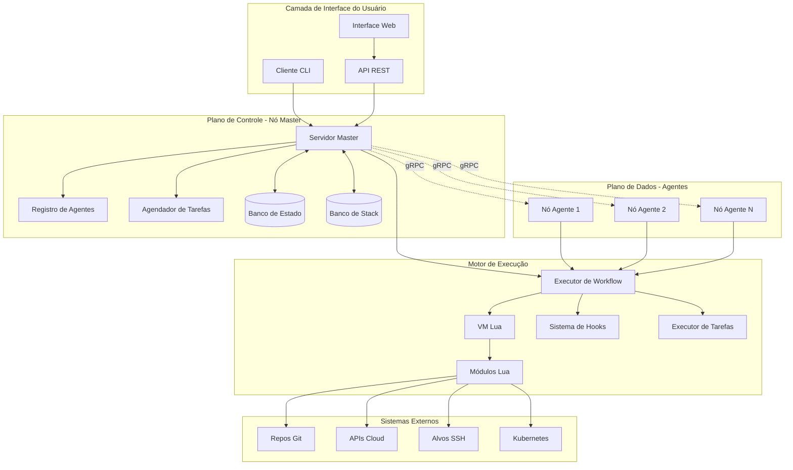
```mermaid
graph TB
    subgraph CamadaDeInterfaceDoUsuário["Camada de Interface do Usuário"]
        CLI[Cliente CLI]
        WebUI[Interface Web]
        API[API REST]
    end

    subgraph PlanoDeControle-NóMaster["Plano de Controle - Nó Master"]
        Master[Servidor Master]
        Registry[Registro de Agentes]
        Scheduler[Agendador de Tarefas]
        StateDB[(Banco de Estado)]
        StackDB[(Banco de Stack)]
    end

    subgraph MotorDeExecução["Motor de Execução"]
        Runner[Executor de Workflow]
        LuaVM[VM Lua]
        Modules[Módulos Lua]
        Hooks[Sistema de Hooks]
        Executor[Executor de Tarefas]
    end

    subgraph PlanoDeDados-Agentes["Plano de Dados - Agentes"]
        Agent1[Nó Agente 1]
        Agent2[Nó Agente 2]
        AgentN[Nó Agente N]
    end

    subgraph SistemasExternos["Sistemas Externos"]
        Git[Repos Git]
        Cloud[APIs Cloud]
        SSH[Alvos SSH]
        K8s[Kubernetes]
    end

    CLI --> Master
    WebUI --> API
    API --> Master
    Master --> Registry
    Master --> Scheduler
    Master <--> StateDB
    Master <--> StackDB

    Master --> Runner
    Runner --> LuaVM
    LuaVM --> Modules
    Runner --> Hooks
    Runner --> Executor

    Master -.gRPC.-> Agent1
    Master -.gRPC.-> Agent2
    Master -.gRPC.-> AgentN

    Modules --> Git
    Modules --> Cloud
    Modules --> SSH
    Modules --> K8s

    Agent1 --> Runner
    Agent2 --> Runner
    AgentN --> Runner
```

---

## Componentes Principais

### 1. **CLI (Interface de Linha de Comando)**

Ponto de entrada para interações do usuário. Construído usando framework Cobra.

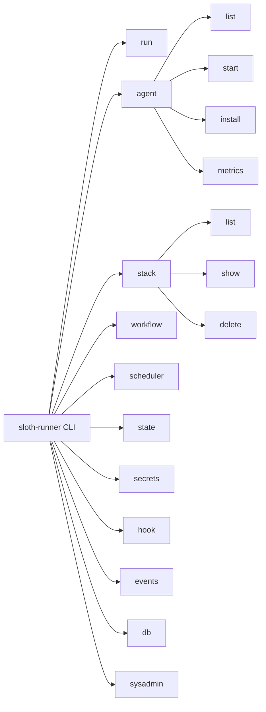
```mermaid
graph LR
    CLI[sloth-runner CLI]
    CLI --> Run[run]
    CLI --> Agent[agent]
    CLI --> Stack[stack]
    CLI --> Workflow[workflow]
    CLI --> Scheduler[scheduler]
    CLI --> State[state]
    CLI --> Secrets[secrets]
    CLI --> Hook[hook]
    CLI --> Events[events]
    CLI --> DB[db]
    CLI --> Sysadmin[sysadmin]

    Agent --> AgentList[list]
    Agent --> AgentStart[start]
    Agent --> AgentInstall[install]
    Agent --> AgentMetrics[metrics]

    Stack --> StackList[list]
    Stack --> StackShow[show]
    Stack --> StackDelete[delete]
```

**Localização**: `cmd/sloth-runner/main.go`, `cmd/sloth-runner/commands/`

**Comandos Principais**:
- `run` - Executa workflows
- `agent` - Gerencia agentes distribuídos
- `stack` - Gerencia stacks de deployment
- `scheduler` - Agenda tarefas recorrentes
- `state` - Operações de estado distribuído
- `workflow` - Gerenciamento de workflows
- `sysadmin` - Ferramentas de administração do sistema

### 2. **Servidor Master**

Coordenador central para execução distribuída.

**Responsabilidades**:
- Registro e monitoramento de saúde de agentes
- Distribuição e agendamento de tarefas
- Coordenação de estado
- Coleta de métricas
- Agregação de eventos

**Localização**: `cmd/sloth-runner/agent_registry.go`

**Componentes**:
- **Registro de Agentes**: Mantém conexões ativas de agentes
- **Distribuidor de Tarefas**: Distribui tarefas para agentes apropriados
- **Monitor de Saúde**: Rastreia saúde e disponibilidade dos agentes
- **Agregador de Métricas**: Coleta métricas de performance

### 3. **Executor de Workflow**

Executa definições de workflow com resolução de dependências.

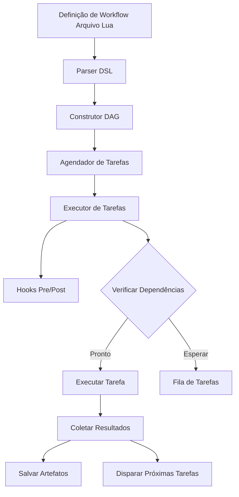
```mermaid
graph TD
    WorkflowDef[Definição de Workflow Arquivo Lua] --> Parser[Parser DSL]
    Parser --> DAG[Construtor DAG]
    DAG --> Scheduler[Agendador de Tarefas]
    Scheduler --> Executor[Executor de Tarefas]

    Executor --> Hooks[Hooks Pre/Post]
    Executor --> StateCheck{Verificar Dependências}
    StateCheck -->|Pronto| Execute[Executar Tarefa]
    StateCheck -->|Esperar| Queue[Fila de Tarefas]

    Execute --> Results[Coletar Resultados]
    Results --> Artifacts[Salvar Artefatos]
    Results --> NextTasks[Disparar Próximas Tarefas]
```

**Localização**: `internal/runner/`, `internal/execution/`

**Recursos Principais**:
- **Resolução de Dependências**: Constrói DAG de execução das dependências de tarefas
- **Execução Paralela**: Executa tarefas independentes concorrentemente
- **Lógica de Retry**: Retry configurável com backoff exponencial
- **Gerenciamento de Timeout**: Timeouts por tarefa e por workflow
- **Gerenciamento de Artefatos**: Compartilhamento de arquivos entre tarefas

### 4. **Integração com VM Lua**

Embute Lua para execução de DSL e sistema de módulos.

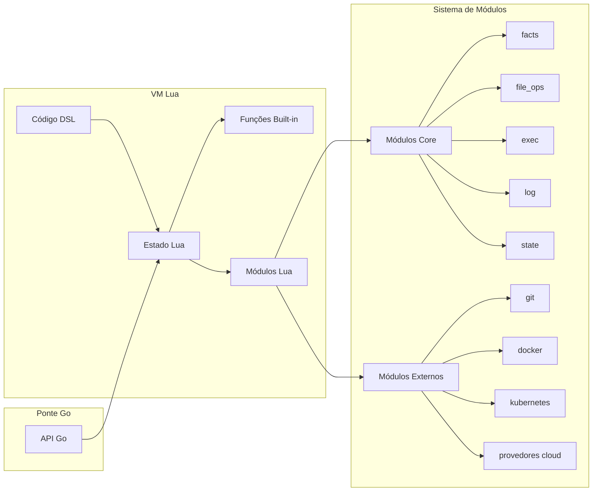
```mermaid
graph LR
    subgraph VmLua["VM Lua"]
        DSL[Código DSL] --> LuaState[Estado Lua]
        LuaState --> BuiltinFuncs[Funções Built-in]
        LuaState --> Modules[Módulos Lua]
    end

    subgraph PonteGo["Ponte Go"]
        GoAPI[API Go]
        GoAPI --> LuaState
    end

    subgraph SistemaDeMódulos["Sistema de Módulos"]
        Modules --> Core[Módulos Core]
        Modules --> External[Módulos Externos]

        Core --> Facts[facts]
        Core --> FileOps[file_ops]
        Core --> Exec[exec]
        Core --> Log[log]
        Core --> State[state]

        External --> Git[git]
        External --> Docker[docker]
        External --> K8s[kubernetes]
        External --> Cloud[provedores cloud]
    end
```

**Localização**: `internal/lua/`, `internal/luamodules/`, `internal/modules/`

**Capacidades**:
- **Parsing DSL**: Converte código Lua em estruturas de workflow
- **Carregamento de Módulos**: Registro dinâmico de módulos
- **Ponte Go-Lua**: Chamadas de função bidirecionais
- **Sandboxing**: Ambiente de execução restrito

### 5. **Sistema de Agentes**

Nós de execução distribuída para execução remota de tarefas.

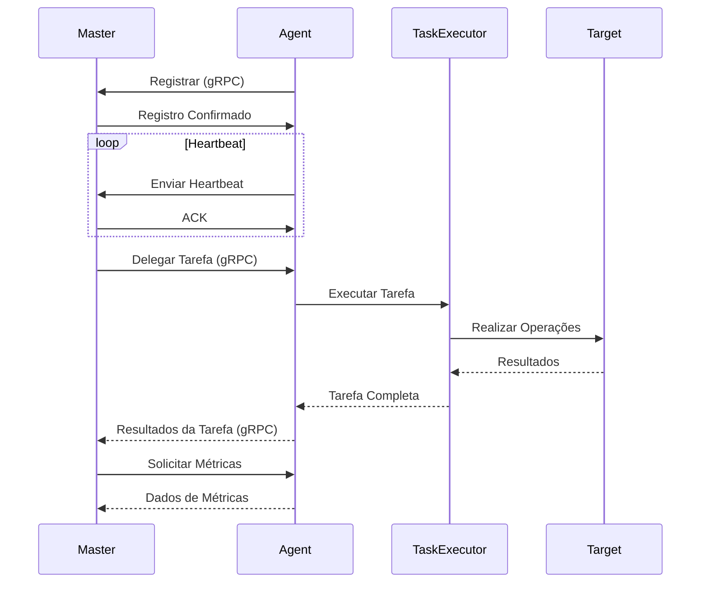
```mermaid
sequenceDiagram
    participant Master
    participant Agent
    participant TaskExecutor
    participant Target

    Agent->>Master: Registrar (gRPC)
    Master->>Agent: Registro Confirmado

    loop Heartbeat
        Agent->>Master: Enviar Heartbeat
        Master->>Agent: ACK
    end

    Master->>Agent: Delegar Tarefa (gRPC)
    Agent->>TaskExecutor: Executar Tarefa
    TaskExecutor->>Target: Realizar Operações
    Target-->>TaskExecutor: Resultados
    TaskExecutor-->>Agent: Tarefa Completa
    Agent-->>Master: Resultados da Tarefa (gRPC)

    Master->>Agent: Solicitar Métricas
    Agent-->>Master: Dados de Métricas
```

**Localização**: `internal/agent/`, `cmd/sloth-runner/commands/agent/`

**Recursos**:
- **Auto-Descoberta**: Agentes se registram no master ao iniciar
- **Monitoramento de Saúde**: Mecanismo contínuo de heartbeat
- **Delegação de Tarefas**: Executa tarefas em nome do master
- **Relatório de Recursos**: Uso de CPU, memória, disco
- **Mecanismo de Atualização**: Capacidade de auto-atualização

### 6. **Gerenciamento de Estado**

Estado distribuído com locking para coordenação.

**Localização**: `internal/state/`, `cmd/sloth-runner/commands/state/`

**Operações**:
- **Get/Set**: Armazenamento chave-valor
- **Compare-and-Swap**: Atualizações atômicas
- **Locking**: Aquisição de lock distribuído
- **Suporte a TTL**: Expiração automática
- **Namespaces**: Espaços de estado isolados

**Backends de Armazenamento**:
- **SQLite**: Banco de dados embutido padrão
- **BoltDB**: Armazenamento chave-valor de alta performance
- **PostgreSQL**: Opcional para alta disponibilidade

### 7. **Sistema de Hooks**

Gerenciamento de ciclo de vida orientado a eventos.

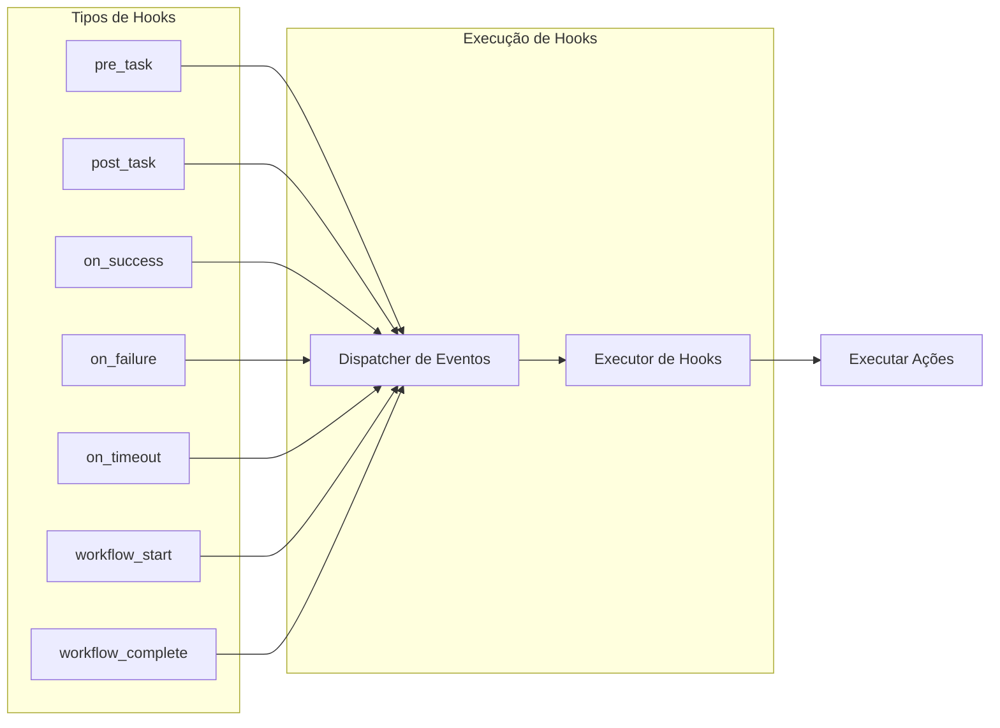
```mermaid
graph LR
    subgraph TiposDeHooks["Tipos de Hooks"]
        PreTask[pre_task]
        PostTask[post_task]
        OnSuccess[on_success]
        OnFailure[on_failure]
        OnTimeout[on_timeout]
        WorkflowStart[workflow_start]
        WorkflowComplete[workflow_complete]
    end

    subgraph ExecuçãoDeHooks["Execução de Hooks"]
        Dispatcher[Dispatcher de Eventos]
        Executor[Executor de Hooks]
    end

    PreTask --> Dispatcher
    PostTask --> Dispatcher
    OnSuccess --> Dispatcher
    OnFailure --> Dispatcher
    OnTimeout --> Dispatcher
    WorkflowStart --> Dispatcher
    WorkflowComplete --> Dispatcher

    Dispatcher --> Executor
    Executor --> Actions[Executar Ações]
```

**Localização**: `internal/hooks/`

**Capacidades**:
- **Hooks de Ciclo de Vida**: Hooks pré/pós execução
- **Execução Condicional**: Executa hooks baseado em condições
- **Execução Assíncrona**: Execução de hooks não-bloqueante
- **Tratamento de Erros**: Tratamento gracioso de falhas

### 8. **Sistema de Módulos**

Módulos plugáveis para extensibilidade.

**Módulos Built-in**:
- `facts` - Descoberta de sistema
- `file_ops` - Operações de arquivo
- `exec` - Execução de comandos
- `git` - Operações Git
- `docker` - Gerenciamento Docker
- `pkg` - Gerenciamento de pacotes
- `systemd` - Gerenciamento de serviços
- `infra_test` - Testes de infraestrutura
- `state` - Operações de estado
- `metrics` - Coleta de métricas
- `log` - Logging
- `net` - HTTP/networking
- `ai` - Integração com IA
- `gitops` - Workflows GitOps

**API de Módulos**:
```lua
-- Registro de módulo
local meu_modulo = {}

function meu_modulo.operacao(args)
    -- Função Go chamada via ponte
    return go_bridge.call("meu_modulo.operacao", args)
end

return meu_modulo
```

---

## Diagramas da Arquitetura do Sistema

### Arquitetura de Deployment

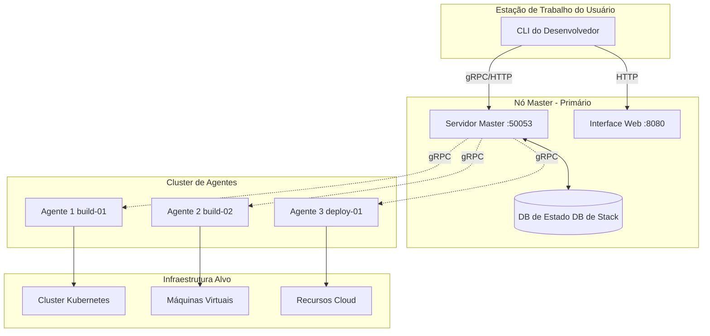
```mermaid
graph TB
    subgraph Workstation["Estação de Trabalho do Usuário"]
        DevCLI[CLI do Desenvolvedor]
    end

    subgraph MasterNode["Nó Master - Primário"]
        Master[Servidor Master :50053]
        MasterDB[(DB de Estado DB de Stack)]
        MasterUI[Interface Web :8080]
    end

    subgraph AgentCluster["Cluster de Agentes"]
        A1[Agente 1 build-01]
        A2[Agente 2 build-02]
        A3[Agente 3 deploy-01]
    end

    subgraph TargetInfra["Infraestrutura Alvo"]
        K8s[Cluster Kubernetes]
        Servers[Máquinas Virtuais]
        Cloud[Recursos Cloud]
    end

    DevCLI -->|gRPC/HTTP| Master
    DevCLI -->|HTTP| MasterUI

    Master <--> MasterDB
    Master -.gRPC.-> A1
    Master -.gRPC.-> A2
    Master -.gRPC.-> A3

    A1 --> K8s
    A2 --> Servers
    A3 --> Cloud
```

### Fluxo de Execução de Tarefas

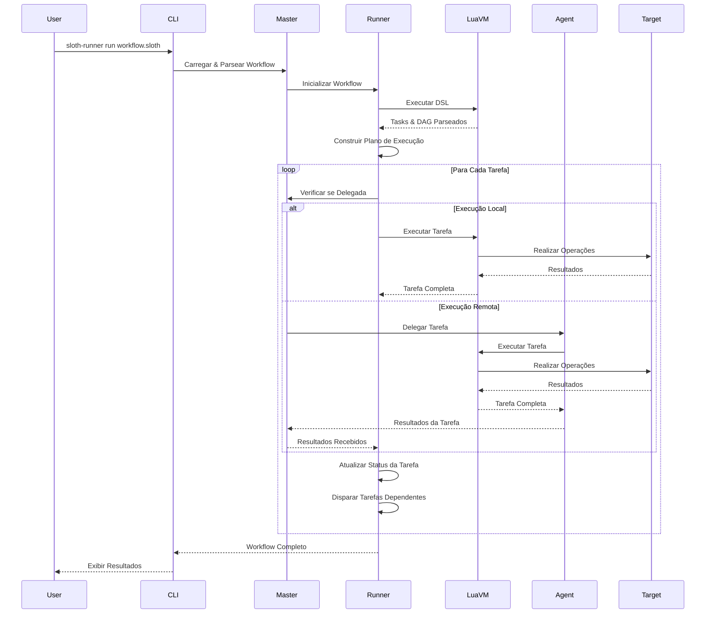
```mermaid
sequenceDiagram
    participant User
    participant CLI
    participant Master
    participant Runner
    participant LuaVM
    participant Agent
    participant Target

    User->>CLI: sloth-runner run workflow.sloth
    CLI->>Master: Carregar & Parsear Workflow
    Master->>Runner: Inicializar Workflow
    Runner->>LuaVM: Executar DSL
    LuaVM-->>Runner: Tasks & DAG Parseados

    Runner->>Runner: Construir Plano de Execução

    loop Para Cada Tarefa
        Runner->>Master: Verificar se Delegada
        alt Execução Local
            Runner->>LuaVM: Executar Tarefa
            LuaVM->>Target: Realizar Operações
            Target-->>LuaVM: Resultados
            LuaVM-->>Runner: Tarefa Completa
        else Execução Remota
            Master->>Agent: Delegar Tarefa
            Agent->>LuaVM: Executar Tarefa
            LuaVM->>Target: Realizar Operações
            Target-->>LuaVM: Resultados
            LuaVM-->>Agent: Tarefa Completa
            Agent-->>Master: Resultados da Tarefa
            Master-->>Runner: Resultados Recebidos
        end

        Runner->>Runner: Atualizar Status da Tarefa
        Runner->>Runner: Disparar Tarefas Dependentes
    end

    Runner-->>CLI: Workflow Completo
    CLI-->>User: Exibir Resultados
```

### Arquitetura de Gerenciamento de Estado

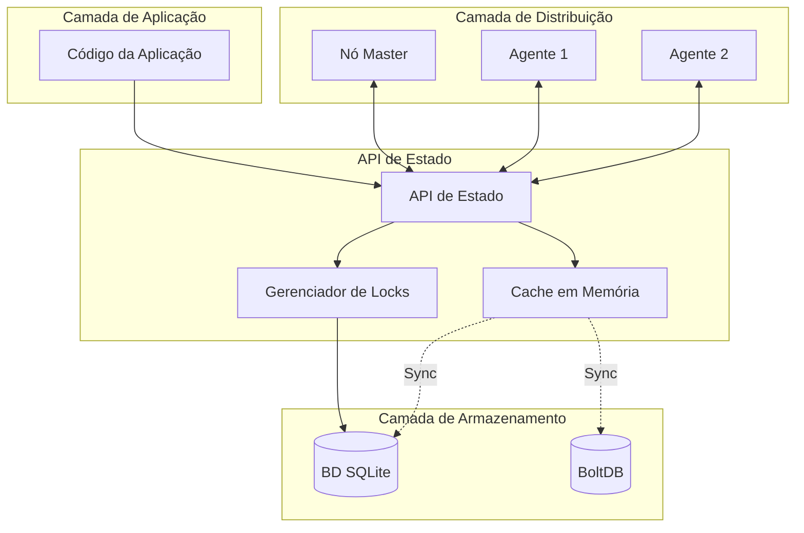
```mermaid
graph TB
    subgraph CamadaDeAplicação["Camada de Aplicação"]
        App[Código da Aplicação]
    end

    subgraph ApiDeEstado["API de Estado"]
        API[API de Estado]
        Lock[Gerenciador de Locks]
        Cache[Cache em Memória]
    end

    subgraph CamadaDeArmazenamento["Camada de Armazenamento"]
        SQLite[(BD SQLite)]
        Bolt[(BoltDB)]
    end

    subgraph CamadaDeDistribuição["Camada de Distribuição"]
        Master[Nó Master]
        Agent1[Agente 1]
        Agent2[Agente 2]
    end

    App --> API
    API --> Lock
    API --> Cache

    Cache -.Sync.-> SQLite
    Cache -.Sync.-> Bolt

    Lock --> SQLite

    Master <--> API
    Agent1 <--> API
    Agent2 <--> API
```

---

## Detalhes dos Componentes

### Estrutura de Comandos CLI

```
sloth-runner
├── run              Executa workflows
├── agent            Gerencia agentes
│   ├── start        Inicia daemon do agente
│   ├── list         Lista agentes registrados
│   ├── install      Instala agente remoto
│   ├── update       Atualiza versão do agente
│   ├── metrics      Visualiza métricas do agente
│   └── modules      Verifica módulos do agente
├── workflow         Operações de workflow
│   ├── list         Lista workflows
│   ├── show         Mostra detalhes do workflow
│   └── validate     Valida sintaxe do workflow
├── stack            Gerenciamento de stack
│   ├── list         Lista stacks
│   ├── show         Mostra detalhes do stack
│   ├── delete       Remove stack
│   └── export       Exporta dados do stack
├── scheduler        Agendamento de tarefas
│   ├── add          Adiciona tarefa agendada
│   ├── list         Lista tarefas agendadas
│   ├── delete       Remove tarefa agendada
│   └── run          Executa tarefas agendadas
├── state            Operações de estado
│   ├── get          Obtém valor de estado
│   ├── set          Define valor de estado
│   ├── delete       Remove chave de estado
│   ├── list         Lista chaves de estado
│   └── lock         Adquire lock distribuído
├── secrets          Gerenciamento de secrets
│   ├── set          Armazena secret
│   ├── get          Recupera secret
│   ├── list         Lista secrets
│   └── delete       Remove secret
├── hook             Gerenciamento de hooks
│   ├── list         Lista hooks registrados
│   ├── add          Adiciona hook
│   └── delete       Remove hook
├── events           Operações de eventos
│   ├── list         Lista eventos
│   └── clear        Limpa log de eventos
├── sysadmin         Administração do sistema
│   ├── health       Verificações de saúde
│   ├── logs         Gerenciamento de logs
│   ├── backup       Operações de backup
│   ├── packages     Gerenciamento de pacotes
│   └── services     Gerenciamento de serviços
├── master           Operações do servidor master
│   └── start        Inicia servidor master
├── ui               Interface Web
│   └── start        Inicia interface web
└── version          Mostra informações de versão
```

---

## Fluxo de Dados

### Fluxo de Dados de Execução de Workflow

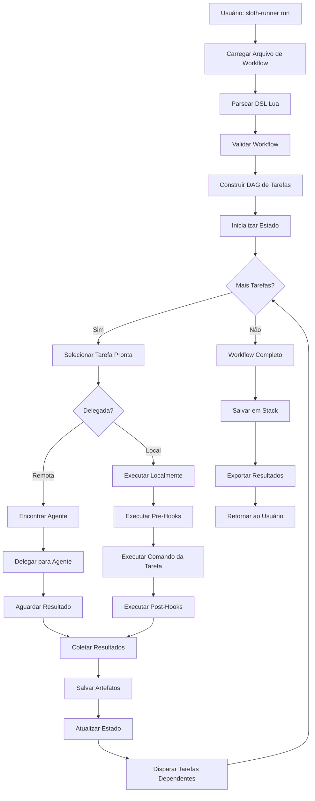
```mermaid
flowchart TD
    Start[Usuário: sloth-runner run] --> Load[Carregar Arquivo de Workflow]
    Load --> Parse[Parsear DSL Lua]
    Parse --> Validate[Validar Workflow]
    Validate --> BuildDAG[Construir DAG de Tarefas]
    BuildDAG --> InitState[Inicializar Estado]

    InitState --> CheckTasks{Mais Tarefas?}
    CheckTasks -->|Não| Complete[Workflow Completo]
    CheckTasks -->|Sim| SelectTask[Selecionar Tarefa Pronta]

    SelectTask --> CheckDelegate{Delegada?}

    CheckDelegate -->|Local| ExecLocal[Executar Localmente]
    CheckDelegate -->|Remota| FindAgent[Encontrar Agente]
    FindAgent --> DelegateTask[Delegar para Agente]
    DelegateTask --> WaitResult[Aguardar Resultado]
    WaitResult --> CollectResult

    ExecLocal --> PreHooks[Executar Pre-Hooks]
    PreHooks --> RunCommand[Executar Comando da Tarefa]
    RunCommand --> PostHooks[Executar Post-Hooks]
    PostHooks --> CollectResult[Coletar Resultados]

    CollectResult --> SaveArtifacts[Salvar Artefatos]
    SaveArtifacts --> UpdateState[Atualizar Estado]
    UpdateState --> TriggerNext[Disparar Tarefas Dependentes]
    TriggerNext --> CheckTasks

    Complete --> SaveStack[Salvar em Stack]
    SaveStack --> ExportResults[Exportar Resultados]
    ExportResults --> End[Retornar ao Usuário]
```

---

## Execução Distribuída

### Modos de Agente

1. **Agente Standalone**
   - Executa independentemente
   - Não requer master
   - Execução local de workflows

2. **Agente Gerenciado**
   - Registra-se com master
   - Recebe tarefas delegadas
   - Reporta status e métricas

3. **Modo Híbrido**
   - Pode executar tarefas locais e delegadas
   - Failover automático
   - Balanceamento de carga

### Estratégia de Delegação de Tarefas

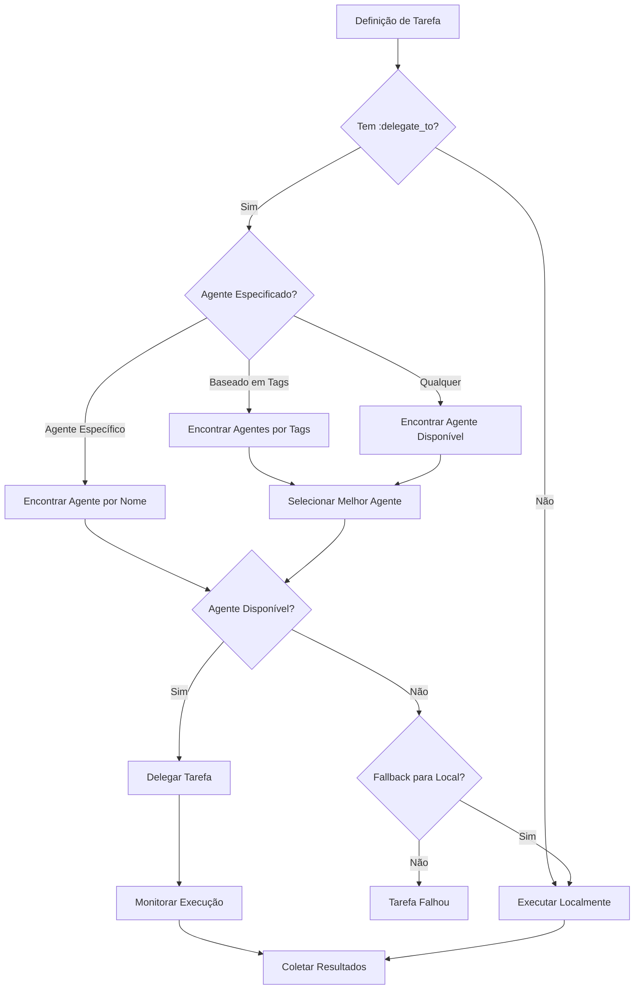
```mermaid
graph TD
    Task[Definição de Tarefa] --> CheckDelegate{Tem :delegate_to?}

    CheckDelegate -->|Não| LocalExec[Executar Localmente]
    CheckDelegate -->|Sim| CheckAgent{Agente Especificado?}

    CheckAgent -->|Agente Específico| FindSpecific[Encontrar Agente por Nome]
    CheckAgent -->|Baseado em Tags| FindByTags[Encontrar Agentes por Tags]
    CheckAgent -->|Qualquer| FindAvailable[Encontrar Agente Disponível]

    FindSpecific --> ValidateAgent{Agente Disponível?}
    FindByTags --> SelectBest[Selecionar Melhor Agente]
    FindAvailable --> SelectBest

    SelectBest --> ValidateAgent

    ValidateAgent -->|Sim| SendTask[Delegar Tarefa]
    ValidateAgent -->|Não| Fallback{Fallback para Local?}

    Fallback -->|Sim| LocalExec
    Fallback -->|Não| Error[Tarefa Falhou]

    SendTask --> Monitor[Monitorar Execução]
    Monitor --> Results[Coletar Resultados]
    LocalExec --> Results
```

---

## Gerenciamento de Estado

### Modelo de Armazenamento de Estado

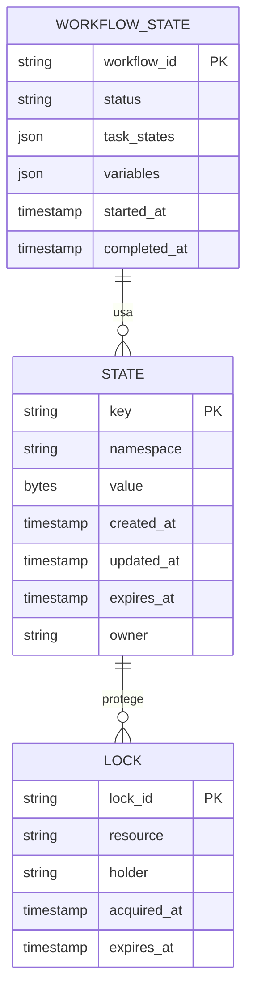
```mermaid
erDiagram
    STATE {
        string key PK
        string namespace
        bytes value
        timestamp created_at
        timestamp updated_at
        timestamp expires_at
        string owner
    }

    LOCK {
        string lock_id PK
        string resource
        string holder
        timestamp acquired_at
        timestamp expires_at
    }

    WORKFLOW_STATE {
        string workflow_id PK
        string status
        json task_states
        json variables
        timestamp started_at
        timestamp completed_at
    }

    STATE ||--o{ LOCK : "protege"
    WORKFLOW_STATE ||--o{ STATE : "usa"
```

---

## Sistema de Gerenciamento de Estado de Stack

### Visão Geral

O **Sistema de Gerenciamento de Estado de Stack** é um subsistema inspirado no Terraform/Pulumi que fornece gerenciamento de estado de nível empresarial para workflows. Ele habilita controle de versão, detecção de drift, rastreamento de dependências e bloqueio distribuído para stacks de deployment.

### Arquitetura do Estado de Stack

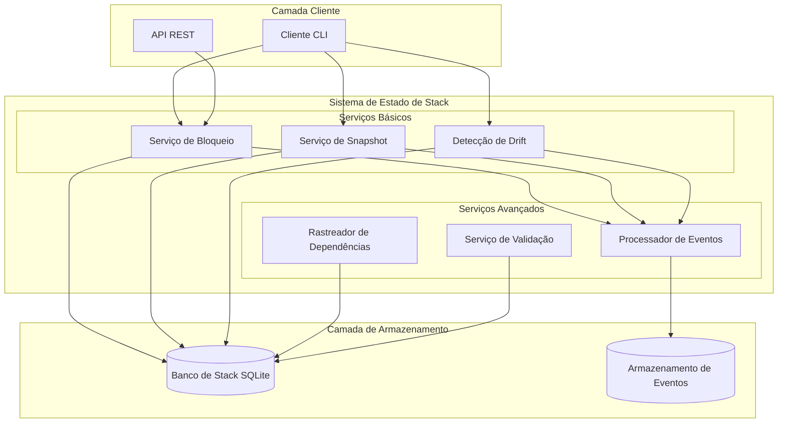
```mermaid
graph TB
    subgraph CamadaCliente["Camada Cliente"]
        CLI[Cliente CLI]
        API[API REST]
    end

    subgraph SistemaEstadoStack["Sistema de Estado de Stack"]
        subgraph ServicosBasicos["Serviços Básicos"]
            LockSvc[Serviço de Bloqueio]
            SnapshotSvc[Serviço de Snapshot]
            DriftSvc[Detecção de Drift]
        end

        subgraph ServicosAvancados["Serviços Avançados"]
            DepSvc[Rastreador de Dependências]
            ValidSvc[Serviço de Validação]
            EventSvc[Processador de Eventos]
        end
    end

    subgraph Armazenamento["Camada de Armazenamento"]
        StackDB[(Banco de Stack SQLite)]
        EventStore[(Armazenamento de Eventos)]
    end

    CLI --> LockSvc
    CLI --> SnapshotSvc
    CLI --> DriftSvc
    API --> LockSvc

    LockSvc --> StackDB
    SnapshotSvc --> StackDB
    DriftSvc --> StackDB
    DepSvc --> StackDB
    ValidSvc --> StackDB

    LockSvc --> EventSvc
    SnapshotSvc --> EventSvc
    DriftSvc --> EventSvc

    EventSvc --> EventStore
```

### Componentes Principais

| Componente | Propósito | Recursos |
|-----------|---------|----------|
| **Serviço de Bloqueio** | Prevenir execuções concorrentes | Rastreamento de metadados, liberação forçada, gerenciamento de timeout |
| **Serviço de Snapshot** | Controle de versão e rollback | Auto-versionamento (v1, v2...), recuperação pontual |
| **Detecção de Drift** | Validação de estado | Comparar real vs desejado, capacidade de correção automática |
| **Rastreador de Dependências** | Gerenciar relacionamentos de stacks | Detecção de dependência circular, ordenação de execução |
| **Serviço de Validação** | Verificações pré-execução | Verificação de recursos, validação de configuração |
| **Processador de Eventos** | Trilha de auditoria | 100 workers, buffer de 1000 eventos |

### Schema do Banco de Dados

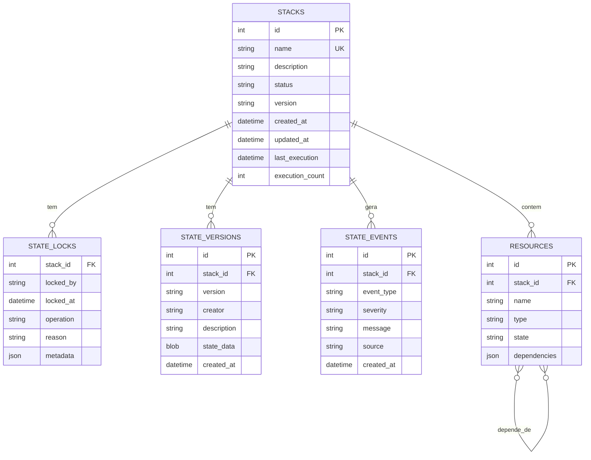
```mermaid
erDiagram
    STACKS ||--o{ STATE_LOCKS : tem
    STACKS ||--o{ STATE_VERSIONS : tem
    STACKS ||--o{ STATE_EVENTS : gera
    STACKS ||--o{ RESOURCES : contem
    RESOURCES }o--o{ RESOURCES : depende_de

    STACKS {
        int id PK
        string name UK
        string description
        string status
        string version
        datetime created_at
        datetime updated_at
        datetime last_execution
        int execution_count
    }

    STATE_LOCKS {
        int stack_id FK
        string locked_by
        datetime locked_at
        string operation
        string reason
        json metadata
    }

    STATE_VERSIONS {
        int id PK
        int stack_id FK
        string version
        string creator
        string description
        blob state_data
        datetime created_at
    }

    STATE_EVENTS {
        int id PK
        int stack_id FK
        string event_type
        string severity
        string message
        string source
        datetime created_at
    }

    RESOURCES {
        int id PK
        int stack_id FK
        string name
        string type
        string state
        json dependencies
    }
```

### Recursos Principais

#### 1. Bloqueio de Estado

Previne modificações concorrentes no mesmo stack:

```bash
# Adquirir bloqueio para deployment
sloth-runner stack lock acquire production-stack \
    --reason "Implantando v2.0.0" \
    --locked-by "deploy-bot"

# Verificar status do bloqueio
sloth-runner stack lock status production-stack

# Liberar bloqueio
sloth-runner stack lock release production-stack
```

**Ciclo de Vida do Bloqueio**:
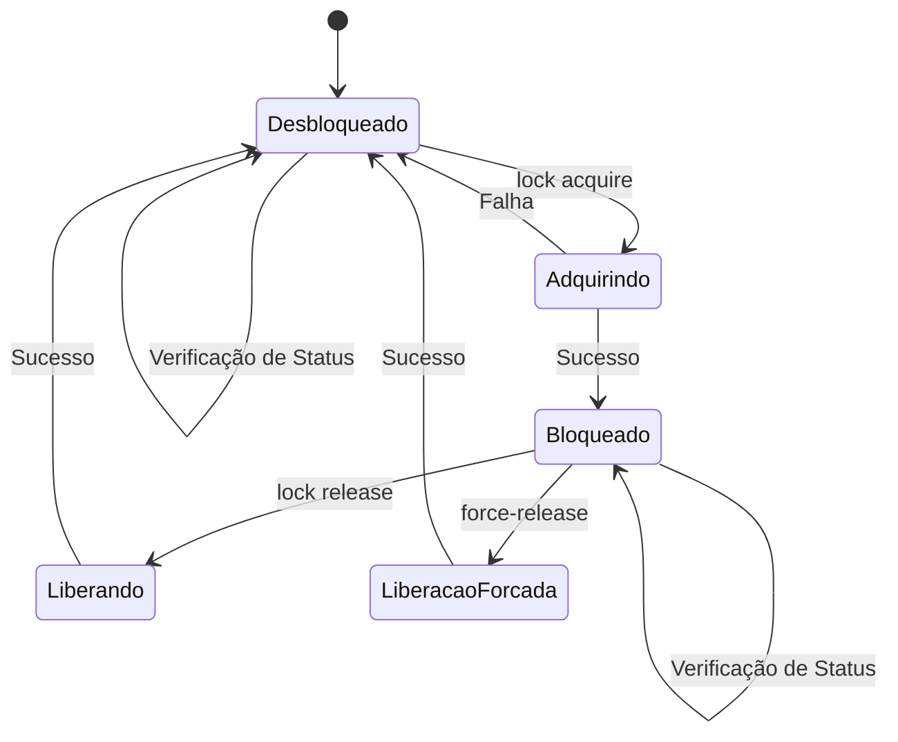
```mermaid
stateDiagram-v2
    [*] --> Desbloqueado
    Desbloqueado --> Adquirindo: lock acquire
    Adquirindo --> Bloqueado: Sucesso
    Adquirindo --> Desbloqueado: Falha

    Bloqueado --> Liberando: lock release
    Liberando --> Desbloqueado: Sucesso

    Bloqueado --> LiberacaoForcada: force-release
    LiberacaoForcada --> Desbloqueado: Sucesso

    Bloqueado --> Bloqueado: Verificação de Status
    Desbloqueado --> Desbloqueado: Verificação de Status
```

#### 2. Snapshots & Versionamento

Backups pontuais com versionamento automático:

```bash
# Criar snapshot
sloth-runner stack snapshot create production-stack \
    --description "Antes da atualização v2.0" \
    --creator "admin"

# Listar versões
sloth-runner stack snapshot list production-stack

# Restaurar para versão anterior
sloth-runner stack snapshot restore production-stack v35

# Comparar versões
sloth-runner stack snapshot compare production-stack v35 v38
```

**Resultados de Testes**: 37+ versões criadas e gerenciadas com sucesso

#### 3. Detecção de Drift

Identifica diferenças entre estado desejado e real:

```bash
# Detectar drift
sloth-runner stack drift detect production-stack

# Mostrar relatório detalhado
sloth-runner stack drift show production-stack

# Corrigir drift automaticamente
sloth-runner stack drift fix production-stack --auto-approve
```

**Tipos de Drift**:
- Drift de configuração (mudanças de porta, contagem de réplicas)
- Drift de recursos (recursos faltantes/extras)
- Drift de estado (status do serviço)
- Drift de dependência (dependências faltantes)

#### 4. Gerenciamento de Dependências

Rastreia e valida dependências de stacks:

```bash
# Mostrar dependências
sloth-runner stack deps show backend-stack

# Gerar grafo de dependências
sloth-runner stack deps graph backend-stack --output deps.png

# Verificar dependências circulares
sloth-runner stack deps check backend-stack

# Determinar ordem de execução
sloth-runner stack deps order frontend backend database cache
```

**Exemplo de Grafo de Dependências**:
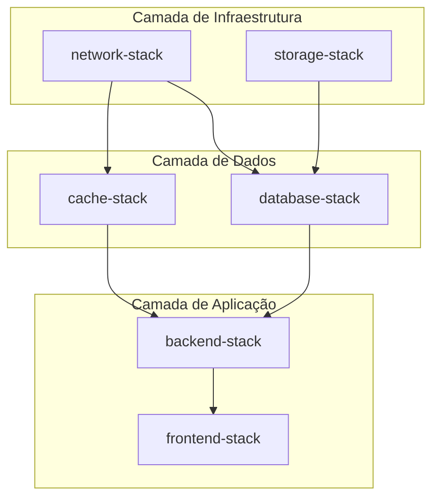
```mermaid
graph TB
    subgraph CamadaInfraestrutura["Camada de Infraestrutura"]
        Network[network-stack]
        Storage[storage-stack]
    end

    subgraph CamadaDados["Camada de Dados"]
        Database[database-stack]
        Cache[cache-stack]
    end

    subgraph CamadaAplicacao["Camada de Aplicação"]
        Backend[backend-stack]
        Frontend[frontend-stack]
    end

    Network --> Database
    Network --> Cache
    Storage --> Database

    Database --> Backend
    Cache --> Backend

    Backend --> Frontend
```

#### 5. Sistema de Validação

Verificações pré-execução:

```bash
# Validar stack único
sloth-runner stack validate production-stack

# Validar todos os stacks
sloth-runner stack validate all
```

**Checklist de Validação**:
- ✓ Sintaxe de configuração
- ✓ Disponibilidade de dependências
- ✓ Existência de recursos
- ✓ Permissões
- ✓ Disponibilidade de bloqueio
- ✓ Espaço em disco
- ✓ Conectividade de rede

### Integração com Sistema de Eventos

Operações de stack emitem eventos para auditabilidade:

**Tipos de Eventos**:
- `stack.created`, `stack.updated`, `stack.destroyed`
- `stack.execution.started`, `stack.execution.completed`, `stack.execution.failed`
- `lock.acquired`, `lock.released`, `lock.force_released`
- `snapshot.created`, `snapshot.restored`, `snapshot.deleted`
- `drift.detected`, `drift.fixed`

**Processamento de Eventos**:
- 100 workers concorrentes
- Capacidade de buffer de 1000 eventos
- Execução automática de hooks
- Persistência completa

### Métricas de Performance

| Operação | Duração | Notas |
|-----------|----------|-------|
| Execução de Workflow | 71ms | 5 tarefas, stack típico |
| Adquirir/Liberar Bloqueio | <50ms | Incluindo persistência |
| Criação de Snapshot | <100ms | Tamanho típico de stack |
| Detecção de Drift | 200-500ms | Depende da contagem de recursos |
| Validação | 100-300ms | Verificações abrangentes |

### Integração com Workflows

Gerenciamento automático de estado em workflows:

```lua
workflow.define("production_deploy")
    :description("Implantação em produção com gerenciamento de estado")
    :version("2.0.0")
    :tasks({deploy})
    :config({
        timeout = "30m",
        require_lock = true,      -- Bloqueio automático
        create_snapshot = true,   -- Snapshot automático antes da execução
        validate_before = true,   -- Validação pré-execução
        detect_drift = true,      -- Verificação de drift pós-execução
        on_failure = "rollback"   -- Rollback automático em falha
    })
```

### Casos de Uso

1. **Pipelines CI/CD**: Prevenir deployments conflitantes, rollback automático
2. **Gerenciamento Multi-Ambiente**: Coordenar deployments através de dev/staging/prod
3. **Infraestrutura como Código**: Gerenciamento de estado estilo Terraform
4. **Colaboração em Equipe**: Coordenação de bloqueios, trilha de auditoria
5. **Recuperação de Desastres**: Restauração pontual

### Armazenamento

**Localização do Banco**: `/etc/sloth-runner/stacks.db`

**Recursos**:
- Criação automática no primeiro uso
- Imposição de chaves estrangeiras
- Índices otimizados
- Conformidade ACID
- Backups automáticos

**Tabelas**: 5 tabelas principais (stacks, state_locks, state_versions, state_events, resources)

### Status de Testes

**Cobertura de Testes**: 98% de taxa de sucesso (97/99 testes aprovados)
- ✅ Operações de bloqueio: 100% funcionais
- ✅ Gerenciamento de snapshots: 37+ versões testadas
- ✅ Detecção de drift: Validada
- ✅ Rastreamento de dependências: Detecção circular funcionando
- ✅ Sistema de validação: Todas verificações passando
- ✅ Sistema de eventos: Integração completa confirmada

### Comparação com Outras Ferramentas

| Recurso | Sloth Runner | Terraform | Pulumi |
|---------|--------------|-----------|---------|
| Backend de Estado | SQLite (local-first) | S3/Remoto | Serviço na nuvem |
| Bloqueio | Integrado | Externo (DynamoDB) | Baseado em serviço |
| Versionamento | Snapshots automáticos | Manual | Checkpoint |
| Detecção de Drift | Integrada | terraform plan | pulumi preview |
| Linguagem | DSL Lua | HCL | Multi-linguagem |
| Dependências | Apenas SQLite | Múltiplos backends | Nuvem necessária |

### Documentação

Para documentação completa sobre Gerenciamento de Estado de Stack, veja:
- [Guia de Gerenciamento de Estado de Stack](./stack-state-management.md)

---

## Arquitetura de Segurança

### Autenticação & Autorização

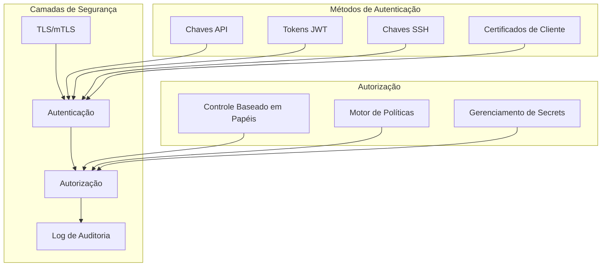
```mermaid
graph TB
    subgraph CamadasDeSegurança["Camadas de Segurança"]
        TLS[TLS/mTLS]
        Auth[Autenticação]
        Authz[Autorização]
        Audit[Log de Auditoria]
    end

    subgraph MetodosAutenticacao["Métodos de Autenticação"]
        APIKey[Chaves API]
        JWT[Tokens JWT]
        SSH[Chaves SSH]
        Cert[Certificados de Cliente]
    end

    subgraph Autorizacao["Autorização"]
        RBAC[Controle Baseado em Papéis]
        Policy[Motor de Políticas]
        Secrets[Gerenciamento de Secrets]
    end

    TLS --> Auth
    Auth --> Authz
    Authz --> Audit

    APIKey --> Auth
    JWT --> Auth
    SSH --> Auth
    Cert --> Auth

    RBAC --> Authz
    Policy --> Authz
    Secrets --> Authz
```

---

## Arquiteturas de Deploy

### Deploy em Nó Único

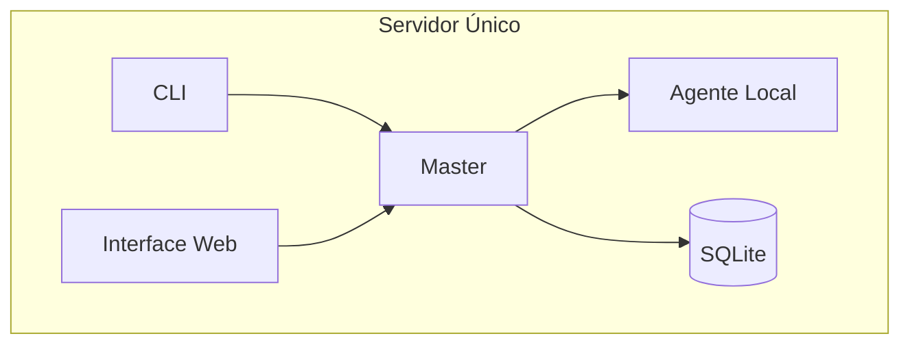
```mermaid
graph TB
    subgraph ServidorÚnico["Servidor Único"]
        CLI[CLI]
        Master[Master]
        Agent[Agente Local]
        DB[(SQLite)]
        UI[Interface Web]
    end

    CLI --> Master
    Master --> Agent
    Master --> DB
    UI --> Master
```

**Caso de Uso**: Desenvolvimento, equipes pequenas, automação de máquina única

### Deploy Distribuído

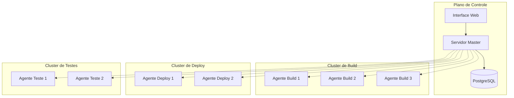
```mermaid
graph TB
    subgraph PlanoDeControle["Plano de Controle"]
        Master[Servidor Master]
        MasterDB[(PostgreSQL)]
        WebUI[Interface Web]
    end

    subgraph ClusterDeBuild["Cluster de Build"]
        B1[Agente Build 1]
        B2[Agente Build 2]
        B3[Agente Build 3]
    end

    subgraph ClusterDeDeploy["Cluster de Deploy"]
        D1[Agente Deploy 1]
        D2[Agente Deploy 2]
    end

    subgraph ClusterDeTestes["Cluster de Testes"]
        T1[Agente Teste 1]
        T2[Agente Teste 2]
    end

    Master --> MasterDB
    WebUI --> Master

    Master -.-> B1
    Master -.-> B2
    Master -.-> B3

    Master -.-> D1
    Master -.-> D2

    Master -.-> T1
    Master -.-> T2
```

**Caso de Uso**: Pipelines CI/CD, deployments enterprise, multi-ambiente

---

## Características de Performance

### Escalabilidade

| Componente | Escalabilidade | Limites |
|-----------|-------------|--------|
| **Master** | Vertical | ~10.000 agentes por master |
| **Agentes** | Horizontal | Agentes ilimitados |
| **Workflows** | Horizontal | Milhares concorrentes |
| **Tarefas por Workflow** | Limitado | ~1.000 tarefas recomendado |
| **Operações de Estado** | Alto | Milhões de operações/seg |

### Throughput

- **Execução de Tarefas**: 100+ tarefas/segundo (agente único)
- **Registro de Agentes**: 1.000+ agentes/minuto
- **Operações de Estado**: 10.000+ ops/segundo
- **Parsing de Workflows**: 50+ workflows/segundo

---

## Melhores Práticas

### Diretrizes de Arquitetura

1. **Separação de Responsabilidades**: Mantenha plano de controle separado da execução
2. **Agentes Stateless**: Agentes não devem armazenar estado localmente
3. **Idempotência**: Projete tarefas para serem idempotentes
4. **Tratamento de Erros**: Sempre trate erros graciosamente
5. **Monitoramento**: Implemente monitoramento abrangente
6. **Segurança**: Sempre use TLS para comunicação de rede

---

## Documentação Relacionada

- [Começando](./getting-started.md)
- [Conceitos Fundamentais](./core-concepts.md)
- [Agentes Distribuídos](./distributed.md)

---

**Idioma**: [English](../en/architecture.md) | [Português](./architecture.md)
