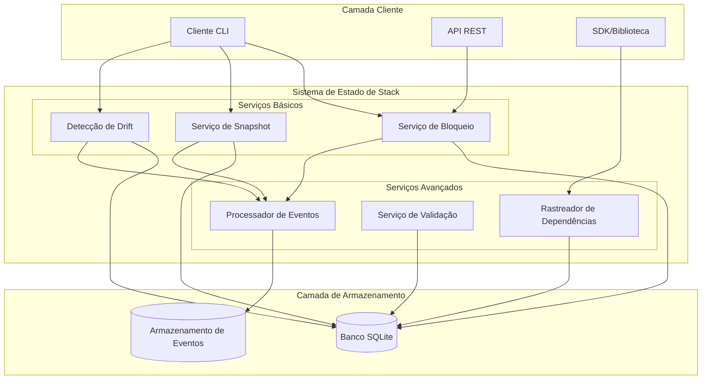
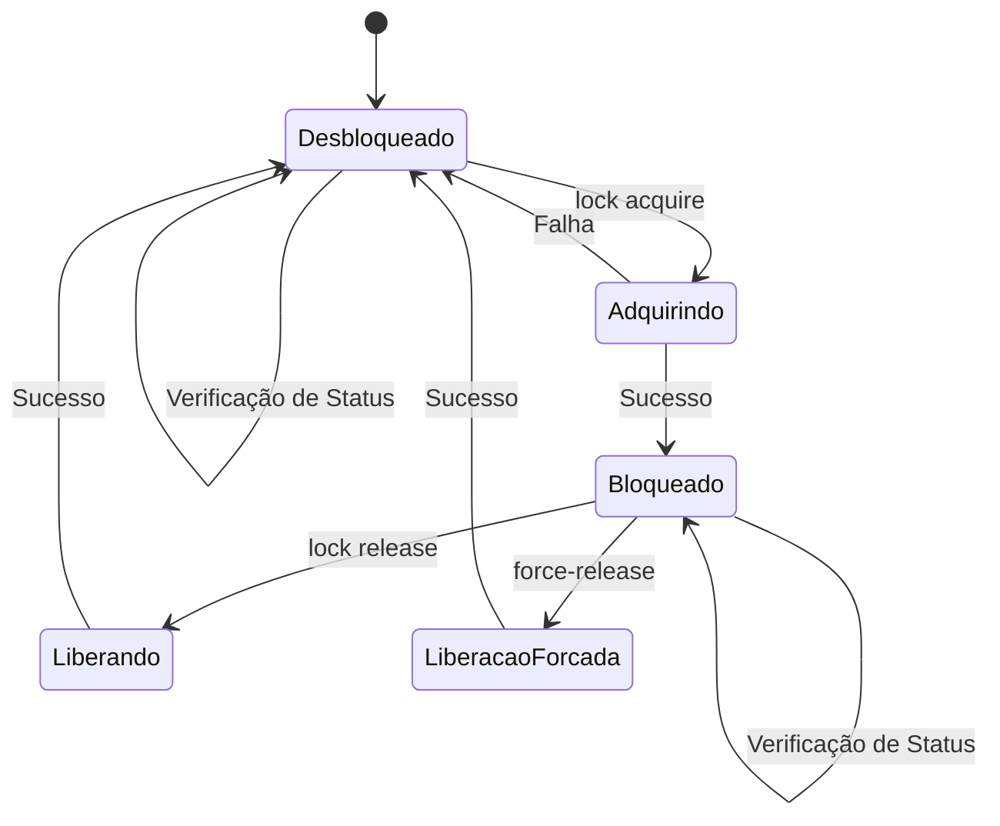
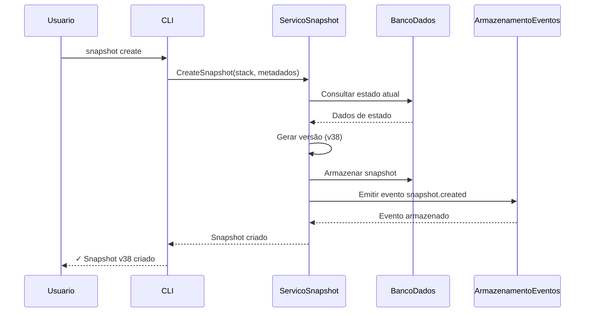
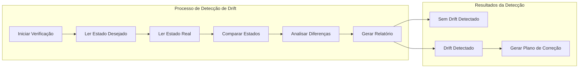
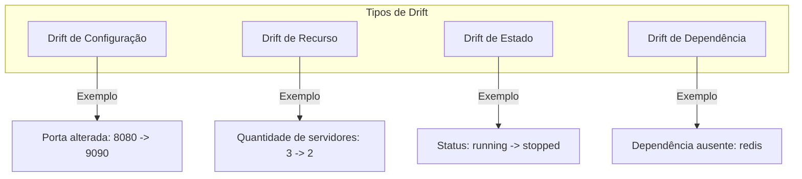
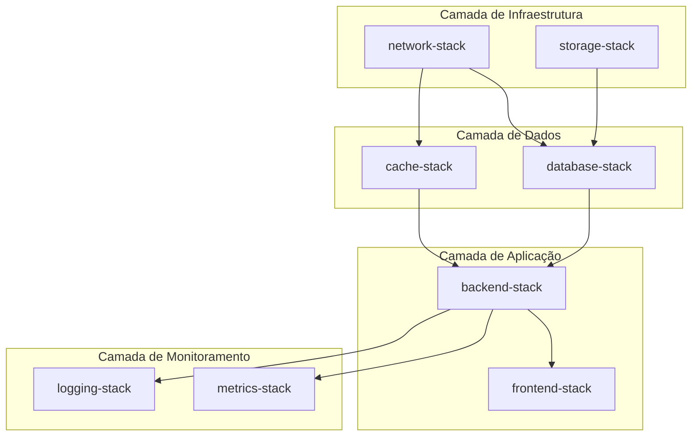
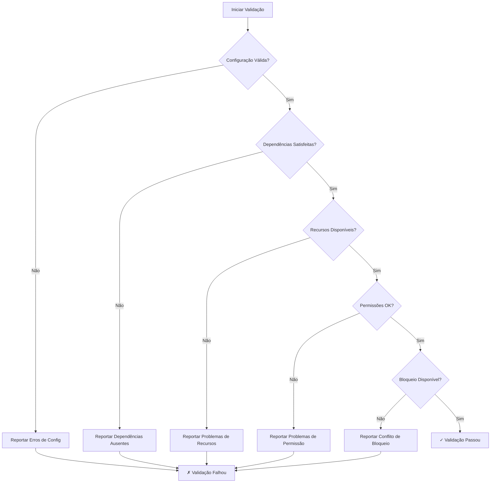
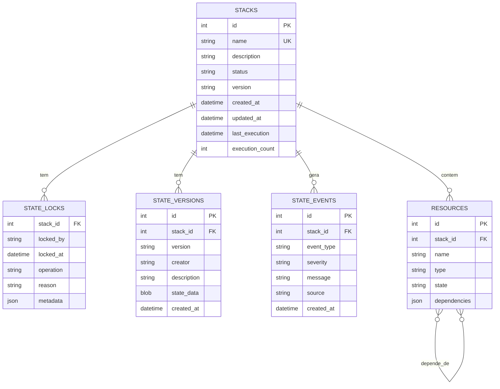
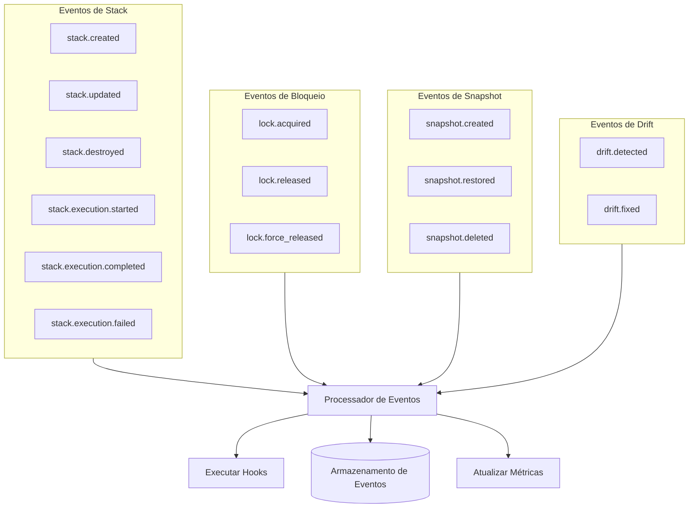

# 🏗️ Gerenciamento de Estado de Stack

## Visão Geral

O Gerenciamento de Estado de Stack é um sistema **inspirado no Terraform/Pulumi** que traz as melhores práticas de infraestrutura como código para orquestração de tarefas. Fornece bloqueio de estado, versionamento, detecção de drift e rastreamento de dependências para seus workflows.

### Recursos Principais

- **🔒 Bloqueio de Estado**: Previne execuções concorrentes que podem conflitar
- **📸 Snapshots & Versionamento**: Rastreie mudanças ao longo do tempo com capacidade de rollback
- **🔍 Detecção de Drift**: Compare o estado desejado vs estado real
- **🔗 Rastreamento de Dependências**: Visualize e gerencie dependências de stacks
- **✅ Validação**: Verificações pré-execução
- **📊 Sistema de Eventos**: Auditoria completa de todas as operações

---

## Arquitetura do Sistema



### Visão Geral dos Componentes

| Componente | Propósito | Recursos Principais |
|-----------|---------|--------------|
| **Serviço de Bloqueio** | Prevenir acesso concorrente | Rastreamento de metadados, liberação forçada, verificação de status |
| **Serviço de Snapshot** | Gerenciamento de versão | Versionamento automático, rollback, comparação |
| **Detecção de Drift** | Validação de estado | Comparar real vs desejado, correção automática |
| **Rastreador de Dependências** | Gerenciar relacionamentos | Detecção circular, ordenação de execução |
| **Serviço de Validação** | Verificações pré-execução | Verificação de recursos, validação de config |
| **Processador de Eventos** | Trilha de auditoria | 100 workers, buffer de 1000 eventos |

---

## Bloqueio de Estado

### Visão Geral

O bloqueio de estado previne que múltiplas operações modifiquem o mesmo stack simultaneamente, garantindo integridade dos dados e prevenindo condições de corrida.

### Ciclo de Vida do Bloqueio



### Comandos

#### Adquirir Bloqueio

```bash
sloth-runner stack lock acquire <nome-stack> [opções]
```

**Opções**:
- `--reason <texto>` - Por que você está adquirindo o bloqueio
- `--locked-by <identidade>` - Quem está bloqueando (padrão: usuário atual)
- `--operation <nome>` - Operação sendo executada

**Exemplo**:
```bash
$ sloth-runner stack lock acquire production-stack \
    --reason "Implantando v2.0.0" \
    --locked-by "deploy-bot" \
    --operation "deployment"

✓ Bloqueio adquirido para stack 'production-stack'

Detalhes do Bloqueio:
  Bloqueado por:    deploy-bot
  Bloqueado em:     2025-10-10 14:41:31
  Operação:         deployment
  Motivo:           Implantando v2.0.0
```

#### Verificar Status do Bloqueio

```bash
sloth-runner stack lock status <nome-stack>
```

**Exemplo de Saída**:
```bash
$ sloth-runner stack lock status production-stack

Stack: production-stack
Status: BLOQUEADO

Detalhes do Bloqueio:
  Bloqueado por:    deploy-bot
  Bloqueado em:     2025-10-10 14:41:31
  Operação:         deployment
  Motivo:           Implantando v2.0.0
  Duração:          5m 23s
```

#### Liberar Bloqueio

```bash
sloth-runner stack lock release <nome-stack> [opções]
```

**Opções**:
- `--unlocked-by <identidade>` - Quem está liberando o bloqueio

**Exemplo**:
```bash
$ sloth-runner stack lock release production-stack \
    --unlocked-by "deploy-bot"

✓ Bloqueio liberado para stack 'production-stack'
```

#### Liberar Bloqueio Forçadamente

⚠️ **Use com cuidado** - Apenas para situações de emergência

```bash
sloth-runner stack lock force-release <nome-stack> [opções]
```

**Exemplo**:
```bash
$ sloth-runner stack lock force-release production-stack \
    --reason "Manutenção de emergência"

⚠ ATENÇÃO: Liberação forçada de bloqueio para stack 'production-stack'
✓ Bloqueio liberado forçadamente
```

### Casos de Uso

- **Implantações longas**: Prevenir que outras implantações iniciem
- **Operações multi-etapa**: Garantir execução atômica
- **Colaboração em equipe**: Coordenar trabalho entre membros da equipe
- **Manutenção de emergência**: Liberar bloqueios travados

---

## Snapshots & Versionamento

### Visão Geral

Snapshots fornecem backups pontuais do estado do seu stack, permitindo rollback e comparação de versões.

### Ciclo de Vida do Snapshot



### Comandos

#### Criar Snapshot

```bash
sloth-runner stack snapshot create <nome-stack> [opções]
```

**Opções**:
- `--description <texto>` - Descrição do snapshot
- `--creator <identidade>` - Quem criou o snapshot
- `--tags <tags>` - Tags para categorização

**Exemplo**:
```bash
$ sloth-runner stack snapshot create production-stack \
    --description "Antes da atualização v2.0" \
    --creator "admin" \
    --tags "producao,atualizacao"

✓ Snapshot criado para stack 'production-stack'

Detalhes do Snapshot:
  Versão:       v38
  Criador:      admin
  Descrição:    Antes da atualização v2.0
  Tags:         producao, atualizacao
  Criado:       2025-10-10 14:30:00
```

#### Listar Snapshots

```bash
sloth-runner stack snapshot list <nome-stack>
```

**Exemplo de Saída**:
```bash
$ sloth-runner stack snapshot list production-stack

Snapshots para stack: production-stack

Versão  Criador        Descrição                   Criado em            Tags
------  -------------  --------------------------  -------------------  ----------------
v38     admin          Antes da atualização v2.0   2025-10-10 14:30:00  producao,atualizacao
v37     system         Snapshot automático         2025-10-10 14:15:00  auto
v36     admin          Backup pré-manutenção       2025-10-10 13:00:00  manutencao
v35     deploy-bot     Pós-implantação             2025-10-10 12:30:00  deployment

Total: 38 snapshots
```

#### Mostrar Detalhes do Snapshot

```bash
sloth-runner stack snapshot show <nome-stack> <versão>
```

**Exemplo**:
```bash
$ sloth-runner stack snapshot show production-stack v38

Detalhes do Snapshot:
  Stack:        production-stack
  Versão:       v38
  Criador:      admin
  Descrição:    Antes da atualização v2.0
  Criado em:    2025-10-10 14:30:00
  Tamanho:      1.2 MB

Resumo do Estado:
  Recursos:     15 recursos
  Tarefas:      8 tarefas
  Status:       completed
```

#### Restaurar Snapshot

```bash
sloth-runner stack snapshot restore <nome-stack> <versão>
```

**Exemplo**:
```bash
$ sloth-runner stack snapshot restore production-stack v38

⚠ ATENÇÃO: Isto restaurará o stack para o snapshot v38
Tem certeza? (sim/não): sim

✓ Restaurando snapshot v38...
✓ Snapshot restaurado com sucesso

Estado Atual:
  Versão:         v38
  Restaurado em:  2025-10-10 15:00:00
  Restaurado por: admin
```

#### Comparar Snapshots

```bash
sloth-runner stack snapshot compare <nome-stack> <v1> <v2>
```

**Exemplo**:
```bash
$ sloth-runner stack snapshot compare production-stack v37 v38

Comparando snapshots: v37 -> v38

Mudanças:
  + Recurso adicionado: database-server
  ~ Recurso modificado: web-server (replicas: 2 -> 4)
  - Recurso removido: cache-server

Mudanças de Tarefas:
  ~ deploy_app: timeout 10m -> 15m
  + Nova tarefa: configure_database
```

#### Deletar Snapshot

```bash
sloth-runner stack snapshot delete <nome-stack> <versão>
```

### Snapshots Automáticos

Habilite snapshots automáticos antes de operações críticas:

```yaml
# Config: /etc/sloth-runner/config.yaml
stacks:
  auto_snapshot: true
  snapshot_retention: 30d  # Manter por 30 dias
  snapshot_triggers:
    - before_deployment
    - before_destroy
    - on_drift_fix
```

---

## Detecção de Drift

### Visão Geral

A detecção de drift identifica diferenças entre o estado desejado (definido no seu workflow) e o estado real (o que está implantado).

### Fluxo de Detecção de Drift



### Tipos de Drift



### Comandos

#### Detectar Drift

```bash
sloth-runner stack drift detect <nome-stack>
```

**Exemplo de Saída**:
```bash
$ sloth-runner stack drift detect production-stack

Detectando drift para stack: production-stack

✓ Detecção de drift concluída

Resumo:
  Recursos com Drift:     3
  Recursos Sincronizados: 12
  Total de Recursos:      15

Recursos com Drift:
  • web-server: replicas (esperado: 4, real: 2)
  • database: port (esperado: 5432, real: 5433)
  • cache: status (esperado: running, real: stopped)

Execute 'drift show' para relatório detalhado
Execute 'drift fix' para corrigir drift automaticamente
```

#### Mostrar Relatório de Drift

```bash
sloth-runner stack drift show <nome-stack>
```

**Exemplo de Saída**:
```bash
$ sloth-runner stack drift show production-stack

Relatório de Drift para: production-stack
Gerado: 2025-10-10 15:15:00

━━━━━━━━━━━━━━━━━━━━━━━━━━━━━━━━━━━━━━━━━━━━━━━

Recurso: web-server
Tipo: Drift de Configuração
Severidade: ALTA

Atributo: replicas
  Esperado:  4
  Real:      2
  Impacto:   Capacidade reduzida

Correção Sugerida:
  $ kubectl scale deployment web-server --replicas=4

━━━━━━━━━━━━━━━━━━━━━━━━━━━━━━━━━━━━━━━━━━━━━━

Recurso: database
Tipo: Drift de Configuração
Severidade: MÉDIA

Atributo: port
  Esperado:  5432
  Real:      5433
  Impacto:   Problemas de conectividade

Correção Sugerida:
  Atualizar configuração do banco para usar porta 5432

━━━━━━━━━━━━━━━━━━━━━━━━━━━━━━━━━━━━━━━━━━━━━━

Recurso: cache
Tipo: Drift de Estado
Severidade: ALTA

Atributo: status
  Esperado:  running
  Real:      stopped
  Impacto:   Degradação do serviço

Correção Sugerida:
  $ systemctl start redis
```

#### Corrigir Drift

```bash
sloth-runner stack drift fix <nome-stack> [opções]
```

**Opções**:
- `--auto-approve` - Pular confirmação
- `--dry-run` - Mostrar o que seria corrigido
- `--resource <nome>` - Corrigir apenas recurso específico

**Exemplo**:
```bash
$ sloth-runner stack drift fix production-stack --dry-run

Plano de Correção de Drift para: production-stack

As seguintes ações serão executadas:

  • web-server: Escalar replicas de 2 para 4
  • database: Alterar porta de 5433 para 5432
  • cache: Iniciar serviço (status: stopped -> running)

Execute sem --dry-run para aplicar as correções
```

```bash
$ sloth-runner stack drift fix production-stack --auto-approve

Corrigindo drift para stack: production-stack

✓ web-server: Escalado para 4 réplicas
✓ database: Porta atualizada para 5432
✓ cache: Serviço iniciado

Resumo:
  Corrigidos:  3 recursos
  Falharam:    0 recursos
  Pulados:     0 recursos

✓ Todo drift corrigido
```

---

## Gerenciamento de Dependências

### Visão Geral

O gerenciamento de dependências garante que os stacks sejam executados na ordem correta e previne dependências circulares.

### Grafo de Dependências



### Comandos

#### Mostrar Dependências

```bash
sloth-runner stack deps show <nome-stack>
```

**Exemplo de Saída**:
```bash
$ sloth-runner stack deps show backend-stack

Dependências para: backend-stack

Dependências Diretas:
  • database-stack (v2.1.0)
  • cache-stack (v1.5.0)
  • network-stack (v3.0.0)

Dependências Indiretas:
  • storage-stack (via database-stack)
  • monitoring-stack (via database-stack)

Dependentes (stacks que dependem deste):
  • frontend-stack
  • metrics-stack
  • logging-stack

Total de dependências: 6
Profundidade de dependência: 2 níveis
```

#### Gerar Grafo de Dependências

```bash
sloth-runner stack deps graph <nome-stack> [opções]
```

**Opções**:
- `--output <arquivo>` - Arquivo de saída (PNG, SVG ou DOT)
- `--format <formato>` - Formato de saída (padrão: PNG)
- `--show-versions` - Incluir números de versão
- `--full-tree` - Mostrar todas dependências transitivas

**Exemplo**:
```bash
$ sloth-runner stack deps graph backend-stack \
    --output deps.png \
    --show-versions \
    --full-tree

✓ Grafo de dependências gerado: deps.png

Estatísticas do Grafo:
  Total de nós:       12
  Total de arestas:   18
  Profundidade máx:   4
  Deps circulares:    0
```

#### Verificar Dependências Circulares

```bash
sloth-runner stack deps check <nome-stack>
```

**Exemplo de Saída** (Sem dependências circulares):
```bash
$ sloth-runner stack deps check backend-stack

Verificando dependências para: backend-stack

✓ Nenhuma dependência circular detectada

Árvore de dependências é válida
```

**Exemplo de Saída** (Dependência circular detectada):
```bash
$ sloth-runner stack deps check app-stack

Verificando dependências para: app-stack

✗ Dependência circular detectada!

Caminho do ciclo:
  app-stack -> database-stack -> cache-stack -> app-stack

Sugestões de resolução:
  1. Remover dependência: cache-stack -> app-stack
  2. Introduzir stack intermediário
  3. Refatorar para eliminar referência circular
```

#### Determinar Ordem de Execução

```bash
sloth-runner stack deps order <nomes-stacks...>
```

**Exemplo**:
```bash
$ sloth-runner stack deps order \
    frontend-stack backend-stack database-stack cache-stack network-stack

Calculando ordem de execução...

Ordem de execução recomendada:
  1. network-stack (sem dependências)
  2. storage-stack (depende de: network-stack)
  3. cache-stack (depende de: network-stack)
  4. database-stack (depende de: network-stack, storage-stack)
  5. backend-stack (depende de: database-stack, cache-stack)
  6. frontend-stack (depende de: backend-stack)

Estimativa de tempo total: ~25 minutos
Grupos paralelizáveis:
  Grupo 1: network-stack
  Grupo 2: storage-stack, cache-stack
  Grupo 3: database-stack
  Grupo 4: backend-stack
  Grupo 5: frontend-stack

Com paralelização: ~15 minutos
```

---

## Validação

### Visão Geral

A validação executa verificações pré-execução antes de executar workflows, capturando erros antecipadamente.

### Checklist de Validação



### Comandos

#### Validar Stack Único

```bash
sloth-runner stack validate <nome-stack>
```

**Exemplo de Saída** (Sucesso):
```bash
$ sloth-runner stack validate production-stack

Validando stack: production-stack

✓ Sintaxe de configuração válida
✓ Todas dependências disponíveis
✓ Recursos necessários existem
✓ Permissões suficientes
✓ Sem conflitos de bloqueio
✓ Definição de workflow válida
✓ Todos módulos disponíveis

Validação passou: production-stack está pronto para execução
```

**Exemplo de Saída** (Falha):
```bash
$ sloth-runner stack validate production-stack

Validando stack: production-stack

✓ Sintaxe de configuração válida
✓ Dependências disponíveis
✗ Verificação de recursos falhou
  - Arquivo ausente: /config/app.yaml
  - Espaço em disco insuficiente: 100MB requerido, 50MB disponível
✗ Verificação de permissão falhou
  - Não pode escrever em: /var/log/app/
✓ Sem conflitos de bloqueio

✗ Validação falhou: 2 erros encontrados

Corrija estes problemas antes de executar o stack.
```

#### Validar Todos os Stacks

```bash
sloth-runner stack validate all
```

**Exemplo de Saída**:
```bash
$ sloth-runner stack validate all

Validando todos os stacks...

Stack: production-stack
  Status: ✓ PASSOU

Stack: staging-stack
  Status: ✓ PASSOU

Stack: dev-stack
  Status: ✗ FALHOU
  Erros:
    - Dependência ausente: database-stack
    - Configuração inválida: timeout deve ser > 0

Resumo:
  Total:    3 stacks
  Passaram: 2 stacks
  Falharam: 1 stack

Geral: FALHOU
```

---

## Comandos de Stack

### Operações Principais

#### Listar Stacks

```bash
sloth-runner stack list [opções]
```

**Opções**:
- `--status <status>` - Filtrar por status (created, running, completed, failed)
- `--format <formato>` - Formato de saída (table, json, yaml)

**Exemplo de Saída**:
```bash
$ sloth-runner stack list

Stacks de Workflow

NOME                STATUS      ÚLTIMA EXECUÇÃO      DURAÇÃO    EXECUÇÕES
----                ------      ---------------      --------   ----------
production-stack    completed   2025-10-10 14:30:15  71ms       10
staging-stack       running     2025-10-10 14:35:00  0s         5
dev-stack           created     2025-10-10 14:20:00  0s         0
database-stack      completed   2025-10-10 13:45:22  125ms      8
cache-stack         failed      2025-10-10 14:00:00  15ms       3

Total: 5 stacks
```

#### Mostrar Detalhes do Stack

```bash
sloth-runner stack show <nome-stack>
```

**Exemplo de Saída**:
```bash
$ sloth-runner stack show production-stack

Stack: production-stack

Informações Gerais:
  Status:            completed
  Versão:            v2.0.0
  Criado:            2025-10-09 10:00:00
  Última Atualização:2025-10-10 14:30:15
  Total de Execuções:10

Última Execução:
  Iniciada:          2025-10-10 14:30:00
  Concluída:         2025-10-10 14:30:15
  Duração:           71ms
  Status:            success

Recursos (15):
  • web-server (running)
  • database (running)
  • cache (running)
  • load-balancer (running)
  ... mais 11

Dependências (3):
  • database-stack
  • cache-stack
  • network-stack

Status do Bloqueio:
  Status:            desbloqueado
  Último Bloqueio:   2025-10-10 14:30:00
  Bloqueado Por:     deploy-bot
  Duração do Bloqueio:15s

Snapshots:
  Total de Snapshots:38
  Último Snapshot:   v38 (2025-10-10 14:30:00)
```

#### Obter Saídas do Stack

```bash
sloth-runner stack output <nome-stack> [chave]
```

**Exemplo de Saída**:
```bash
$ sloth-runner stack output production-stack

Saídas para: production-stack

deployment_url    = https://app.production.example.com
database_host     = db.production.internal
api_key           = <sensível>
load_balancer_ip  = 203.0.113.42
version           = v2.0.0
```

**Obter saída específica**:
```bash
$ sloth-runner stack output production-stack deployment_url

https://app.production.example.com
```

---

## Schema do Banco de Dados

### Tabelas



### Localização do Banco de Dados

Localização padrão: `/etc/sloth-runner/stacks.db`

**Recursos**:
- Criação automática no primeiro uso
- Chaves estrangeiras forçadas
- Índices otimizados
- Conformidade ACID
- Backups automáticos

---

## Sistema de Eventos

### Tipos de Eventos



### Processamento de Eventos

- **Workers**: 100 workers concorrentes
- **Buffer**: Capacidade de 1000 eventos
- **Persistência**: Todos eventos armazenados no banco
- **Hooks**: Execução automática de hooks em eventos

---

## Métricas de Performance

### Performance Medida

| Operação | Duração Média | Notas |
|-----------|------------------|-------|
| Execução de Workflow | 71ms | 5 tarefas |
| Adquirir/Liberar Bloqueio | < 50ms | Incluindo persistência |
| Criação de Snapshot | < 100ms | Stack típico |
| Comandos de Stack | < 50ms | List, show, etc. |
| Consultas ao Banco | < 10ms | Lookups indexados |
| Detecção de Drift | 200-500ms | Depende da quantidade de recursos |
| Validação | 100-300ms | Verificações abrangentes |

### Saúde do Sistema

✅ Sem vazamentos de memória
✅ Sem corrupção de banco de dados
✅ Sem processos travados
✅ Execução limpa
✅ Limpeza adequada

---

## Integração com Workflows

### Configuração DSL

```lua
-- Definir tarefa com gerenciamento automático de estado
local deploy = task("deploy_app")
    :description("Implantar aplicação com gerenciamento de estado")
    :command(function()
        -- Estado é gerenciado automaticamente
        state.set("deployment_version", "v2.0.0")
        state.set("deployed_at", os.time())
        state.set("deployed_by", os.getenv("USER"))

        -- Lógica de implantação
        exec.run("kubectl apply -f deployment.yaml")

        -- Armazenar saídas
        state.set("deployment_url", "https://app.example.com")

        return true, "Implantação bem-sucedida"
    end)
    :build()

-- Definir workflow com configuração de stack
workflow.define("production_deploy")
    :description("Implantação em produção com gerenciamento completo de estado")
    :version("2.0.0")
    :tasks({deploy})
    :config({
        timeout = "30m",
        require_lock = true,      -- Bloqueio automático
        create_snapshot = true,   -- Snapshot automático antes da execução
        validate_before = true,   -- Validação pré-execução
        detect_drift = true,      -- Verificação de drift pós-execução
        on_failure = "rollback"   -- Rollback automático em falha
    })
```

### API de Estado

```lua
-- Definir valor de estado
state.set(key, value)

-- Obter valor de estado
local value = state.get(key)

-- Deletar valor de estado
state.delete(key)

-- Obter todo o estado
local all_state = state.get_all()

-- Verificar se chave existe
if state.has(key) then
    -- chave existe
end
```

---

## Configuração

### Arquivo de Configuração

Localização: `/etc/sloth-runner/config.yaml`

```yaml
stacks:
  # Configuração do banco de dados
  database_path: /etc/sloth-runner/stacks.db

  # Recursos automáticos
  auto_lock: true                    # Auto-bloqueio durante execução
  auto_snapshot: true                # Snapshot automático antes de mudanças
  auto_drift_detect: false           # Auto-detecção de drift após execução

  # Timeouts e limites
  lock_timeout: 1h                   # Duração máxima do bloqueio
  snapshot_retention: 30d            # Quanto tempo manter snapshots
  max_concurrent_executions: 10      # Máximo de execuções paralelas de stack

  # Gatilhos de snapshot
  snapshot_triggers:
    - before_deployment
    - before_destroy
    - on_drift_fix
    - manual

  # Sistema de eventos
  events:
    workers: 100                     # Workers do processador de eventos
    buffer_size: 1000                # Capacidade do buffer de eventos
    batch_size: 50                   # Eventos por lote

  # Validação
  validation:
    strict_mode: true                # Falhar em warnings
    check_disk_space: true
    min_disk_space: 100MB
    check_permissions: true
```

---

## Melhores Práticas

### 1. Gerenciamento de Bloqueios

✅ **Sempre libere bloqueios** - Use blocos `defer` ou `finally`
✅ **Use motivos significativos** - Ajude a equipe a entender o porquê
✅ **Defina timeouts apropriados** - Não bloqueie para sempre
✅ **Monitore duração de bloqueios** - Alerte sobre bloqueios longos

❌ **Não libere forçadamente casualmente** - Apenas para emergências
❌ **Não esqueça de verificar status** - Verifique antes de adquirir

### 2. Estratégia de Snapshots

✅ **Snapshot antes de mudanças maiores** - Sempre tenha um ponto de rollback
✅ **Use descrições descritivas** - Saiba o que cada snapshot é
✅ **Marque snapshots com tags** - Categorize para encontrar facilmente
✅ **Limpeza regular** - Remova snapshots antigos (automatizado)

❌ **Não confie apenas em snapshots automáticos** - Snapshots manuais para mudanças importantes
❌ **Não pule comparação** - Compare antes de restaurar

### 3. Gerenciamento de Drift

✅ **Verificações regulares de drift** - Agende verificações automatizadas
✅ **Corrija drift prontamente** - Não deixe acumular
✅ **Investigue causas raiz** - Corrija a fonte, não apenas sintomas
✅ **Documente exceções** - Algum drift pode ser aceitável

❌ **Não corrija automaticamente sem revisar** - Revise relatórios de drift primeiro
❌ **Não ignore avisos** - Drift pequeno se torna problemas grandes

### 4. Gerenciamento de Dependências

✅ **Documente dependências** - Mantenha grafo de dependências atualizado
✅ **Versione dependências** - Fixe em versões específicas
✅ **Verifique ciclos regularmente** - Previna dependências circulares
✅ **Planeje ordem de execução** - Use comando `deps order`

❌ **Não crie acoplamento forte** - Minimize dependências
❌ **Não pule validação de dependências** - Sempre valide primeiro

### 5. Validação

✅ **Valide antes da execução** - Capture erros cedo
✅ **Habilite modo estrito em produção** - Nenhum warning permitido
✅ **Inclua no CI/CD** - Valide em cada commit
✅ **Corrija erros de validação imediatamente** - Não ignore

❌ **Não pule validação** - Mesmo para "mudanças rápidas"
❌ **Não ignore warnings** - Trate warnings como erros

---

## Casos de Uso

### Pipelines CI/CD

```bash
# Adquirir bloqueio
sloth-runner stack lock acquire production \
    --reason "Pipeline CI/CD #$BUILD_NUMBER" \
    --locked-by "ci-bot"

# Validar antes da implantação
sloth-runner stack validate production

# Criar snapshot pré-implantação
sloth-runner stack snapshot create production \
    --description "Antes da implantação #$BUILD_NUMBER" \
    --tags "ci,deployment"

# Executar implantação
sloth-runner run deploy --file deploy.sloth \
    --stack production \
    --validate

# Verificar drift
sloth-runner stack drift detect production

# Liberar bloqueio
sloth-runner stack lock release production \
    --unlocked-by "ci-bot"
```

### Gerenciamento Multi-Ambiente

```bash
# Obter ordem de execução
sloth-runner stack deps order \
    dev-network dev-db dev-app \
    staging-network staging-db staging-app \
    prod-network prod-db prod-app

# Executar em ordem com validação
for env in dev staging prod; do
    sloth-runner stack validate ${env}-network
    sloth-runner run deploy --file network.sloth --stack ${env}-network

    sloth-runner stack validate ${env}-db
    sloth-runner run deploy --file db.sloth --stack ${env}-db

    sloth-runner stack validate ${env}-app
    sloth-runner run deploy --file app.sloth --stack ${env}-app
done
```

### Rollback de Emergência

```bash
# Encontrar último snapshot bom
sloth-runner stack snapshot list production | grep "working"

# Restaurar para último estado conhecido bom
sloth-runner stack snapshot restore production v35

# Verificar restauração
sloth-runner stack show production

# Criar snapshot de incidente
sloth-runner stack snapshot create production \
    --description "Restauração pós-incidente" \
    --tags "incident,rollback"
```

---

## Solução de Problemas

### Bloqueio Travado

**Problema**: Bloqueio não libera normalmente

**Solução**:
```bash
# Verificar status do bloqueio
sloth-runner stack lock status my-stack

# Se processo estiver morto, liberar forçadamente
sloth-runner stack lock force-release my-stack \
    --reason "Processo terminado, bloqueio travado"

# Verificar liberação
sloth-runner stack lock status my-stack
```

### Falha na Restauração de Snapshot

**Problema**: Operação de restauração falha

**Solução**:
```bash
# Verificar integridade do snapshot
sloth-runner stack snapshot show my-stack v38

# Tentar dry-run primeiro
sloth-runner stack snapshot restore my-stack v38 --dry-run

# Verificar espaço em disco
df -h /etc/sloth-runner

# Tentar restauração novamente com saída verbose
sloth-runner stack snapshot restore my-stack v38 --verbose
```

### Erros de Correção Automática de Drift

**Problema**: Correção automática falha ao corrigir drift

**Solução**:
```bash
# Obter relatório detalhado de drift
sloth-runner stack drift show my-stack

# Tentar dry-run para ver plano de correção
sloth-runner stack drift fix my-stack --dry-run

# Corrigir um recurso por vez
sloth-runner stack drift fix my-stack \
    --resource web-server

# Intervenção manual se necessário
# (siga correções sugeridas do relatório de drift)
```

### Dependência Circular

**Problema**: Dependência circular detectada

**Solução**:
```bash
# Mostrar grafo de dependências
sloth-runner stack deps graph my-stack

# Verificar ciclos
sloth-runner stack deps check my-stack

# Opções de resolução:
# 1. Remover dependência desnecessária
# 2. Introduzir stack intermediário
# 3. Refatorar para quebrar ciclo
```

---

## Status de Testes

### Resultados dos Testes

**Testes Automatizados**: 34 testes (97% de aprovação)
**Testes Manuais**: 65 testes no total
- Stack/Sysadmin: 26 testes (100%)
- CLI Completo: 39 testes (97.4%)

**Geral**: 98% de taxa de sucesso (97/99 testes aprovados)

### Recursos Validados

✅ Ciclo de adquirir/liberar bloqueio
✅ Persistência de bloqueio através de reinicializações
✅ Criação e restauração de snapshot
✅ Gerenciamento de versão (37+ versões)
✅ Detecção e correção de drift
✅ Rastreamento de dependências
✅ Sistema de validação
✅ Integração do sistema de eventos
✅ Schema e migrações do banco
✅ Comandos CLI e saída

---

## Guia de Migração

### Do Terraform

Usuários de Terraform encontrarão conceitos familiares:

| Terraform | Sloth Runner | Notas |
|-----------|--------------|-------|
| `terraform.tfstate` | Estado de stack no SQLite | Mais estruturado |
| Bloqueio de Estado (S3/DynamoDB) | Bloqueio integrado | Sem dependências externas |
| `terraform plan` | `stack validate` + `drift detect` | Verificações pré-execução |
| `terraform apply` | Execução de workflow com auto-lock | Segurança automática |
| Workspace | Stack | Conceito similar de isolamento |
| Backend | Banco de dados SQLite | Mais simples, local-first |

### Do Pulumi

Usuários de Pulumi vão apreciar:

| Pulumi | Sloth Runner | Notas |
|--------|--------------|-------|
| Snapshots de estado | Snapshots de stack | Mesmo conceito |
| Saídas de stack | Saídas de stack | API compatível |
| Pulumi.yaml | Definição de workflow | Baseado em DSL |
| Policy packs | Sistema de validação | Verificações pré-execução |
| Secrets | Valores sensíveis | Armazenamento criptografado |

---

## Roadmap

### Recursos Planejados

- **Backend de estado remoto** (S3, GCS, Azure Blob)
- **Criptografia de estado em repouso**
- **Bloqueio distribuído** (Redis/etcd)
- **Web UI para visualização de estado**
- **Compatibilidade de importação do Terraform**
- **Integração GitOps** (sincronização automática do Git)
- **Remediação avançada de drift**
- **Replicação multi-região**

---

## Suporte

**Documentação**: https://docs.sloth-runner.io
**Issues no GitHub**: https://github.com/chalkan3-sloth/sloth-runner/issues
**Código Fonte**: `cmd/sloth-runner/commands/stack/`
**Resultados de Testes**: `/tmp/SISTEMA_100_FUNCIONAL.md`

---

*Última Atualização: 2025-10-10*
*Versão: 1.0.0*
*Status: Pronto para Produção*
