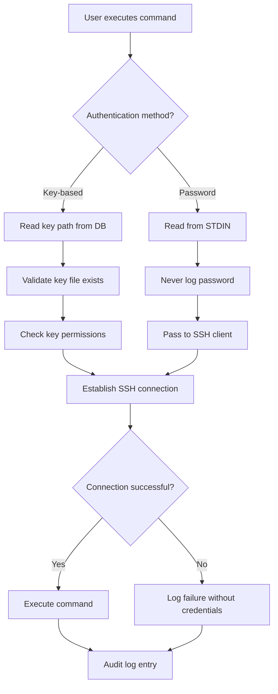

# SSH Profile Management - Detailed Documentation

## Table of Contents

1. [Architecture Overview](#architecture-overview)
2. [Database Design](#database-design)
3. [Security Model](#security-model)
4. [Command Reference](#command-reference)
5. [Authentication Methods](#authentication-methods)
6. [Implementation Details](#implementation-details)
7. [Best Practices](#best-practices)
8. [Troubleshooting](#troubleshooting)

## Architecture Overview

The SSH management system in Sloth Runner follows a secure, profile-based architecture that separates connection metadata from authentication credentials.

```
┌─────────────────────────────────────────────────────────────┐
│                     Sloth Runner CLI                         │
├─────────────────────────────────────────────────────────────┤
│                    SSH Profile Manager                       │
│  ┌──────────────┐  ┌──────────────┐  ┌──────────────┐      │
│  │   Profile    │  │   SQLite     │  │     SSH      │      │
│  │   Commands   │──│   Database   │  │   Executor   │      │
│  └──────────────┘  └──────────────┘  └──────────────┘      │
│         │                 │                   │              │
│         └─────────────────┴───────────────────┘              │
│                           │                                  │
├───────────────────────────┴──────────────────────────────────┤
│                    Security Layer                            │
│  ┌──────────────┐  ┌──────────────┐  ┌──────────────┐      │
│  │ No Password  │  │   Key File   │  │   Password   │      │
│  │   Storage    │  │  Validation  │  │  from STDIN  │      │
│  └──────────────┘  └──────────────┘  └──────────────┘      │
└─────────────────────────────────────────────────────────────┘
```

## Database Design

### Schema Definition

```sql
-- Main profiles table
CREATE TABLE ssh_profiles (
    -- Primary identifier
    name TEXT PRIMARY KEY NOT NULL,

    -- Connection details
    host TEXT NOT NULL,
    user TEXT NOT NULL,
    port INTEGER DEFAULT 22 CHECK(port > 0 AND port <= 65535),

    -- Authentication (key-based only stored)
    key_path TEXT,

    -- Metadata
    description TEXT,
    created_at TIMESTAMP DEFAULT CURRENT_TIMESTAMP,
    updated_at TIMESTAMP DEFAULT CURRENT_TIMESTAMP,
    last_used TIMESTAMP,
    use_count INTEGER DEFAULT 0,

    -- Configuration
    connection_timeout INTEGER DEFAULT 30,
    keepalive_interval INTEGER DEFAULT 60,
    strict_host_checking BOOLEAN DEFAULT TRUE,

    -- Constraints
    UNIQUE(host, user, port),
    CHECK(length(name) > 0 AND length(name) <= 50),
    CHECK(length(host) > 0),
    CHECK(length(user) > 0)
);

-- Index for faster lookups
CREATE INDEX idx_ssh_profiles_host ON ssh_profiles(host);
CREATE INDEX idx_ssh_profiles_last_used ON ssh_profiles(last_used);

-- Audit log table
CREATE TABLE ssh_audit_log (
    id INTEGER PRIMARY KEY AUTOINCREMENT,
    profile_name TEXT NOT NULL,
    action TEXT NOT NULL, -- 'connect', 'execute', 'fail'
    command TEXT,
    timestamp TIMESTAMP DEFAULT CURRENT_TIMESTAMP,
    success BOOLEAN,
    error_message TEXT,
    FOREIGN KEY(profile_name) REFERENCES ssh_profiles(name) ON DELETE CASCADE
);

-- Trigger to update timestamp
CREATE TRIGGER update_ssh_profile_timestamp
AFTER UPDATE ON ssh_profiles
BEGIN
    UPDATE ssh_profiles
    SET updated_at = CURRENT_TIMESTAMP
    WHERE name = NEW.name;
END;
```

### Data Storage Location

**Default Locations:**
- **Unix/Linux**: `$HOME/.sloth-runner/ssh_profiles.db`
- **macOS**: `$HOME/.sloth-runner/ssh_profiles.db`
- **Windows**: `%USERPROFILE%\.sloth-runner\ssh_profiles.db`

**Custom Location:**
```bash
export SLOTH_RUNNER_SSH_DB="/custom/path/ssh_profiles.db"
```

## Security Model

### 1. Credential Separation

```
┌──────────────────────────────────────┐
│         What IS Stored               │
├──────────────────────────────────────┤
│ ✓ Profile name                       │
│ ✓ Hostname/IP                        │
│ ✓ Username                           │
│ ✓ Port number                        │
│ ✓ SSH key path                       │
│ ✓ Connection preferences             │
└──────────────────────────────────────┘

┌──────────────────────────────────────┐
│        What is NEVER Stored          │
├──────────────────────────────────────┤
│ ✗ Passwords                          │
│ ✗ Passphrases                        │
│ ✗ Private key contents               │
│ ✗ Session tokens                     │
│ ✗ Sudo passwords                     │
└──────────────────────────────────────┘
```

### 2. Authentication Flow



### 3. File Permissions Requirements

**SSH Key Files:**
```bash
# Private key - read-only by owner
chmod 600 ~/.ssh/id_rsa

# Public key - readable by all
chmod 644 ~/.ssh/id_rsa.pub

# SSH config directory
chmod 700 ~/.ssh
```

**Database File:**
```bash
# Database - read/write by owner only
chmod 600 ~/.sloth-runner/ssh_profiles.db

# Directory - accessible by owner only
chmod 700 ~/.sloth-runner
```

## Command Reference

### `sloth-runner ssh add`

**Complete Syntax:**
```bash
sloth-runner ssh add <profile-name> \
  --host <hostname-or-ip> \
  --user <username> \
  [--port <port-number>] \
  --key <private-key-path> \
  [--description "<text>"] \
  [--timeout <seconds>] \
  [--keepalive <seconds>] \
  [--no-strict-host-checking]
```

**Parameters:**

| Parameter | Required | Default | Description |
|-----------|----------|---------|-------------|
| `<profile-name>` | Yes | - | Unique identifier (alphanumeric, hyphen, underscore) |
| `--host` | Yes | - | Target hostname or IP address |
| `--user` | Yes | - | SSH username |
| `--port` | No | 22 | SSH port (1-65535) |
| `--key` | Yes | - | Path to private SSH key |
| `--description` | No | - | Profile description (max 255 chars) |
| `--timeout` | No | 30 | Connection timeout in seconds |
| `--keepalive` | No | 60 | Keepalive interval in seconds |
| `--no-strict-host-checking` | No | false | Disable host key verification (NOT RECOMMENDED) |

**Examples:**

```bash
# Basic profile
sloth-runner ssh add prod-web \
  --host 192.168.1.10 \
  --user ubuntu \
  --key ~/.ssh/prod_key

# Complete profile with all options
sloth-runner ssh add staging-db \
  --host staging-db.internal \
  --user postgres \
  --port 2222 \
  --key ~/.ssh/staging_key \
  --description "Staging database server" \
  --timeout 60 \
  --keepalive 30

# Profile for bastion/jump host
sloth-runner ssh add bastion \
  --host bastion.example.com \
  --user jump \
  --port 22022 \
  --key ~/.ssh/bastion_key \
  --description "Bastion host for production access"
```

### `sloth-runner ssh list`

**Syntax:**
```bash
sloth-runner ssh list [--format <format>] [--filter <expression>]
```

**Options:**
- `--format`: Output format (table, json, yaml, csv)
- `--filter`: Filter expression (e.g., "host=192.168.*")

**Examples:**
```bash
# List all profiles (table format)
sloth-runner ssh list

# JSON output for scripting
sloth-runner ssh list --format json

# Filter by hostname pattern
sloth-runner ssh list --filter "host=*.example.com"

# CSV for export
sloth-runner ssh list --format csv > ssh_profiles.csv
```

### `sloth-runner ssh show`

**Syntax:**
```bash
sloth-runner ssh show <profile-name> [--format <format>]
```

**Example Output:**
```
Profile: production-web
═══════════════════════════════════════
Host:           prod.example.com
User:           ubuntu
Port:           22
Key Path:       /home/user/.ssh/prod_key
Description:    Production web server
Created:        2024-01-15 10:30:00
Last Modified:  2024-01-20 14:45:30
Last Used:      2024-01-22 09:15:00
Use Count:      47
Timeout:        30s
Keepalive:      60s
Strict Host:    Enabled
```

### `sloth-runner ssh update`

**Syntax:**
```bash
sloth-runner ssh update <profile-name> \
  [--host <new-hostname>] \
  [--user <new-username>] \
  [--port <new-port>] \
  [--key <new-key-path>] \
  [--description "<new-description>"] \
  [--timeout <seconds>] \
  [--keepalive <seconds>]
```

**Example:**
```bash
# Update only the key path
sloth-runner ssh update prod-web --key ~/.ssh/new_prod_key

# Update multiple fields
sloth-runner ssh update staging \
  --host new-staging.example.com \
  --port 2222 \
  --description "New staging environment"
```

### `sloth-runner ssh remove`

**Syntax:**
```bash
sloth-runner ssh remove <profile-name> [--force]
```

**Options:**
- `--force`: Skip confirmation prompt

**Example:**
```bash
# Remove with confirmation
sloth-runner ssh remove old-server

# Force remove without confirmation
sloth-runner ssh remove temp-server --force
```

### `sloth-runner ssh test`

Test SSH connectivity without executing commands.

**Syntax:**
```bash
sloth-runner ssh test <profile-name> [--ssh-password-stdin -]
```

**Examples:**
```bash
# Test with key authentication
sloth-runner ssh test production

# Test with password authentication
echo -n "password" | sloth-runner ssh test legacy-server --ssh-password-stdin -
```

## Authentication Methods

### 1. SSH Key Authentication (Recommended)

**Setup Process:**

```bash
# 1. Generate SSH key pair
ssh-keygen -t ed25519 -f ~/.ssh/sloth_key -C "sloth-runner"

# 2. Copy public key to server
ssh-copy-id -i ~/.ssh/sloth_key.pub user@host

# 3. Add profile with key
sloth-runner ssh add myserver \
  --host hostname \
  --user username \
  --key ~/.ssh/sloth_key

# 4. Test connection
sloth-runner ssh test myserver
```

### 2. Password Authentication (When Required)

**⚠️ Security Warning:** Password authentication should only be used when key-based authentication is not possible.

**Password Input Methods:**

```bash
# Method 1: From file (most common)
echo -n "password" > pass.txt
chmod 600 pass.txt
sloth-runner run stack --file task.sloth \
  --ssh server --ssh-password-stdin - < pass.txt
shred -u pass.txt

# Method 2: From environment variable
export SSH_PASS="password"
sloth-runner run stack --file task.sloth \
  --ssh server --ssh-password-stdin - < <(echo -n "$SSH_PASS")
unset SSH_PASS

# Method 3: Interactive input (for manual execution)
sloth-runner run stack --file task.sloth \
  --ssh server --ssh-password-stdin -
# (Type password and press Ctrl+D)

# Method 4: From password manager
pass show server/ssh | sloth-runner run stack --file task.sloth \
  --ssh server --ssh-password-stdin -
```

### 3. SSH Agent Integration

**Using SSH Agent:**

```bash
# Start SSH agent
eval $(ssh-agent -s)

# Add key to agent
ssh-add ~/.ssh/private_key

# Profile uses key from agent
sloth-runner ssh add server \
  --host hostname \
  --user username \
  --key ~/.ssh/private_key  # Key will be accessed via agent
```

### 4. Jump Host / Bastion Configuration

**ProxyJump Setup:**

```bash
# 1. Create SSH config
cat >> ~/.ssh/config <<EOF
Host production-*
    ProxyJump bastion
    User ubuntu
    IdentityFile ~/.ssh/prod_key

Host bastion
    HostName bastion.example.com
    User jump
    IdentityFile ~/.ssh/bastion_key
EOF

# 2. Add profile referencing SSH config
sloth-runner ssh add production-web \
  --host production-web \
  --user ubuntu \
  --key ~/.ssh/prod_key
```

## Implementation Details

### Connection Establishment

```go
// Pseudo-code for SSH connection
func EstablishSSHConnection(profile SSHProfile, password *string) (*ssh.Client, error) {
    config := &ssh.ClientConfig{
        User: profile.User,
        HostKeyCallback: ssh.InsecureIgnoreHostKey(), // Or proper validation
        Timeout: time.Duration(profile.Timeout) * time.Second,
    }

    // Authentication method selection
    if password != nil {
        config.Auth = []ssh.AuthMethod{
            ssh.Password(*password),
        }
        // Clear password from memory immediately after use
        *password = ""
    } else if profile.KeyPath != "" {
        key, err := ioutil.ReadFile(profile.KeyPath)
        if err != nil {
            return nil, fmt.Errorf("unable to read private key: %v", err)
        }

        signer, err := ssh.ParsePrivateKey(key)
        if err != nil {
            return nil, fmt.Errorf("unable to parse private key: %v", err)
        }

        config.Auth = []ssh.AuthMethod{
            ssh.PublicKeys(signer),
        }
    }

    address := fmt.Sprintf("%s:%d", profile.Host, profile.Port)
    client, err := ssh.Dial("tcp", address, config)
    if err != nil {
        return nil, fmt.Errorf("failed to dial: %v", err)
    }

    return client, nil
}
```

### Password Handling

```go
// Secure password reading from stdin
func ReadPasswordFromStdin() (string, error) {
    // Check if stdin is available
    stat, _ := os.Stdin.Stat()
    if (stat.Mode() & os.ModeCharDevice) != 0 {
        // Interactive mode - use terminal
        fmt.Print("SSH Password: ")
        password, err := term.ReadPassword(int(os.Stdin.Fd()))
        fmt.Println() // New line after password
        return string(password), err
    }

    // Pipe mode - read from stdin
    reader := bufio.NewReader(os.Stdin)
    password, err := reader.ReadString('\n')
    if err != nil && err != io.EOF {
        return "", err
    }

    // Remove any trailing whitespace/newlines
    password = strings.TrimSpace(password)

    // Validate password is not empty
    if password == "" {
        return "", fmt.Errorf("empty password received")
    }

    return password, nil
}
```

## Best Practices

### 1. Profile Naming Conventions

```bash
# Environment-based
production-web
staging-db
development-api

# Service-based
nginx-prod
postgres-staging
redis-cache

# Location-based
us-east-1-web
eu-west-2-db
asia-pac-cache
```

### 2. Key Management

```bash
# Dedicated keys per environment
~/.ssh/keys/
├── production/
│   ├── web_servers
│   ├── db_servers
│   └── cache_servers
├── staging/
│   └── all_servers
└── development/
    └── local_key

# Profile creation with organized keys
sloth-runner ssh add prod-web-1 \
  --host 10.0.1.10 \
  --user deploy \
  --key ~/.ssh/keys/production/web_servers
```

### 3. Security Checklist

- [ ] Use SSH keys instead of passwords whenever possible
- [ ] Store private keys with 600 permissions
- [ ] Use strong passphrases for SSH keys
- [ ] Rotate SSH keys regularly (monthly/quarterly)
- [ ] Use different keys for different environments
- [ ] Enable SSH agent forwarding only when necessary
- [ ] Implement proper host key verification
- [ ] Audit SSH access logs regularly
- [ ] Use jump hosts for production access
- [ ] Implement session recording for compliance

### 4. Automation Guidelines

```bash
#!/bin/bash
# Secure automation script template

set -euo pipefail  # Exit on error, undefined variables, pipe failures

# Configuration
readonly PROFILE_NAME="production"
readonly TASK_FILE="deploy.sloth"
readonly STACK_NAME="deploy-$(date +%Y%m%d-%H%M%S)"
readonly LOG_FILE="/var/log/sloth-runner/deploy.log"

# Logging function
log() {
    echo "[$(date +'%Y-%m-%d %H:%M:%S')] $*" | tee -a "$LOG_FILE"
}

# Error handling
trap 'log "ERROR: Command failed at line $LINENO"' ERR

# Main execution
main() {
    log "Starting deployment to $PROFILE_NAME"

    # Verify profile exists
    if ! sloth-runner ssh show "$PROFILE_NAME" > /dev/null 2>&1; then
        log "ERROR: SSH profile '$PROFILE_NAME' not found"
        exit 1
    fi

    # Execute deployment
    if sloth-runner run "$STACK_NAME" \
         --file "$TASK_FILE" \
         --ssh "$PROFILE_NAME" \
         'deployment_script.sh'; then
        log "Deployment successful"
    else
        log "Deployment failed"
        exit 1
    fi
}

main "$@"
```

## Troubleshooting

### Common Issues and Solutions

#### 1. Profile Not Found

**Error:**
```
Error: SSH profile 'myserver' not found
```

**Solution:**
```bash
# Check if profile exists
sloth-runner ssh list | grep myserver

# If missing, add it
sloth-runner ssh add myserver --host hostname --user username --key ~/.ssh/key
```

#### 2. Key Permission Error

**Error:**
```
Error: Private key file has incorrect permissions (must be 600)
```

**Solution:**
```bash
chmod 600 ~/.ssh/private_key
chmod 700 ~/.ssh
```

#### 3. Password Authentication Failing

**Error:**
```
Error: Authentication failed (password)
```

**Debugging Steps:**
```bash
# 1. Verify password file has no newline
hexdump -C pass.txt | tail -1
# Should NOT show 0a (newline) at the end

# 2. Test SSH directly
ssh user@host -o PreferredAuthentications=password

# 3. Check for special characters
# Ensure password is properly escaped in file
```

#### 4. Connection Timeout

**Error:**
```
Error: Connection timeout after 30 seconds
```

**Solution:**
```bash
# Increase timeout
sloth-runner ssh update myserver --timeout 60

# Test connectivity
ping hostname
nc -zv hostname 22
```

#### 5. Host Key Verification Failed

**Error:**
```
Error: Host key verification failed
```

**Solution:**
```bash
# Option 1: Add host to known_hosts
ssh-keyscan -H hostname >> ~/.ssh/known_hosts

# Option 2: Disable strict checking (NOT RECOMMENDED for production)
sloth-runner ssh add server --host hostname --user user --key ~/.ssh/key --no-strict-host-checking
```

### Debug Mode

Enable verbose logging for troubleshooting:

```bash
# Set debug environment variable
export SLOTH_RUNNER_DEBUG=true

# Run command with debug output
sloth-runner run stack --file task.sloth --ssh server --debug

# View debug logs
tail -f ~/.sloth-runner/debug.log
```

### Audit Log Analysis

```sql
-- View recent connections
SELECT * FROM ssh_audit_log
ORDER BY timestamp DESC
LIMIT 10;

-- Find failed authentications
SELECT profile_name, timestamp, error_message
FROM ssh_audit_log
WHERE success = 0
ORDER BY timestamp DESC;

-- Connection statistics
SELECT
    profile_name,
    COUNT(*) as total_connections,
    SUM(CASE WHEN success = 1 THEN 1 ELSE 0 END) as successful,
    SUM(CASE WHEN success = 0 THEN 1 ELSE 0 END) as failed
FROM ssh_audit_log
GROUP BY profile_name;
```

## Migration and Backup

### Backup Profiles

```bash
# Backup database
cp ~/.sloth-runner/ssh_profiles.db ~/.sloth-runner/ssh_profiles.db.backup

# Export to JSON
sloth-runner ssh list --format json > ssh_profiles_backup.json

# Encrypted backup
tar czf - ~/.sloth-runner/ssh_profiles.db | \
  openssl enc -aes-256-cbc -salt -out ssh_profiles.tar.gz.enc
```

### Restore Profiles

```bash
# Restore from backup
cp ~/.sloth-runner/ssh_profiles.db.backup ~/.sloth-runner/ssh_profiles.db

# Restore from encrypted backup
openssl enc -d -aes-256-cbc -in ssh_profiles.tar.gz.enc | tar xzf -
```

### Migration Between Systems

```bash
# Export on source system
sloth-runner ssh export > profiles.json

# Import on target system
sloth-runner ssh import < profiles.json
```

## Security Compliance

### SOC2 Compliance

- ✅ No password storage in database
- ✅ Audit logging for all connections
- ✅ Encrypted communication (SSH)
- ✅ Access control via file permissions
- ✅ Session management and timeout

### PCI-DSS Requirements

- ✅ Strong cryptography (SSH keys)
- ✅ No clear-text password storage
- ✅ Audit trail for access
- ✅ Regular key rotation capability
- ✅ Secure key storage

### GDPR Considerations

- ✅ No personal data in logs
- ✅ Encrypted data transmission
- ✅ Right to deletion (remove profile)
- ✅ Data portability (export/import)

---

**Remember:** This system is designed with security as the primary concern. Never compromise on security for convenience.