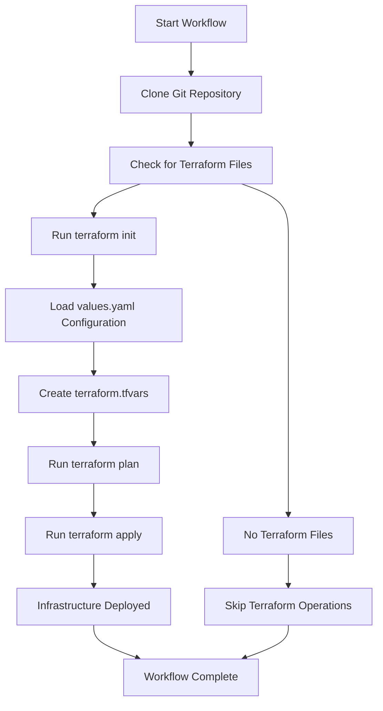

# Sloth Runner Examples

This directory contains practical examples demonstrating Sloth Runner's capabilities.

## 📁 Examples Overview

### `deploy_git_terraform.sloth`
**Complete GitOps Workflow with Terraform and Values Configuration**

This example demonstrates a complete GitOps workflow that:
1. **Clones a Git repository** containing Terraform infrastructure code
2. **Deploys infrastructure** using Terraform with configuration from `values.yaml`
3. **Manages the complete lifecycle** from git clone to infrastructure deployment

#### ✨ **Key Features Demonstrated:**
- **Git Module Integration**: Clone repositories with the modern DSL
- **Terraform Module Integration**: Automatic `terraform init`, `plan`, and `apply`
- **Values Configuration**: External configuration using `values.yaml`
- **Error Handling**: Comprehensive error handling and cleanup
- **Workflow Orchestration**: Multi-task workflow with dependencies
- **Logging**: Detailed logging throughout the process

#### 🚀 **How to Run:**

1. **Edit the configuration** in `values.yaml`:
   ```yaml
   terraform:
     do_token: "your-actual-digitalocean-token"
     droplet_name: "my-demo-droplet"
     droplet_region: "nyc3"
     # ... other configuration
   ```

2. **Run the workflow**:
   ```bash
   # With values file
   sloth-runner run -f examples/deploy_git_terraform.sloth -v examples/values.yaml deploy_git_terraform
   
   # Or run specific tasks
   sloth-runner run -f examples/deploy_git_terraform.sloth deploy_git_terraform
   ```

3. **Monitor the execution**:
   - Watch the git clone progress
   - See Terraform init output
   - Review the Terraform plan
   - Observe the apply process (if token is valid)

#### 📋 **What This Example Does:**



#### 🔧 **Configuration via values.yaml:**

The example shows how to use external configuration files instead of hardcoded values:

```lua
-- Instead of hardcoded values:
do_token = "hardcoded-token"

-- Use values from YAML:
do_token = Values.terraform.do_token or ""
```

This approach provides:
- **Environment-specific configurations**
- **Secure token management** (keep tokens out of code)
- **Reusable workflows** across different environments
- **Easy customization** without modifying the `.sloth` file

#### 🎯 **Learning Outcomes:**

After running this example, you'll understand:
- How to create multi-task workflows
- How to integrate Git and Terraform modules
- How to use external configuration files
- How to handle errors and cleanup resources
- How to implement comprehensive logging
- How to structure complex GitOps workflows

#### ⚠️ **Prerequisites:**

- `terraform` command available in PATH
- `git` command available in PATH
- Valid DigitalOcean token (for actual deployment)
- Network access to GitHub and DigitalOcean APIs

#### 🔒 **Security Note:**

Never commit real API tokens to version control. Use environment variables or secure configuration management for production deployments.

---

## 📚 **Next Steps**

Explore the code in `deploy_git_terraform.sloth` to see:
- Modern DSL task definitions
- Fluent API usage
- Error handling patterns
- Workflow orchestration
- Integration with external tools

For more examples and documentation, visit: [Sloth Runner Documentation](../docs/)